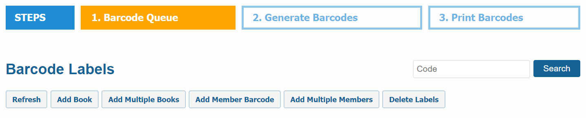
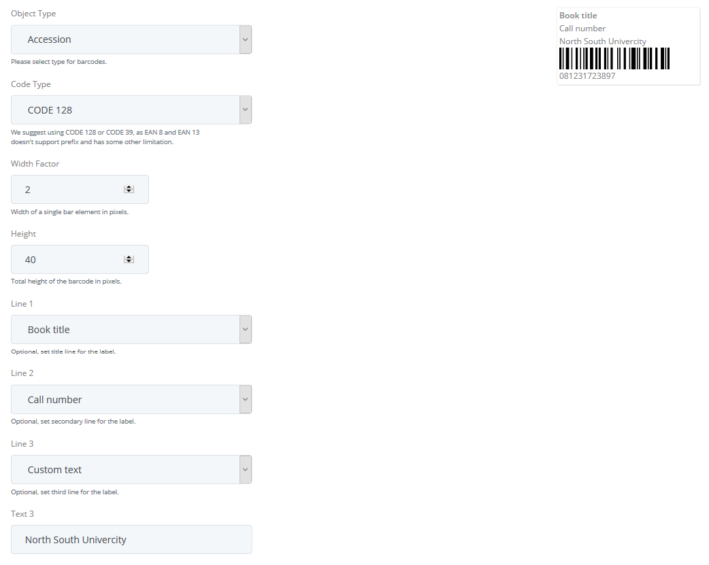

# Barcode Labels

Barcode Labels is the section that can be accessed by the librarians only. In this section the librarian can add single or multiple books and also add member barcode to the Barcode Queue. Once books are added to the queue then the librarian can generate barcodes. After the barcodes are generated they can print them out in standard label stationary or normal papers. Barcodes are very useful for the librarians as well as the library members. 

**Some barcode scanners can't scan small numbers. Hence, it is recommended to use barcodes that is at least 6-8 characters long so that all barcode scanner can scan them accurately.**

## Add to Barcode Queue

Add To Barcode Queue is the section where single or multiple books and also the member barcodes are used to added to the queue.

To add books to the barcode queue, please follow the below steps:

* At first login to your library.
* Go to the  `Circulations` option from the Main Menu.
* Click on `Barcode Labels` from the `Circulations` dropdown menu.

    

* After clicking on `Barcode Labels` you can see the options like below.

    

* Now if you click on the `Add Book` button then you can add a single book to the Barcode Queue by it's accession number.

    

* Once you have added one book to the Queue, you can also add more books to the Queue like below.

     

* If you click on the `Add Multiple Books` button, you can add multiple books to the Barcode Queue by their accession number. Please enter accession number separated by comma.

    

* If you click on the `Add Member Barcode` button, then you can add a member like below.

    

 * After you add one, you can also add more member as shown below.

    

* If you click on the `Add Multiple Members` button, you can add multiple members to the Barcode Queue by their member no. Please enter member no separated by comma.

    

* Once you click on `Add to Queue` button, then step one will be completed and all your items will be available in Generate Barcodes section and you can also see how many items you have added in the Generate Barcode Section.
 
    

## Generate Barcodes

Generate Barcodes is the section where actions are taken depend upon the currently added items on the Barcode Queue.
Once you have added items to barcodes queue, you need to generate the barcode labels. This option applies to the currently added items to the barcode queue. If no item is in the queue, then this option will be disabled.

To Generate Barcodes, please follow the below steps:

* Click on `Generate Barcodes` and a page will be appear like this.

     

* At first, please select `Object Type` to either Accession or Member to generate barcodes for library materials or member id cards respectively.

      

* Select the desired `Code Type` by default CODE 128 is selected. We suggest to use CODE 128 or CODE 39 for better scannability.

     
     

* You can specify the `Width Factor` and `Height` for your barcode image.
* Now in `Line 1, Line 2, Line 3` you can give a title to your barcode such as Book Title, Call Number and Custom Text. If you select Call Number then also select `Binding Fold Option` below.

      

* If you choose the `Custom Text` option then a text box will be appear and you can give any text as your choice.

      

* Now if choose all this your barcode will be appear like below.

     

* if you want to Generate Bind fold Barcodes then you need to select the **Binding Fold Option** otherwise leave it unchecked.

       

* Please do not change `Remove Prefix` option, leave it checked.
* When you are done, click the `Submit` button then all your selected barcodes will be generated and you will be moved to Print Barcodes section. You can also see the number of generated barcodes in the Print Barcodes queue.

     

## Bulk Delete Barcodes

If you want to delete the queued or generated barcodes all together then you can use our **Delete Labels** option. 

* To do so please go to the `Barcode Labels` section as shown below.

    

* Then click on the `Delete Labels` button from the top of this section.

    

* From the `Object Type` dropdown menu you can select either the member or accession number to delete your barcodes. If you select **All** then both member barcodes and item barcodes will be deleted.
    
    

* Then from the `Label Type` dropdown menu you can select either you want to delete the queued barcodes or the generated barcodes.

    

* After selecting the object type and label type please click on the `Delete` button and barcodes will be deleted.

## Print Barcodes

Print Barcodes is the section where you can print out the barcodes which you have been generated already.

To print the barcodes you have to follow the below steps:

* If you click on the `Print Barcodes` option then a print layout page will be appeared along with the generated barcodes like below.

    

* Now to print the labels, click on `Print` button and in chrome browser it will appear as shown below.

     

* Click on `More Settings` and select the desired paper size and marging as shown below. Paper size may vary depending on the type of label you want to print.

     

* Please make sure that you choose **None** in the `Margins` option.
* All of your labels should be properly placed in print layout correctly. If so then you are ready to print them out.
* For a precuation, please print a small quantity of labels as a first step.

### Custom Print Settings

You can also apply your custom `Page Settings` to print customized barcodes.

To do so, please follow the below steps:

* Click on the `Page Settings` button and a page will be appeared as shown below.

    

* Select a pre configured print setting from the `Saved Setting` drop down and click `Apply`. We have some common label settings for Roll type and Sheet type barcode label.
* Next if you click on the `Page` tab then it will be appeared like below.

    

* In this page you can give Page Type, Page Size, Page Orientation, Width, Height and Labels/Page per your need.
* If you click on `Margins` tab then it will be appeared like below.

    

* In this page you can apply margins per your need.
* If you click on `Label` tab then it will be appeared like below.

    

* In this page you can change the font size of your barcodes. Also you can change the width, height, font and padding of the barcodes per your need.
* If you click on `Lines` tab then it will be appeared like below.

    

* In this page you can apply the font size and text limit of the lines per your need.
* When you are done, click `Apply` button to see your changes in prints layouts.

## Complete Printing and Start New Queue

When you have items in the Print Queue sections, you can't generate new barcodes. In order to generate new barcodes, you need to complete current print queue and start over.

To do so, please follow the below steps:

* Please click on the `Print Completed` button and click ok to confirm. 

    

* All your generated barcode labels will be marked as completed and the `Print Barcodes` will become empty.

    

* Now you can generate new barcodes like before.

## Custom Barcode

If you have already labeled your old items using existing barcode number then enter those barcode number into accession number field.

To do so, please follow the below steps:

* Please go to the `Dashboard -> Catalogs -> Catalog Items` section then locate the item you want to edit from your catalog and click on the `View` link on the right to that item. Navigate to the copies section at the bottom of the page. Click on the `Edit` link on the right to that specific copy. 

     

* An edit copy form will be appeared like below.

    

* Now in the edit copy form replace the Librarika generated accession number with your own barcode number on the Accession No field.    

* Then the old barcode and the new barcode will same.

**For Bulk Import**:

You can provide your catalog information along with your own (existing) accession number for barcode (existing) when adding your records using our [Bulk Import](cataloging.md#bulk-import) method. You can only use your existing barcode labels if they are numeric digit.