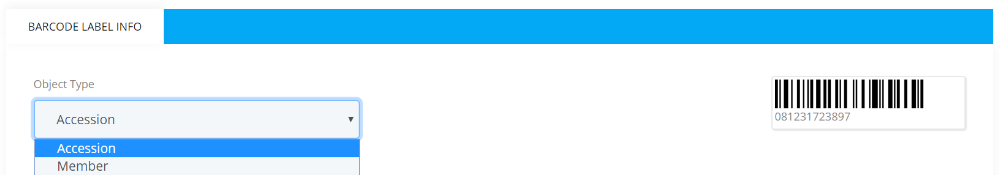

# Barcode Labels

Barcode Labels is the section that can be accessed by the librarians only. In this section the librarian can add single or multiple books and also add member barcode to the Barcode Queue. Once books are added to the queue then the librarian can generate barcodes. After the barcodes are generated they can print them out in standard label stationary or normal papers. Barcodes are very useful for the librarians as well as the library members. 

**Some barcode scanners can't scan small numbers. Hence, it is recommended to use barcodes that is at least 6-8 characters long so that all barcode scanner can scan them accurately.**

## Add to Barcode Queue

Add To Barcode Queue is the section where single or multiple books and also the member barcodes are used to added to the queue.

To add books to the barcode queue, please follow the below steps:

* At first login to your library.
* Go to the  `Circulations` option from the Main Menu.
* Click on `Barcode Labels` from the `Circulations` dropdown menu.

    

* After clicking on `Barcode Labels` you can see the options like below.

    

* Now if you click on the `Add Book` option then you can add single book to the Barcode Queue by their accession number.

    

* Once you added one book to the Queue, you can also add more books to the Queue like below.

     

* If you click on the `Add Multiple Books` option, you can add multiple books to the Barcode Queue by their accession number. Please enter accession number separated by comma.

    

* If you click on the `Add Member Barcode` option, then you can add a member like below.

    

 * After you add one, you can also add more member as shown below.

    

* Once you click on `Add to Queue` button, then step one will be completed and all your items will be available in Generate Barcodes section and you can also see how many items you have added in the Generate Barcode Section.
 
    

## Generate Barcodes

Generate Barcodes is the section where actions are taken depend upon the currently added items on the Barcode Queue.
Once you have added items to barcodes queue, you need to generate the barcode labels. This option applies to the currently added items to the barcode queue. If no item is in the queue, then this option will be disabled.

To Generate Barcodes, please follow the below steps:

* Click on `Generate Barcodes` and a page will be appear like this.

     

* Here at first you can see the `Object Type` options like, one is **Accession** which is used to Generating barcode label  for library material.and the other is **Member** which is used to Generating barcode label for member ID card.

      

* If you want to add the items in the Queue according to `Add Member Barcode` then you have to select the **Member** option must. and this will **Generate Member Barcodes** for you.

* If want to `Generate Book Barcodes` then you have to select the **Accession** option must.

* You don't need to change the `Code Type` option.
* You can give the `Width Factor` and `Height` per your barcode size.
* Now in `Line 1, Line 2, Line 3` you can give a title to your barcode such as Book Title, Call Number and Custom Text.

      

* If you choose the `Custom Text` option then a text box will be appear and you can give any text per your choice.

      

* Now if choose all this your barcode will be appear like below.

     

* if you want to `Generate Bind folds` Barcodes then you must have to select the **Binding Fold Option** otherwise you don't need to select it.

       

* Now you don't need to change the `Remove Prefix` option.it is good to be auto selected.
* At last if you click the **Submit** button then all your generated barcodes will be gone to the Print Barcodes section and you can also see the number of generated barcodes in the Print Barcodes section.

     

## Print Barcodes

Print Barcodes is the section where you can print out the barcodes which you have been generated so far.

To print the barcodes you have to follow the below steps:

* Click on `Print Barcodes` and a page will be appear like below.

      

* If you want to change the previous settings then you can click on `Page Settings` option.
* In the `Page Settings` section there are so many options are given such as Presets, Page, Margins, Label and Lines.
* At first you can see the `Presets` option by default.

    

* In this page you can 
* If you click on `Page` option then it will be appear like below.

    

      
* In this page you can give Page Type, Page Size, Page Orientation, Width, Height and Labels/Page per your need.
* If you click on `Margins` then it will be appear like below.

     

* In this page you can apply margins per your choice.
* If you click on `Label` then it will be appear like below.

     

* In this page you apply label per your choice.
* If you click on `Lines` then it will be appear like below.

     

* In this page you can apply lines per your need.
* Now if you want to print them then you can click on `Print` and it will appear like below.

     

* In this page you can change **Destination**, you can give the amount of **Pages**, **Copies** and you can also choose the two sided **Option** if you need.
* Now if you click on `More Settings` then you can see more options.

     

* Among all those options always choose **None** in the `Margins` option.
* Now if your all settings are ready then you can simply print them out.

## Complete Printing and Start New Queue

When you have items in the Print Queue sections, you can't generate new barcodes. In order to generate new barcodes, you need to complete current print queue and start over.

To do so, please follow the below steps:

* Please click ok on `Print Completed` and confirm. 

    

* All your generated barcode labels will be marked as completed and the `Print Barcodes` will become empty.
* Now you can generate new barcodes like before.

