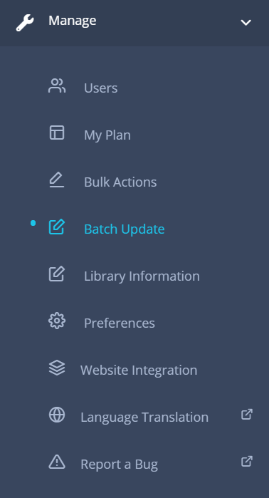
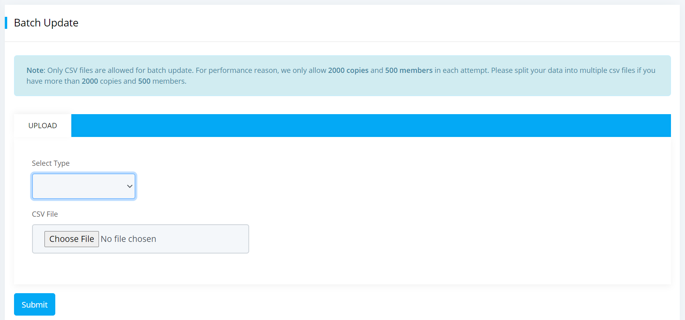
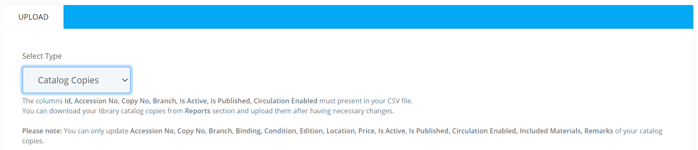
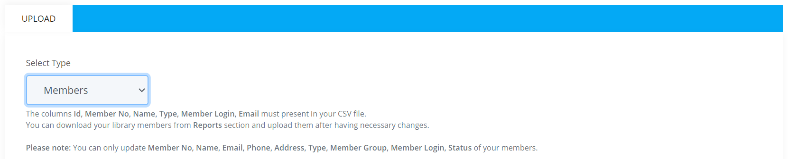

# Batch Update

Batch update method is used to edit mass amount of data at once and batch update them. For now batch update is only applicable to the catalog item copies and members of the library. Only CSV files are allowed for batch updating. Also, batch update feature is only availabe to paid libraries.

**Tips:** You can download your library catalog copies and members from Reports section and upload them after having necessary changes.

To access this section, please follow the below steps:

* Please go to `Dashboard -> Manage -> Batch Update` section.

	

* Click on the `Batch Update` menu and a page will be appeared like below.

	

* Now you can select either the catalog copies or members and update their  information according to your need.

## Update Catalog Copies

You can use the batch update method to update all the catalog copies information of your library. It is useful to those who wants to update multiple fields at a time like accession no, copy no, branch, location and many more altogether.

To do so, please follow the below steps:

* Select `Catalog Copies` from the select type dropdown like below.

	

* After selecting catalog copies option you will see some text hints, please read them carefully.
* Before uploading catalog copies CSV file please make sure that **Id, Accession No, Copy No, Branch, Is Active, Is Published and Circulation Enabled** column must be present in your file. Because this fields are required.
* Moreover, you can only update the **Accession No, Copy No, Branch, Binding, Condition, Edition, Location, Price, Is Active, Is Published, Circulation Enabled, Included Materials, Remarks** of your catalog copies file.
* After editing necessary information please upload the catalog copies CSV file into your library. You will see that your catalog copies information has been updated successfully.

## Update Members

Using the batch update method you can update your library members information in bulk. Which means you can update multiple fields data at once like member no, name, email, phone etc. You can edit those data in your CSV file and then upload them into your library.

To do so, please follow the below steps:

* Select `Members` from the select type dropdown like below.

	

* After selecting the members option you will see some text hints. please read them carefully.
* Before uploading the members CSV file please make sure that **Id, Member No , Name, Type, Member Login and Email** column must be present in your file. Because this fields are required.
* Moreover, you can only update the **Member No, Name, Email, Phone, Address, Type, Member Group, Member Login, Status** of your members CSV file.
* After editing necessary information of your members please upload the file into your library. You will see that members information has been updated successfully.