# Bulk Actions

Our bulk actions method is used to update or delete your book, copy or member records in bulk. You can use this option to partially or fully select records from your library and apply bulk update or delete operation to those records matching the criteria.

To do the bulk Actions, please follow the below steps:

* At first login to your library
* Go to the `Others` option from the Main Menu.
* Click on `Bulk Actions` from the `Others` dropdown Menu.

    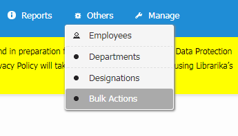

* After clicking on `Bulk Actions` a page will shown like below.
  
    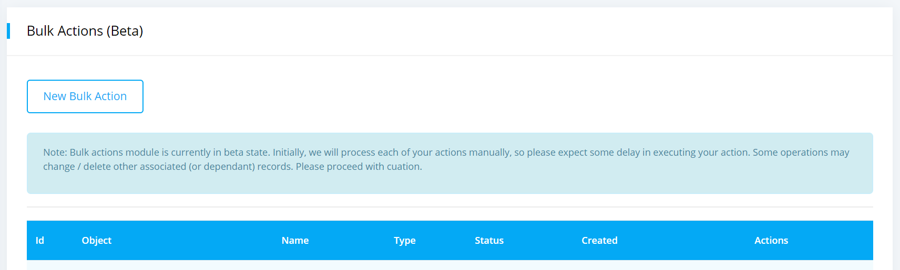

* Now if you click on `New Bulk Action` you can select the type of your Bulk Actions.

    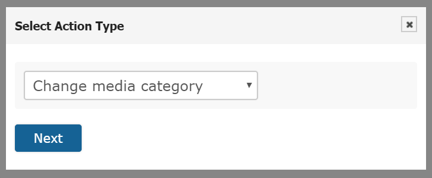

* Here `Change Media Category` is the default type. you can also choose the other types of option.

## Update Medias

You can use bulk action method to update only medias information in your catalog. Such as category, tags, type, titles active flags etc

To do so, please follow the below steps:

* Click on `New Bulk Action` and a form will shown like before.
* In this form various types of medias are given like below.

    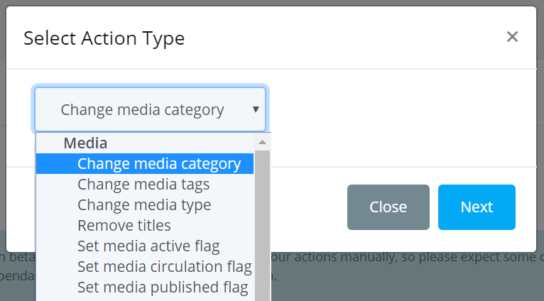

* You can choose any types of medias among all this.

### Change Media Category 

* If you choose `Change Media Category` then a form will shown like below.

    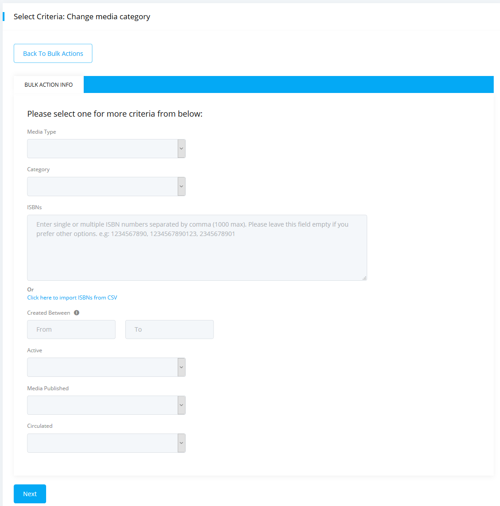

* Now you need to specify at least one conditions based on which the records will be updated. You can specify more than one criteria to further narrow down the selection. 
    - The first option that you can see is the `Media Type` where you can choose any types of Media.

        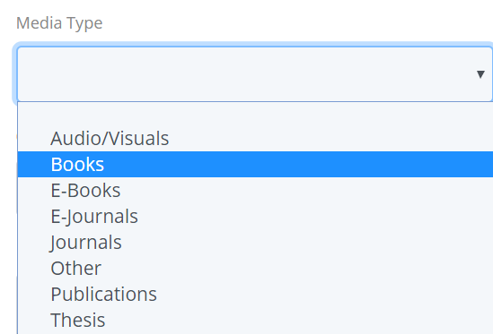 

    - Then you can choose the `Category` option as shown below.

        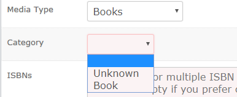 

    - The next one is the `ISBNs` where you can choose single or multiple ISBN numbers separated by a comma or you can import them from your CSV file. You can leave this field empty if you do not want to enter this criteria.

        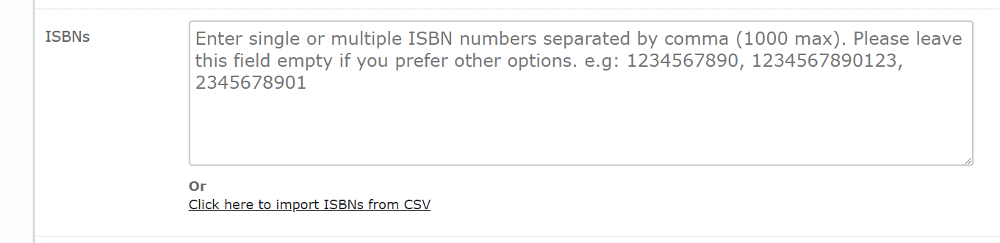 

    - Next is the `Created Between` option. You can choose the date between the Medias are created.

        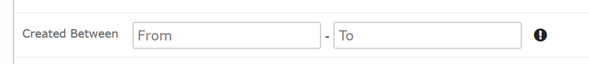

    - Then next one is the `Active` option. You can choose if the Media is active or not.

        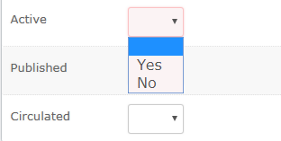

    - Then you can choose the `Published` and `Circulted` option same as the Active option.  

* Once you finished all the selection in the `Change Media Category` criteria then click on the `NEXT` button and a page will be appeared like below.

    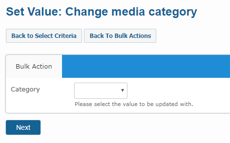 

* Here select the `Category` to which you wanted to updated with. Otherwise an error message will be shown.

    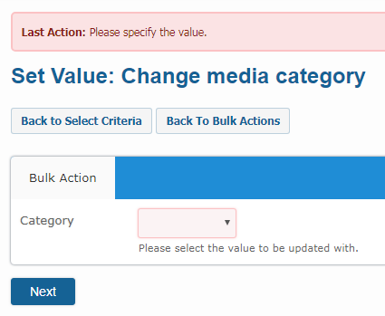

* After selecting the destination **Category** click on the **NEXT** button. Now you can review the changes and then Confirm it.

    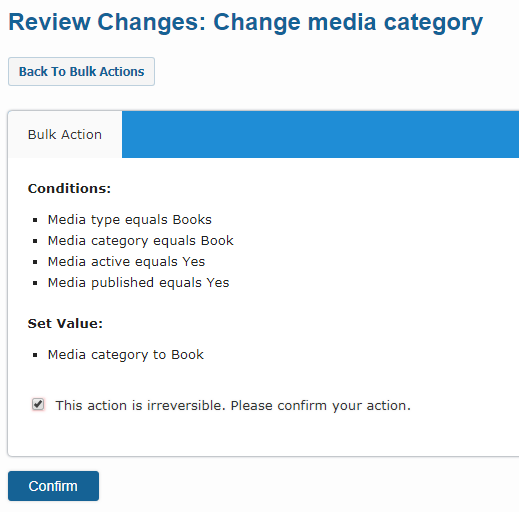    

* Click on `Confirm` button and your bulk actions will be created.

    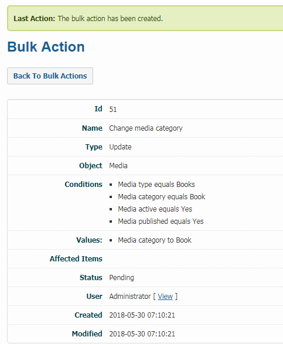 

### Change Media Tags

To create a bulk action to Change Media Tags, please follow the bellow steps:

* Click on the `New Bulk Action` button and choose Change Media Tags from the dropdown menu. 

    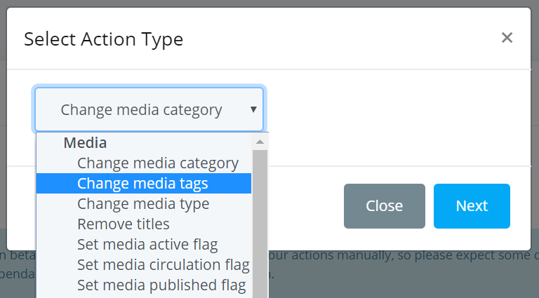 

* A **Select Criteria** form will appear same as **Change Media Category** section mention above and after selecting all the criteria click on the NEXT button.
* Now enter your desired Tags in the Set Value form and click on NEXT when you are done.

    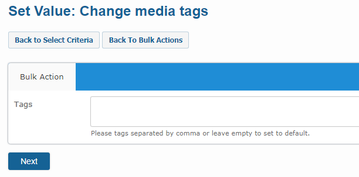 

* Now review your changes and click on the confirm button. Your bulk actions will be saved.

### Change Media Type

To create a bulk action to Change Media Type, please follow the below steps:

* Click on `New Bulk Action` button and choose Change Media Type option from the dropdown menu. 

    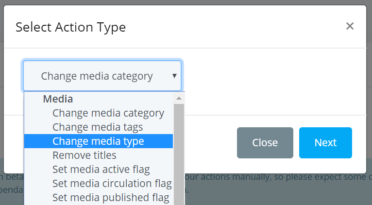

* A **Select Criteria** form will appear same as **Change Media Tags** section mention above and after selecting all the criteria click on the NEXT button.
* Now you must have to select your desired Media Type in the Set Value form otherwise it will shown an error message.

    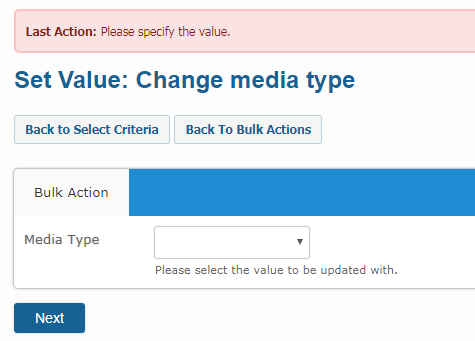

* Many options are given in Media Type so you can choose any type per your need and click NEXT when you are done.

    

* Now review your changes and click on the confirm button. Once you confirm it your bulk actions will be saved.

## Delete Medias

You can delete media titles using the bulk action method. When you delete titles, All related child copies and media bookings will be deleted by default. You can also choose to delete authors, publishers and categories of the selected books.

To do so, please follow the below steps:

* Click on the `New Bulk Action` button and select the `Remove Media Titles` option.

    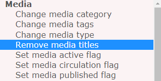 

* Select one or more criteria from the **Select Criteria** form like before and click on NEXT button.
* After click on **NEXT** button a form will shown like below.

    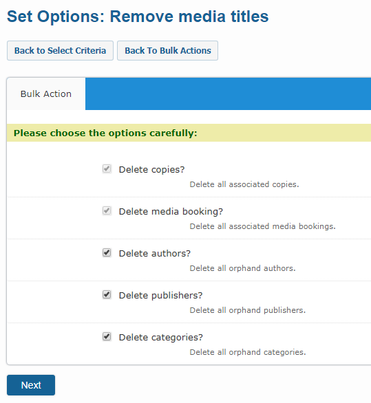

* You can choose to delete related authors, publishers or categories as your choice. Related copies and media bookings will be deleted by default. Please choose the options very carefully.

    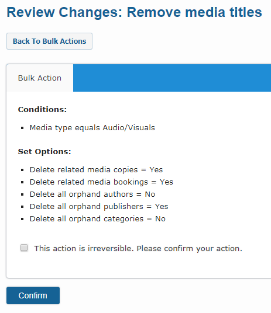

* Now review your changes and click on the confirm button. Your bulk actions will be saved.

### Set Media Active Flag

To create a New Bulk Action with the Set Media Active Flag, please follow the below steps:

* Click on `New Bulk Action` button and choose Set Media Active Flag from the dropdown menu.

    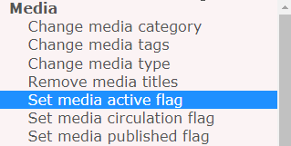 

* Select one or more criteria from the **Select Criteria** form like before and click on NEXT button.
* Now you can choose the Set Media Active Flag in the Set Value form and click on NEXT when you are done.

    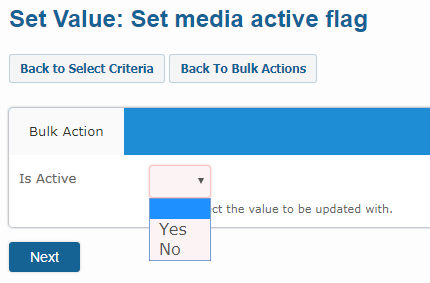    

* Now can review your changes that you have made and click on the confirm button.
* Your bulk actions will be saved.

### Set Media Circulation Flag

To create a New Bulk Action with the Set Media Circulation Flag, please follow the below steps:

* Click on `New Bulk Action` button and select Set Media Circulation Flag like below.

    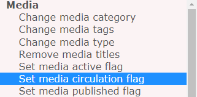

* Select one or more criteria from the **Select Criteria** form like before and click on NEXT button.
* Now you can choose the Set Media Circulation Flag in the Set Value form and click on NEXT when you are done.

    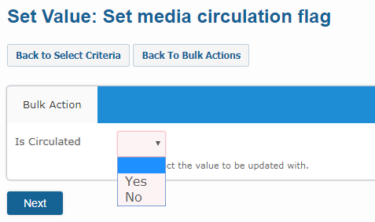 

* Now you can review your changes and click on the confirm button. Your bulk actions will be saved.

### Set Media Published Flag

To create a New Bulk Action with the Set Media Published Flag, please follow the below steps:

* Click on `New Bulk Action` button and select Set Media Published Flag like below.

    

* Select one or more criteria from the **Select Criteria** form like before and click on NEXT button.
* Now you can choose the Set Media Published Flag in the Set Value form and click on NEXT when you are done.

    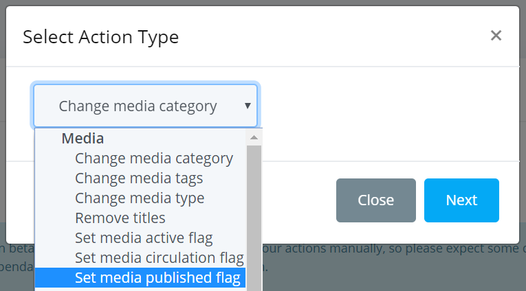

* Now you can review your changes and click on confirm button. Your bulk actions will be saved.

## Update Copies

You can use bulk action method to update only media copies information in your catalog. Such as branch, location, active flags etc

To do so, please follow the below steps:

* Click on `New Bulk Action` and you can see the **Media Copy** options like below.

    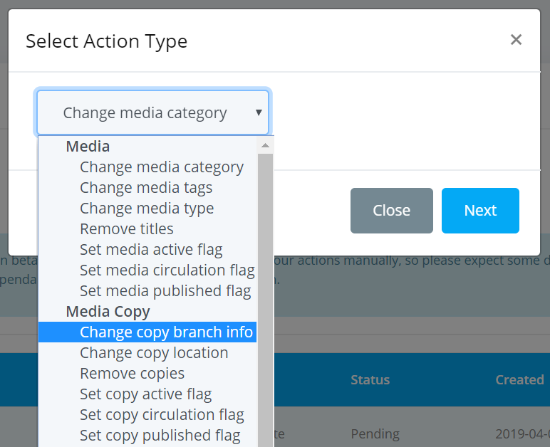

### Change Media Copy's Branch Info

To create a New Bulk Action to Change Media Copy's Branch Info, please follow the below steps:

* If you select the `Change Media Copy's Branch Info` a page will be shown like below.

    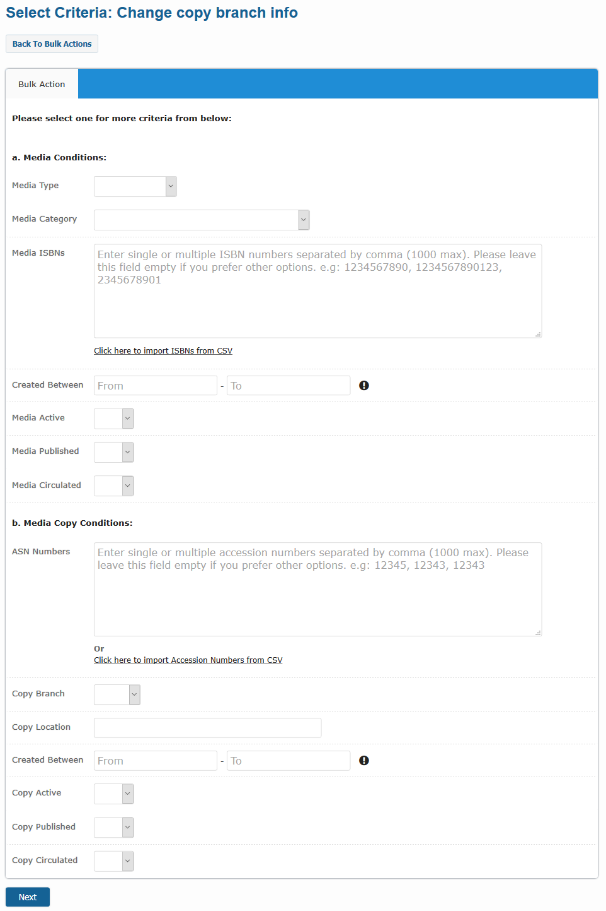

* In this page you can see that two types of conditions are given. The first one is the `Media Conditions` which is as same as the **Update Medias** but here you also have to fulfill the second conditions which is the `Media Copy Conditions`.

* In `Media Copy Conditions` you need to specify at least one conditions based on which the records will be updated. You can specify more than one criteria to further narrow down the selection. 

    - The first one is the `ASN Numbers` where you can choose single or multiple accession numbers separated by a comma or you can import them from your CSV file. You can leave this field empty if you do not want to enter this criteria.

        

    - Next is the `Created Between` option. You can choose the date between the Media Copy's are created.

        

    - Then you can choose the `Copy Branch` option as shown below.

        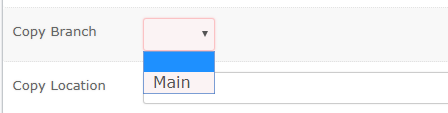

    - The next one is the `Copy Location` option. You can select here, from which location you want to copy your medias.

    - Next is the `Copy Active` option. You can choose if the copy is active or not.

        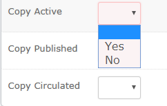

    - Then you can choose the `Copy Published` and `Copy Circulted` option same as the Copy Active option.

* After selected one or more options click on the `NEXT` button and a page will be shown like below.

    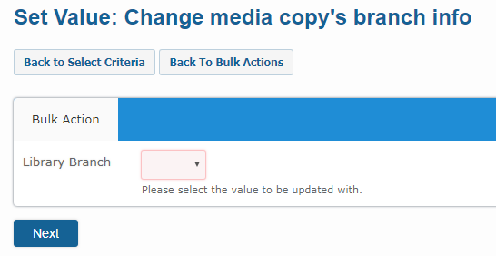

* Here select the `Library Branch` to which you wanted to updated with. Otherwise an error message will be shown.
* Click on `NEXT` button and you can review the changes of your media copy based on your given conditions.

    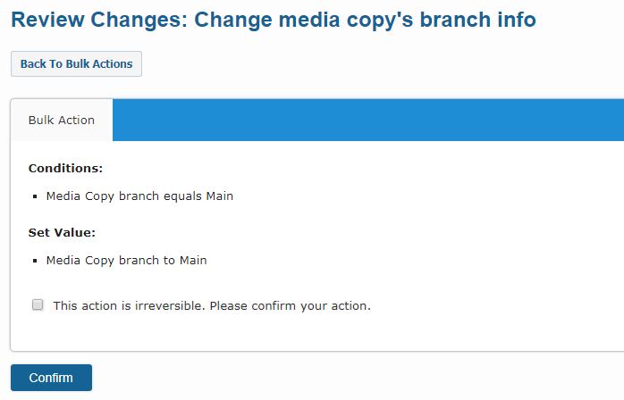

* Click on `Confirm` button and your bulk actions will be created.

    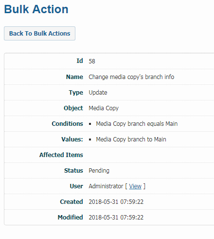

### Change Media Copy's Condition

To create a bulk action to Change Media Copy's Condition, please follow the below steps:

* Click on `New Bulk Action` button and choose Change Media Copy's Condition option from the dropdown menu. 

    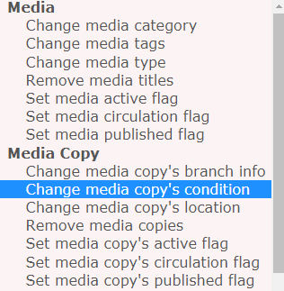

* A **Select Criteria** form will appear same as **Change Media Copy's Branch Info** section mention above and after selecting all the criteria click on the NEXT button.
* Now enter your desired Condition in the Set Value form and click on NEXT when you are done.

        

* Now you can review your changes and click on the confirm button.

    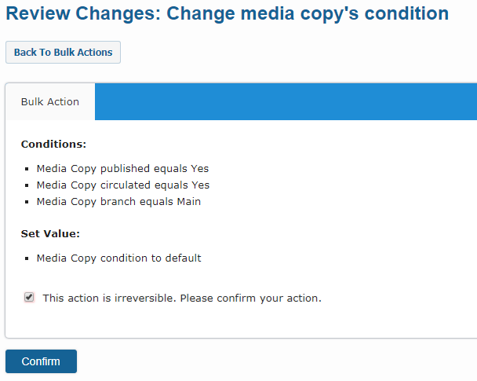

* Once you confirm it your bulk actions will be saved.

### Change Media Copy's Location

To create a bulk action to Change Media Copy's Location, please follow the below steps:

* Click on `New Bulk Action` button and choose Change Media Copy's Location option from the dropdown menu.

    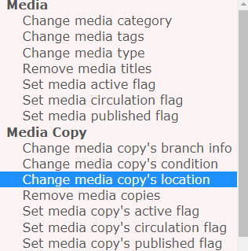

* Select one or more criteria from the **Select Criteria** form like before and click on NEXT button.
* Now you can choose the Change Media Copy's Location in the Set Value form and click on NEXT when you are done.

    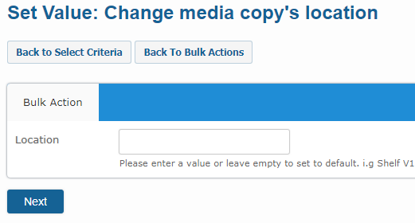

* You can review the changes and click on confirm button. Your bulk actions will be saved.

## Delete Copies

You can delete media copies using the bulk action method. When you delete copies, All related child copies and media bookings will be deleted by default. You can also choose to delete titles, authors, publishers and categories of the selected books.

To do so, please follow the below steps:

* Click on `New Bulk Action` and select the `Remove Media Copies` option.

     

* Select one or more criteria from the **Select Criteria** form like before and click on NEXT button.
* After click on **NEXT** button a form will shown like below.

    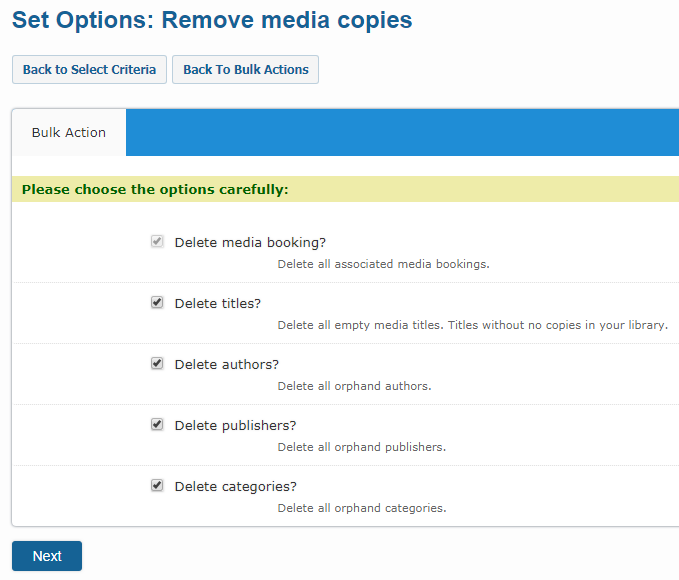   

* You can choose to delete related titles, authors, publishers or categories as your choice. Related media bookings will be deleted by default. Please choose the options very carefully.

    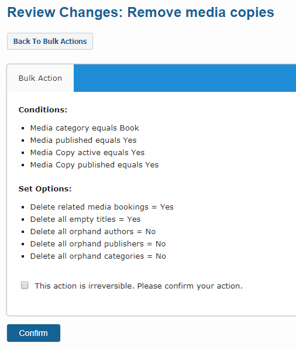

* Now review your changes and click on the confirm button. Your bulk actions will be saved.

### Set Media Copy's Active Flag

To create a New Bulk Action with the Set Media Copy's Active Flag, please follow the below steps:

* Click on `New Bulk Action` button and choose Set Media Copy's Active Flag from the dropdown menu.

    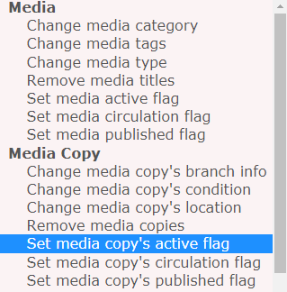 

* Select one or more criteria from the **Select Criteria** form like before and click on NEXT button.
* Now can choose the Set Media Copy's Active Flag in the Set Value form and click on NEXT when you are done.

    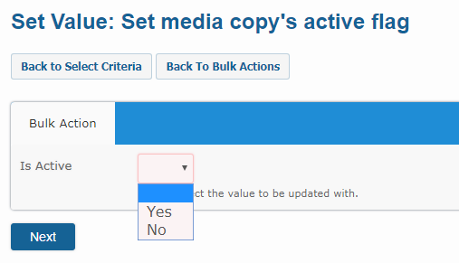

* Now can review your changes that you have made and click on the confirm button.
* Your bulk actions will be saved.

### Set Media Copy's Circulation Flag

To create a New Bulk Action with the Set Media Copy's Circulation Flag, please follow the below steps:

* Click on `New Bulk Action` button and select Set Media Copy's Circulation Flag like below.

    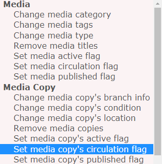

* Select one or more criteria from the **Select Criteria** form like before and click on NEXT button.
* Now you can choose the Set Media Copy's Circulation Flag in the Set Value form and click on NEXT when you are done.

    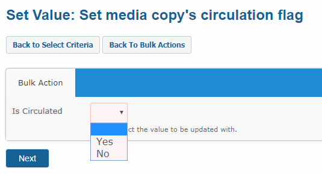 

* Now you can review your changes and click on the confirm button. Your bulk actions will be saved.

### Set Media Copy's Published Flag

To create a New Bulk Action with the Set Media Copy's Published Flag, please follow the below steps:

* Click on `New Bulk Action` button and select Set Media Copy's Published Flag like below.

    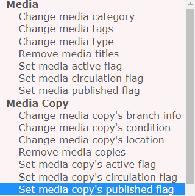

* Select one or more criteria from the **Select Criteria** form like before and click on NEXT button.
* Now you can choose the Set Media Copy's Published Flag in the Set Value form and click on NEXT when you are done.

    

* Now you can review your changes and click on confirm button. Your bulk actions will be saved.

## Update Members

You can use bulk action method to update only members information in your catalog. Such as booking quota, group, status, type etc

To do so, please follow the below steps:

* Click on `New Bulk Action` and you can see the **Member** options like below.

    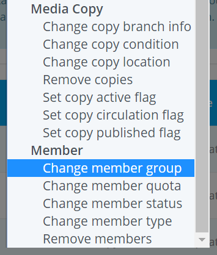

### Change Member's Booking Quota

To create a New Bulk Action to Change Member's Booking Quota, please follow the below steps:

* If you select the `Change Member's Booking Quota` a page will be shown like below.

    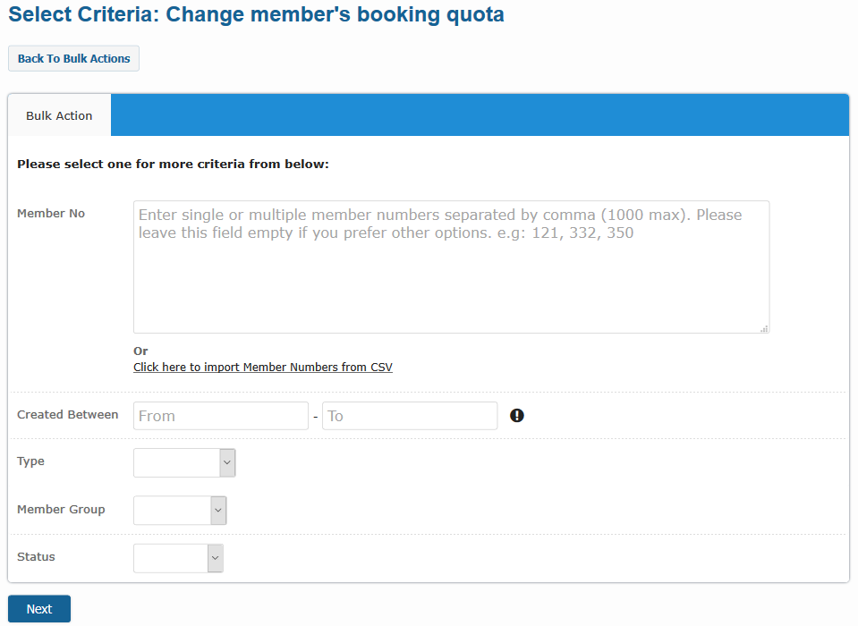

* Now you need to specify at least one conditions based on which records will be updated. You can specify more than one criteria to further narrow down the selection.
    - The first option that you can see is hte `Member No` where you can choose single or multiple member numbers separated by a comma or you can import them from your CSV file. You can leave this field empty if you do not want to enter this criteria.

        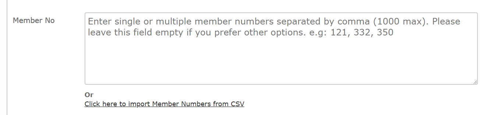 

    - Next is the `Created Between` option. You can choose the date between the Members are created.

        

    - The next option that you can see is the `Type` where you can choose any types of member.

        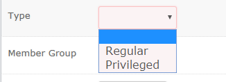 

    - Then you can choose the `Member Group` option.

    - The last one is the `Status` option. You can choose if the member's status is active or not.

        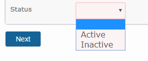

* Once you finished all the selection in the `Change Member's Booking Quota` criteria then click on the `NEXT` button and a page will be shown like below.

    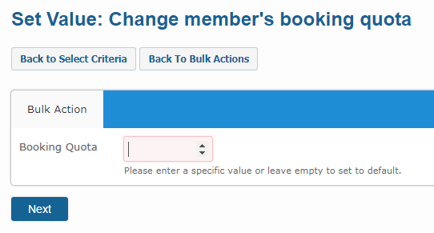 

* Now enter a specific value in the Change Member's Booking Quota Set Value form. You can leave this field empty if you do not want to enter this criteria.
* After selecting the destination **Booking Quota** click on the **NEXT** button. Now you can review the changes and then Confirm it.

    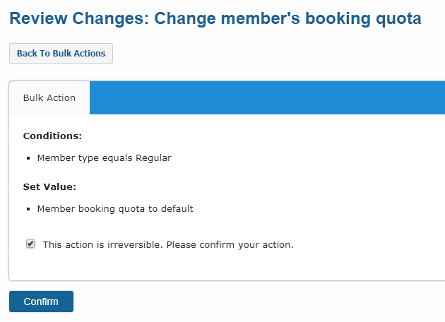    

* Click on `Confirm` button and your bulk actions will be created.

    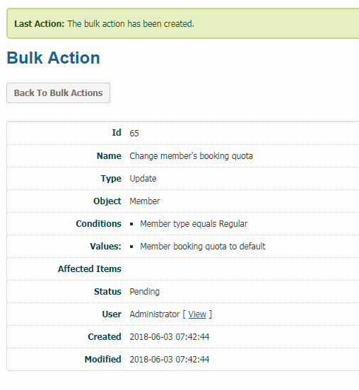 

### Change Member's Group

To create a bulk action to Change Member's Group, please follow the bellow steps:

* Click on the `New Bulk Action` button and choose Change Member's Group from the dropdown menu. 

    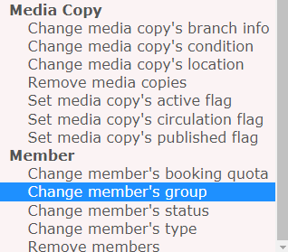 

* A **Select Criteria** form will appear same as **Change Member's Booking Quota** section mention above and after selecting all the criteria click on the NEXT button.
* Now enter your desired Member Gruop in the Set Value form and click on NEXT when you are done.

    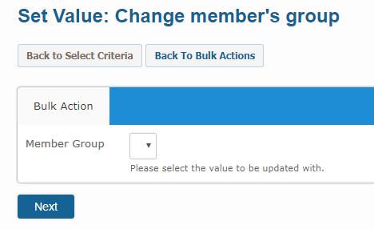 

* Now review your changes and click on the confirm button. Your bulk actions will be saved.

### Change Member's Status

To create a bulk action to Change Member's Status, please follow the bellow steps:

* Click on the `New Bulk Action` button and choose Change Member's Status from the dropdown menu. 

    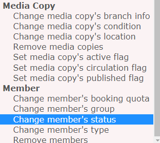 

* A **Select Criteria** form will appear same as **Change Member's Group** section mention above and after selecting all the criteria click on the NEXT button.
* Now you must have to select the Status in the Set Value form otherwise an error message will be shown.

    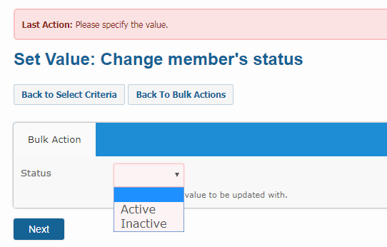 

* After selecting a Status click on the NEXT button.
* Now review your changes and click on the confirm button. Your bulk actions will be saved.

### Change Member's Type

To create a bulk action to Change Member's Type, please follow the below steps:

* Click on `New Bulk Action` button and choose Change Member's Type option from the dropdown menu. 

    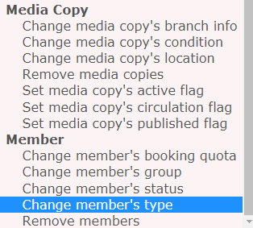

* A **Select Criteria** form will appear same as **Change Member's Status** section mention above and after selecting all the criteria click on the NEXT button.
* Now you must have to select your desired Member Type in the Set Value form otherwise it will show an error message.

    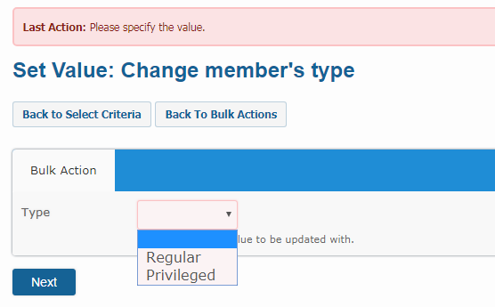

* Click on the NEXT button when you are done.
* Now review your changes and click on the confirm button. Once you confirm it your bulk actions will be saved.

## Delete Members

You can delete members using the bulk action method. When you delete members, All associated media bookings including reservations, issued items, overdue items and all associated login access to members section will be also deleted by default. 

To do so, please follow the below steps:

* Click on `New Bulk Action` and select the `Remove Media Copies` option.

    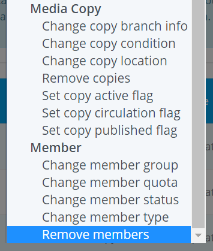 

* Select one or more criteria from the **Select Criteria** form like before and click on NEXT button.
* After click on **NEXT** button a form will be shown like below.

    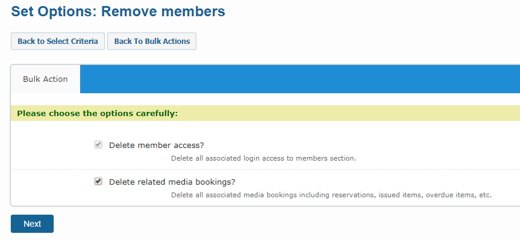   

* You can choose to delete related media bookings including reservations, issued items, overdue items. Related member access will be also deleted by default. Please choose the options very carefully.

    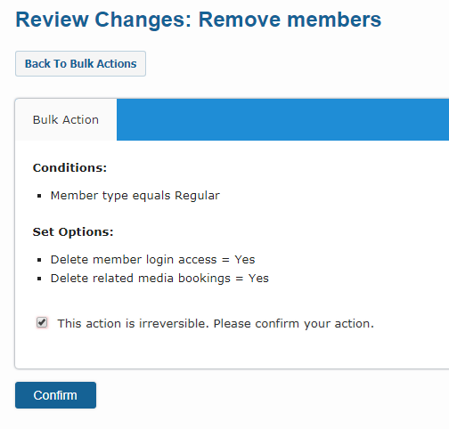

* Now review your changes and click on the confirm button. Your bulk actions will be saved.
