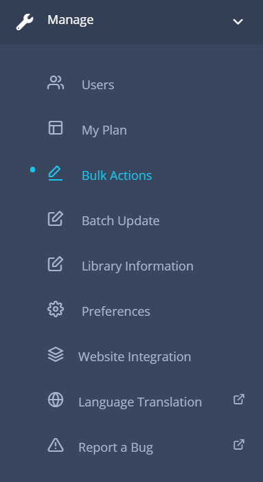
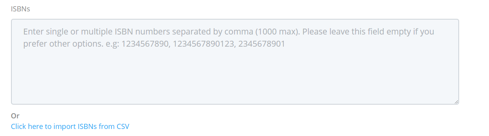
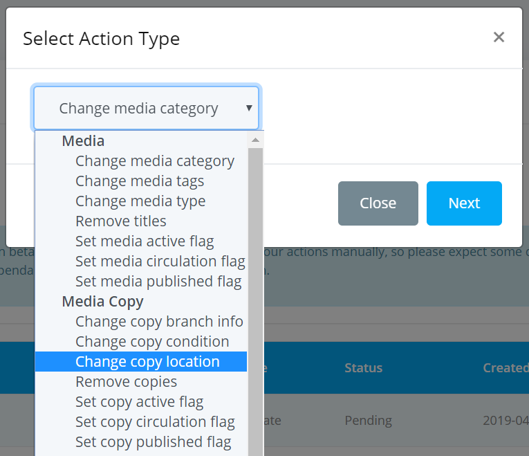
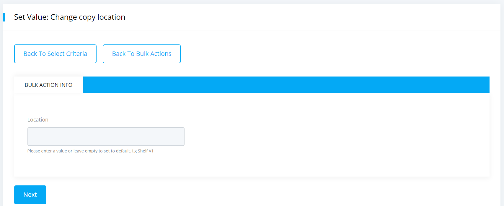
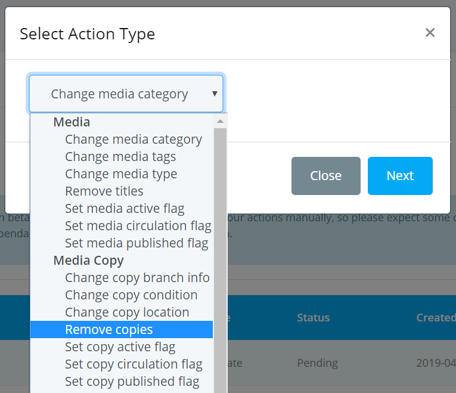
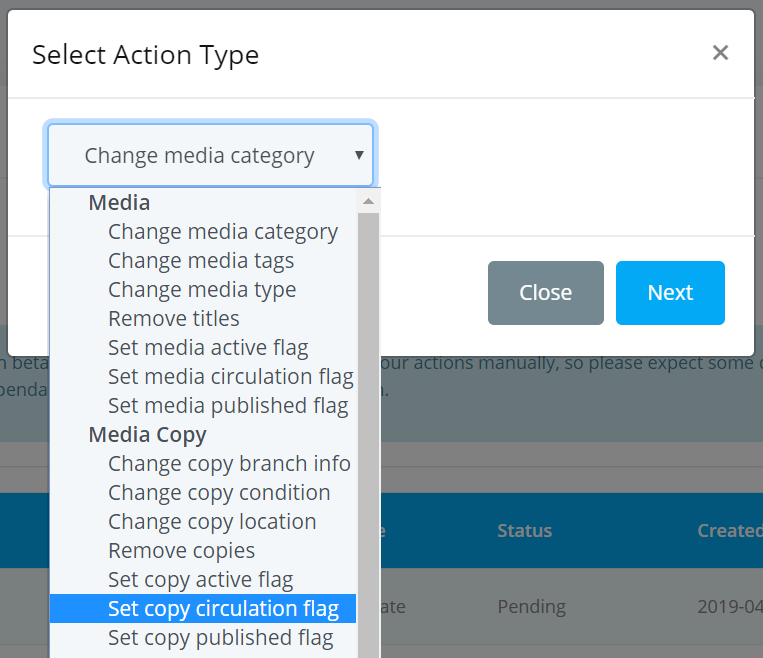
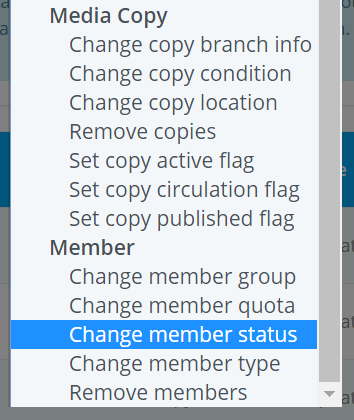

# Bulk Actions

Bulk actions method is used to update or delete your book, book copy or member records in bulk. You can use this option to partially or fully select records from your library and apply bulk update or delete operation to those records matching the criteria.

To do bulk actions, please follow the below steps:

* At first login to your library.
* Please go to the `Dashboard -> Others -> Bulk Actions` option from the dropdown menu.

    

* After clicking on `Bulk Actions` a page will be appeared like below.
  
    

* Now if you click on `New Bulk Action` button then you can select the type of your bulk actions.

    

* Here `Change media category` is the default type. You can also select the other types of action per your need.

## Update Medias

You can use bulk action method to update all the media information in your catalog such as category, tags, type, titles active flags etc.

To do so, please follow the below steps:

* Click on `New Bulk Action` button and a select action type form will be appeared.
* In this form various types of action are given like below.

    

* You can select your preferred action type from which you wanted to update or delete your media.

### Change Media Category 

* If you select `Change media category` then a form will be appeared like below.

    

* Now you need to specify at least one condition based on which the records will be updated. You can specify more than one criteria to further narrow down the selection. 
    - The first option that you can see is the `Media Type` where you can select the types of media per your need.

         

    - Then you can select the `Category` option as shown below.

         

    - The next one is the `ISBNs` where you can enter single or multiple ISBN numbers separated by a comma or you can import them from your CSV file. You can leave this field empty if you do not want to enter this criteria.

         

    - Next is the `Created Between` option where you can give the date range for the medias.

        

    - Then next one is the `Active` option where you can select if the media is active or not.

        

    - Then you can select the `Published` and `Circulted` option same as the `Active` option mentioned above.  

* Once you finished all the selection in the `Change media category` criteria, please click on the `NEXT` button and a page will be appeared like below.

     

* Here please select the `Category` from which you wanted to updated with. Otherwise an error message will be shown.

    

* After selecting the destination **Category** click on the `NEXT` button. Now you can review your changes like below.

        

* Click on `Confirm` button and your bulk actions will be saved.

    

* To processed your bulk actions immediately please click on the `Process this action?` button.

### Change Media Tags

To create a bulk action for changing media tags, please follow the bellow steps:

* Click on the `New Bulk Action` button and select `Change media tags` from the dropdown menu. 

     

* A **Select Criteria** form will appear same as **Change Media Category** section mention above and after selecting all the criteria click on the next button.
* Now enter your desired tags in the **Set Value** form and click on `NEXT` button when you are done.

     

* Now review your changes and click on the confirm button. Your bulk actions will be saved.
* Finally click on the `Process this action?` button for processing your actions.

### Change Media Type

To create a bulk action for changing media type, please follow the below steps:

* Click on `New Bulk Action` button and select `Change media type` option from the dropdown menu. 

    

* A **Select Criteria** form will appear same as **Change Media Category** section mention above and after selecting all the criteria click on the next button.
* Now you must have to select your desired media type in the **Set Value** form otherwise it will shown an error message.
* You can select any types of media according to your need and click on the `NEXT` button when you are done.

    

* Now review your changes and click on the confirm button. Once you confirm it your bulk actions will be saved. 
* Then you need to process your actions by clicking on `Process this action?` button.

## Delete Medias

You can delete media titles using the bulk action method. When you delete titles, all related child copies and media bookings will be deleted by default. You can also delete the authors, publishers and categories of the selected books.

To do so, please follow the below steps:

* Click on the `New Bulk Action` button and select the `Remove titles` option.

     

* Select one or more criteria from the **Select Criteria** form like before.
* Then click on `NEXT` button and a form will be shown like below.

    

* You can also delete the related authors, publishers or categories if you want. Related copies and media bookings will be deleted by default. Please choose this options very carefully.

    

* Now review your changes and click on the confirm button. Finally click on the `Process this action?` button and your medias will be deleted.

### Set Media Active Flag

To create a bulk action with the media active flag, please follow the below steps:

* Click on `New Bulk Action` button and select `Set media active flag` from the dropdown menu.

     

* Select one or more criteria from the **Select Criteria** form like before and click on `NEXT` button.
* Now select the value for media active flag in the **Set Value** form and click on the next button when you are done.

    

* Now review your changes that you have made and click on the confirm button. Your bulk actions will be saved. 
* Then please click on the `Process this action?` button and your actions will be processed.

### Set Media Circulation Flag

To create a bulk action with the media circulation flag, please follow the below steps:

* Click on `New Bulk Action` button and select `Set media circulation flag` like below.

    

* Select one or more criteria from the **Select Criteria** form like before and click on `NEXT` button.
* Now select the value for media circulation flag in the **Set Value** form and click on the next button when you are done.

     

* Now you can review your changes and click on the confirm button. Your bulk actions will be saved. 
* Finally please process your actions by clicking on `Process this action?` button.

### Set Media Published Flag

To create a bulk action with the media published flag, please follow the below steps:

* Click on `New Bulk Action` button and select `Set media published flag` like below.

    

* Select one or more criteria from the **Select Criteria** form like before and click on `NEXT` button.
* Now set value for the media published flag in the **Set Value** form and click on the next button when you are done.

    

* Now you can review your changes and click on confirm button. Your bulk actions will be saved.
* To process your actions please click on `Process this action?` button.

## Update Copies

You can use bulk action method to update only the media copies information in your catalog such as branch, location, active flags etc.

To do so, please follow the below steps:

* Click on `New Bulk Action` button and you can see the **Media Copy** options like below.

    

### Change Media Copy's Branch Info

To create a bulk action for changing media copy's branch information, please follow the below steps:

* If you select the `Change copy branch info` a page will be appeared like below.

    
    

* In this page you can see that there are two types of conditions. The first one is the `Media Conditions` which is as same as the **Update Medias** mentioned above. But here you also need to fulfill the second conditions which is the `Media Copy Conditions`

* In `Media Copy Conditions` you need to specify at least one condition based on which the records will be updated. You can specify more than one criteria to further narrow down the selection. 

    - The first one is the `ASN Numbers` where you can enter single or multiple accession numbers separated by a comma or you can import them from your CSV file. You can leave this field empty if you do not want to enter this criteria.

        

    - Then you can select the `Copy Branch` option as shown below.

        

    - The next one is the `Copy Location` option where you can select the location of your media copies.

    - Next is the `Created Between` option where you can give the date range for the media copies.

        

    - Next one is the `Copy Active` option where you can select if the copy is active or not.

        

    - Then you can select the `Copy Published` and `Copy Circulted` option same as the **Copy Active** option.

* After selected one or more options click on the `NEXT` button and a page will be shown like below.

    

* Here select the `Library Branch` to which you wanted to updated with. Otherwise an error message will be shown.
* Click on `NEXT` button and you can review the changes like below.

    

* Click on `Confirm` button and your bulk actions will be saved.

    

* At last click on the `Process this action?` button for processing your actions.

### Change Media Copy's Condition

To create a bulk action for changing media copy's condition, please follow the below steps:

* Click on `New Bulk Action` button and select `Change media copy's condition` option from the dropdown menu. 

    

* A **Select Criteria** form will appear same as **Change Media Copy's Branch Info** section mention above and after selecting all the criteria click on the next button.
* Now enter your desired condition in the **Set Value** form and click on `NEXT` button when you are done.

        

* Now you can review your changes and click on the confirm button.

    

* Once you confirm it your bulk actions will be saved.
* Finally click on the `Process this action?` button to process your actions.

### Change Media Copy's Location

To create a bulk action for changing media copy's location, please follow the below steps:

* Click on `New Bulk Action` button and select `Change copy location` option from the dropdown menu.

    

* A **Select Criteria** form will appear same as **Change Media Copy's Branch Info** section mention above and after selecting all the criteria click on `NEXT` button.
* Now you can set value for the media copy's location in the **Set Value** form and click on the next button when you are done.

    

* Now you can review your changes and click on confirm button. Your bulk actions will be saved.
* Finally click on the `Process this action?` button and your actions will be processed.

## Delete Copies

You can delete media copies using the bulk action method. When you delete copies, all related child copies and media bookings will be deleted by default. You can also delete titles, authors, publishers and categories of the selected books.

To do so, please follow the below steps:

* Click on `New Bulk Action` button and select the `Remove Copies` option.

     

* Select one or more criteria from the **Select Criteria** form like before and click on `NEXT` button. A form will be shown like below.

       

* You can delete related titles, authors, publishers or categories if you need. Related media bookings will be deleted by default. Please choose this options very carefully.
* Click on the next button and a form will be appeared like below.

    

* Now review your changes and click on the confirm button.
* At last click on the `process this action?` button and all your selected media copies will be deleted from your library catalog.

### Set Media Copy's Active Flag

To create a bulk action with the media copy's active flag, please follow the below steps:

* Click on `New Bulk Action` button and select `Set copy active flag` from the dropdown menu.

     

* Select one or more criteria from the **Select Criteria** form like before and click on `NEXT` button.
* Now in the **Set Value** form please set the value for media copy's active flag and click on the next button when you are done.

    

* Now review your changes that you have made and click on the confirm button.
* Your bulk actions will be saved. For processing your actions please click on the `Process this action?` button.

### Set Media Copy's Circulation Flag

To create a bulk action with the media copy's circulation flag, please follow the below steps:

* Click on `New Bulk Action` button and select `Set copy circulation flag` like below.

    

* Select one or more criteria from the **Select Criteria** form like before and click on `NEXT` button.
* Now set the value for media copy's circulation flag in the **Set Value** form and click on the next button when you are done.

     

* Now review your changes and click on the confirm button. Your bulk actions will be saved. To process your actions please click on the `Process this action?` button.

### Set Media Copy's Published Flag

To create a bulk action with the media copy's published flag, please follow the below steps:

* Click on `New Bulk Action` button and select `Set copy published flag` like below.

    

* Select one or more criteria from the **Select Criteria** form like before and click on `NEXT` button.
* Now set the value for media copy's published flag in the **Set Value** form and click on the next button when you are done.

    

* Now review your changes and click on the confirm button. Then for processing your actions please click on the `Process this action?` button.

## Update Members

You can use bulk action method to update the members information in your catalog such as booking quota, group, status, type etc.

To do so, please follow the below steps:

* Click on `New Bulk Action` button and you can see the **Member** options like below.

    

### Change Member's Group

To create a bulk action for changing member group, please follow the bellow steps:

* If you select the `Change member group` option then a page will be shown like below.

    

* Now you need to specify at least one condition based on which records will be updated. You can specify more than one criteria to further narrow down the selection.
    - The first option that you can see is the `Member No` where you can enter single or multiple member numbers separated by a comma or you can import them from your CSV file. You can leave this field empty if you do not want to enter this criteria.

         

    - Next is the `Created Between` option where you can give the date range for the members.

        

    - The next option that you can see is the `Type` where you can select your member type.

         

    - Then you can select the group of your member from the `Member Group` dropdown menu.

    - The last one is the `Status` option where you can select if the status of your member is active or not.

        

* Once you finished all the selection in the `Change member group` criteria please click on the `NEXT` button and a page will be shown like below.

     

* Now enter a specific value for the member group in the **Set Value** form. You can leave this field empty if you do not want to enter this criteria.
* After selecting the destination member group click on the `NEXT` button. Now you can review your changes like below.

        

* Click on `Confirm` button and your bulk actions will be saved.

     

* At last click on the `Process this action?` button and your actions will be processed.

### Change Member's Quota

To create a bulk action for changing member booking quota, please follow the below steps:

* Click on the `New Bulk Action` button and select `Change member quota` from the dropdown menu. 

     

* A **Select Criteria** form will appear same as **Change Member's Group** section mention above and after selecting all the criteria click on the `NEXT` button.
* Now enter the value for member booking quota in the **Set Value** form and click on the next button when you are done.

     

* After review your changes please click on the confirm button and your bulk actions will be saved.
* For processing your actions please click on the `Process this action?` button.

### Change Member's Status

To create a bulk action for changing member status, please follow the below steps:

* Click on the `New Bulk Action` button and select `Change member status` from the dropdown menu. 

     

* A **Select Criteria** form will appear same as **Change Member's Group** section mention above and after selecting all the criteria click on the `NEXT` button.
* Now you must have to select the status in the **Set Value** form otherwise an error message will be shown.

     

* After selecting a status click on the next button.
* Now review your changes and click on the confirm button. Your bulk actions will be saved.
* Finally click on the `Process this action?` button and your actions will be processed.

### Change Member's Type

To create a bulk action for changing member's type, please follow the below steps:

* Click on `New Bulk Action` button and select `Change member type` option from the dropdown menu. 

    

* A **Select Criteria** form will appear same as **Change Member's Group** section mention above and after selecting all the criteria click on the `NEXT` button.
* Now you must have to select your desired member type option in the **Set Value** form otherwise an error message will be shown.

    

* Click on the next button when you are done.
* Now review your changes and click on the confirm button. Once you confirm it your bulk actions will be saved.
* Please remember to click on the `Process this action?` button otherwise your created actions will not be processed.

## Delete Members

You can delete your library members using the bulk action method. When you delete members, all associated media bookings including reservations, issued items, overdue items and all associated login access to members section will also be deleted by default. 

To do so, please follow the below steps:

* Click on `New Bulk Action` button and select the `Remove members` option.

     

* Select one or more criteria from the **Select Criteria** form like before and click on the `NEXT` button.
* A set options form will be shown like below.

       

* You can choose to delete related media bookings including reservations, issued items, overdue items. Related members with login access will also be deleted by default. Please choose this options very carefully.

    

* Now review your changes and click on the confirm button. Your bulk actions will be saved.
* Finally click on the `Process this action?` button and all your selected members will be deleted from your library.
