# Cataloging

Cataloging new books / items in **Librarika** platform is super easy. We have tried our level best to keep the interface simplified, so that our librarians can spent more time with their daily duties instead of working with complex cataloging tools.

Our simplified cataloging interface enables novice user or people with very limited experience to manage their library perfectly. This makes **Librarika** a suitable platform for schools, small colleges, corporate offices, NGOs, personal libraries where dedicated skilled librarians are not always available.

## Basics

**Librarika** organizes books under two logical entities: Media and Media Copy. When a new book is added to a library, master book information is added once as `Media` entity, we also call this as title or title record. Other related info is added to the `Media Copy` entity with reference to the parent `Media` entity. Then when another copy of the same book is added, only a new `Media Copy` entity is created with reference to the previous parent `Media` entity.

##### Media entity

Contains non-repeating fields such as title, ISBN, ISBN13, description, abstract, publisher, authors, cover photos etc.

##### Media Copy entity

Contains uniquely identifiable data such as accession number, copy number, location, branch as well as some other information related to the copy.

##### Relationship
```
 		Media (Single)
			  |
 	 	 	   --- Media Copies (Multiple)
```

##### Accession number:

When a new item is added to the catalog, the system assigns an auto-generated unique incremental accession number (numeric only) to each copy for your library. This accession number is then used to uniquely identify that specific copy during check-out / check-in / other system level activities. 

System usually assigns this number starting form 1. The auto generation logic for new accession number is as below:

	accession_number = max(accession_number) + 1

The same accession number field is used to generate barcode labels. If you plan to use barcode labels, you may need to start with a larger number (such as 100001) as some barcode scanner can not read small barcode properly.

The auto generation of accession number doesn't happen when you do bulk import of books or items. In this case, system saves the value of accession number field right from the provided source file without checking the uniqueness. This is to provide the flexibility to the librarians so that they can migrate their existing barcodes easily.

Tips: If you edit the accession number of a book copy to 100001 which is the max accession value in your library, then next accession will be 100002. You can use this tips to start your library's accession number from any arbritary position. 

---

## Authors

You can add an author (also known as a writer) of your catalog items from our `Authors` section. Using this section you can add, view, edit or delete an author.

To use this section, please follow the below steps:

* Please go to the `Dashboard -> Catalogs -> Authors` section.
* Authors form will be displayed like below.

	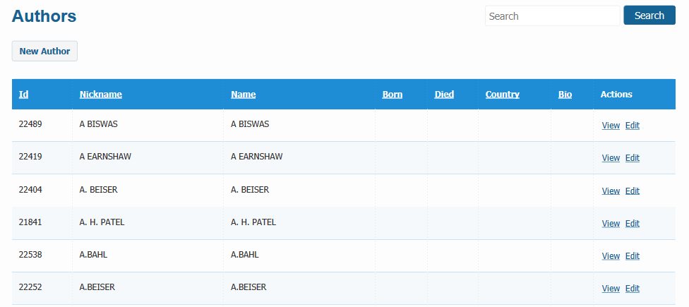

* Click on the `New Author` button.
* An add author form will be appeared like below.

	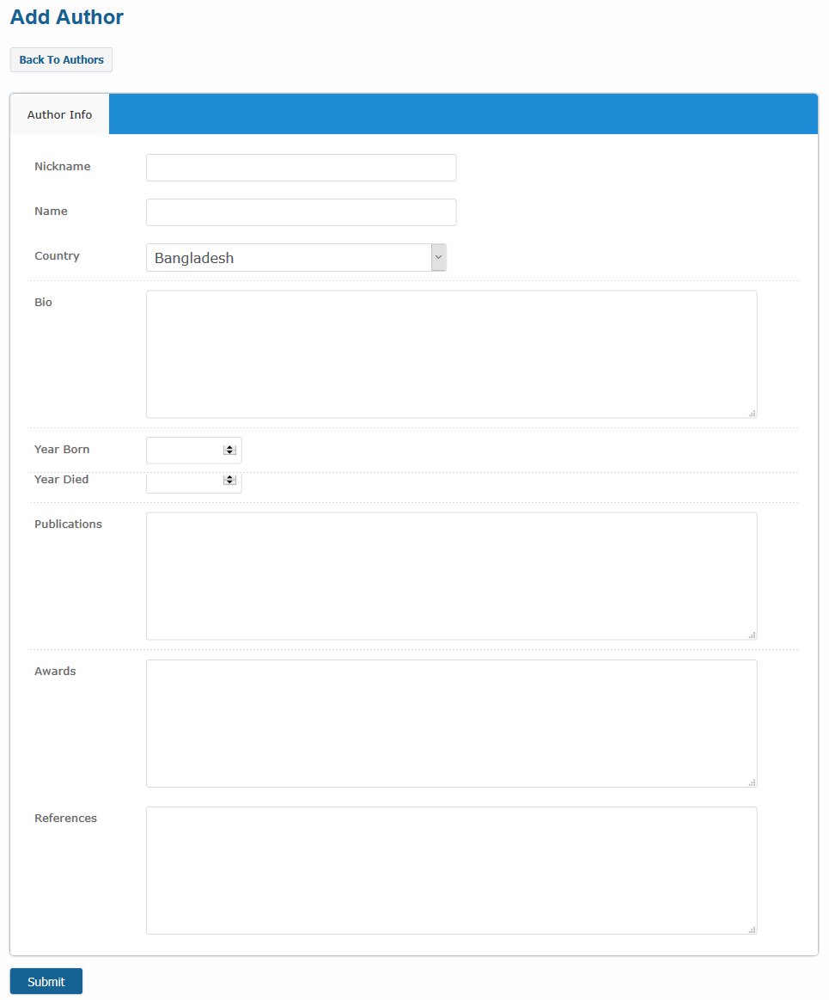

* Enter necessary information regarding the author. Only nickname, name and country fields are mandatory.
* Click on the `Submit` button when you are done.
* A new author record will be created.

### Edit Author

You can edit an author information from `Authors` sction. 

* Please go to the `Dashboard -> Catalogs -> Authors` section.

* Locate the author you want to edit from authors section and click on the `Edit` link on the right to that author.
* Then the below form will appear with existing information.

	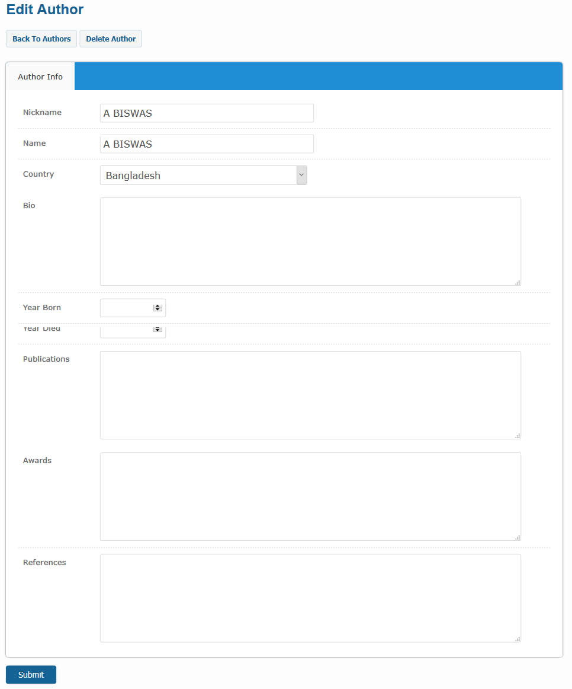

* Do make necessary changes to the author entity.
* Click on the `Submit` button when you are done and your changes will be saved.

### Delete Author

You can delete an author from your library catalog. You can go to either view page or edit page from authors section to delete a specific author of your catalog item.  

* Please go to the `Dashboard -> Catalogs -> Authors` section.
* Locate the author you want to delete from authors section and click on the `View` link on the right to that author.
* An author view page will be appeared with its related media information like below. 
* Click on the `Delete Author` button and confirm your delete action.

	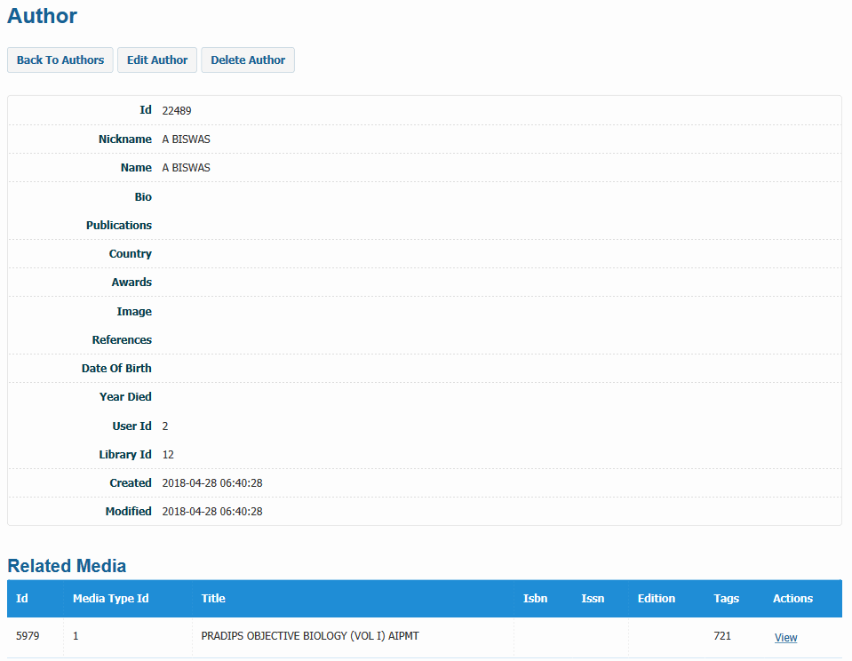

* The record will then be deleted from the library.

---

## Publishers

You can add a publisher of your catalog items from our `Publishers` section. Using this section you can handle all the publishers with their necessary information.

To use this section, please follow the below steps:

* Please go to the `Dashboard -> Catalogs -> Publishers` section.
* Publishers form will be displayed like below.

	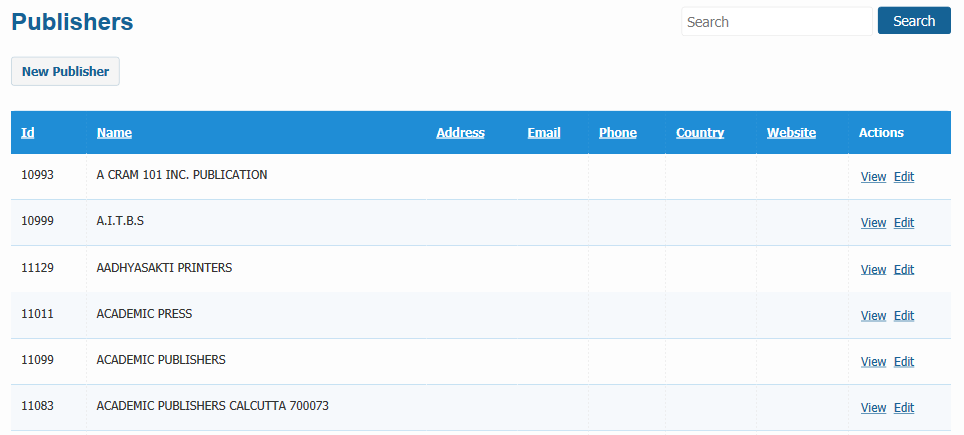

* Click on the `New Publisher` button.
* An add publisher form will be appeared like below.

	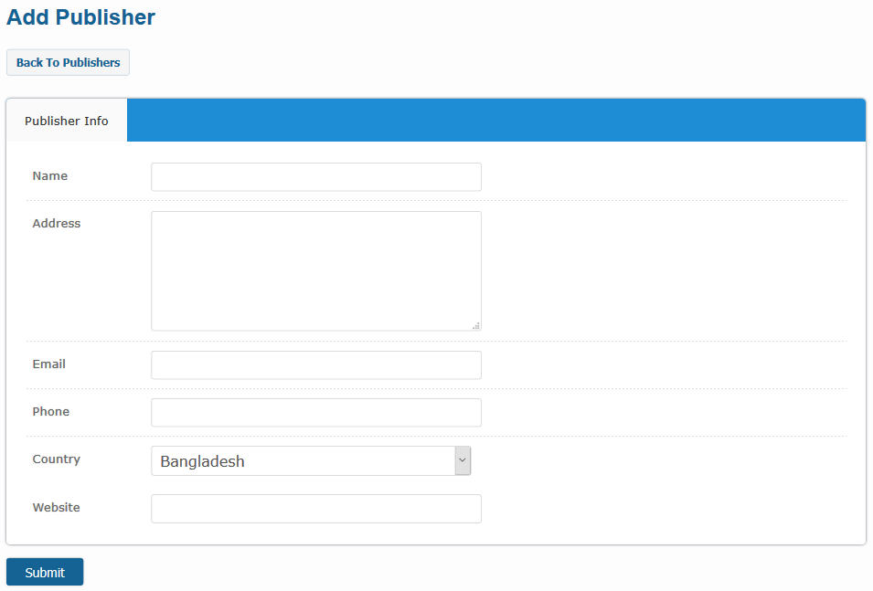

* Enter necessary information regarding your publisher. Only the name and country fields are mandatory.
* Click on the `Submit` button when you are done.
* A new publisher record will be created. 

### Edit Publisher

You can edit publisher information from `Publishers` section. 

* Please go to the `Dashboard -> Catalogs -> Publishers` section.

* Locate the publisher you want to edit from publisher section and click on the `Edit` link on the right to that publisher.
* Then the below form will appear with existing information.

	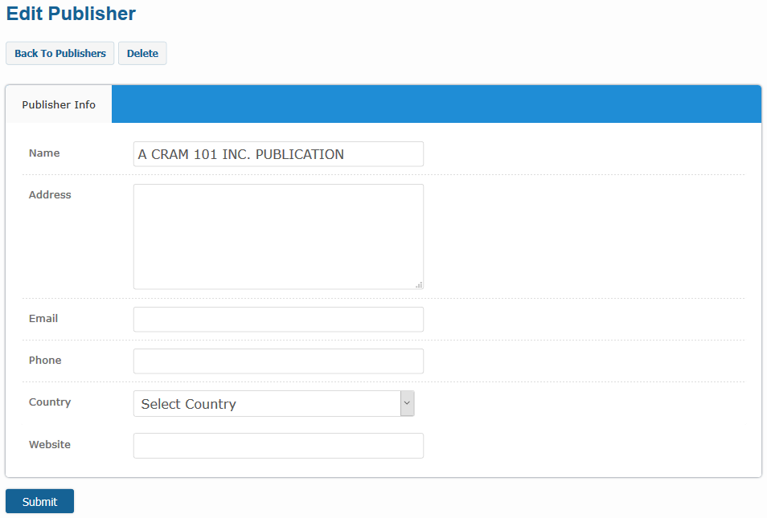

* Do make necessary changes to the publisher entity.
* Click on the `Submit` button when you are done and your changes will be saved.

### Delete Publisher

You can delete a publisher from your library catalog. Please go to the [Edit Publisher](#edit-publisher) section and the edit publisher form will be displayed with a button named `Delete` on the top of the section. Click on it and confirm your delete action. 

---

## Categories

Categories is the section where you can categorize all your library items. From this section you can also find out how many items are available under each of your category.

To use this section, please follow the below steps:

* Please go to the `Dashboard -> Catalogs -> Categories` section.
* categories form will be displayed like below.

	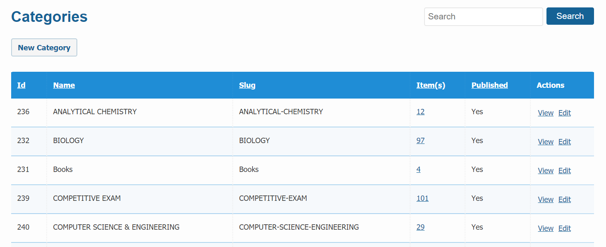

* If you click on the `View` link then can see all the details about your category.
* Click on the `New Category` button.
* An add category form will be appeared like below.

	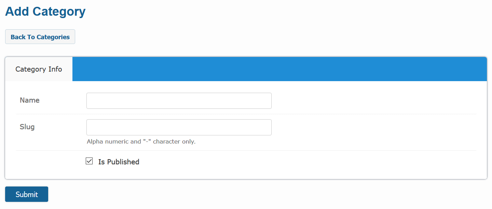

* Enter necessary information regarding your category. 
* Click on the `Submit` button when you are done.
* A new category record will be created.

### Edit Category

You can edit category information from `Categories` section. 

* Please go to the `Dashboard -> Catalogs -> Categories` section.

* Locate the category you want to edit from categories section and click on the `Edit` link on the right to that category.
* Then the below form will appear with existing information.

	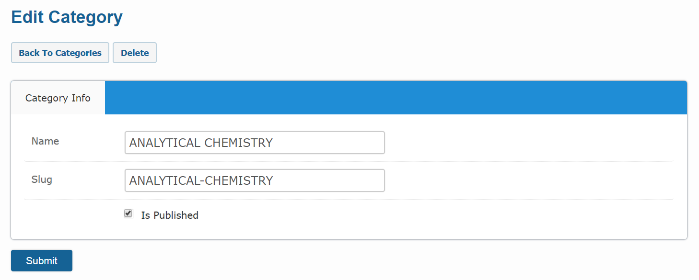

* Do make necessary changes to the category entity.
* Click on the `Submit` button when you are done and your changes will be saved.

### Delete Category

You can delete a category from your library catalog. Please go to the [Edit Category](#edit-category) section and in the edit category page you can see a `Delete` button on the top of this page. Click on it and confirm your delete action.

---

## Tags

Tags is the section where you can add a tag for your library catalog. You can also check under which catalog item you have added your tag.

To use this section, please follow the below steps:

* Please go to the `Dashboard -> Catalogs -> Tags` section.
* The tags form will be displayed like below.

	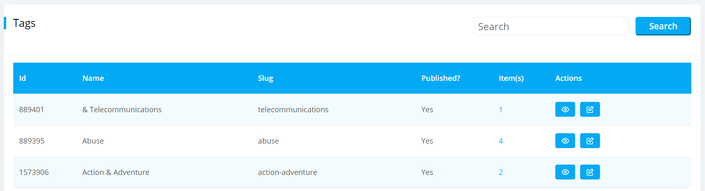

* If you click on the `View` link then you can see all the details about your tag.

	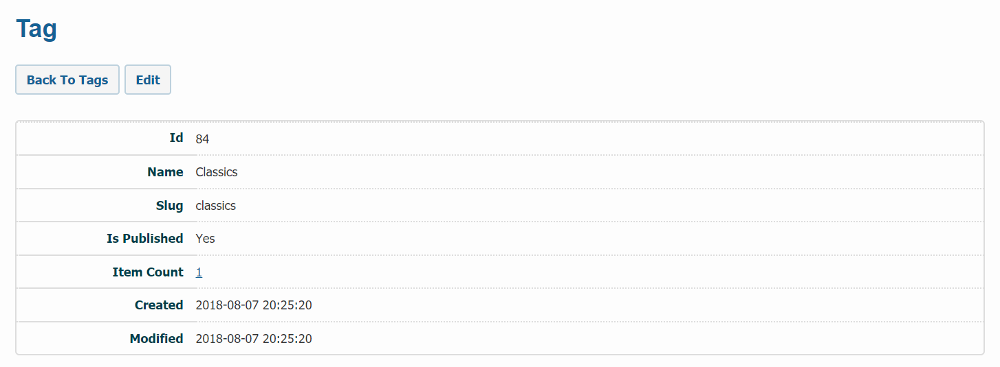

* If you want to remove tag from your catalog items then click on the `Edit` link and the edit tag form will appear like below. 

	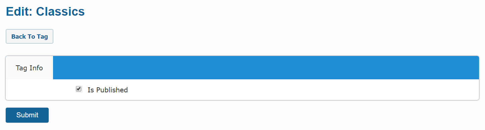

* Now uncheck the `Is_Published` checkbox and click on the `Submit` button then your tag will be removed.

---

## Reviews

Reviews is the section where your library members can post a review on different library items according to their choice. For posting a review your library member need to log in first.

To use this section, please follow the below steps:

* Please go to the `Dashboard -> Catalogs -> Reviews` section.
* The reviews form will be displayed like below.

	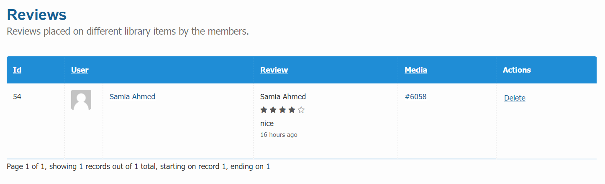

* If you want to remove review from your catalog items then click on the `Delete` link on the right to that review.

---

## Media

You can access all your catalog items along with their associated copy's information from the `Dashboard -> Catalogs -> Catalog Items` section. Clicking on the `View` link next to a Catalog Item will display the item detail containing all the copies. You can edit / modify / delete those information for this same detail page.

### Smart Add

Smart add method lets you easily add book's information from the Internet. All you need is the ISBN number to catalog a new book. 

Note: Please treat this smart add method as an added feature, not a complete replacement of the `Manual Add` method.

To use this method, please follow the below steps:

* Please go to the `Dashboard -> Catalogs -> Catalog Items` section.
* Click on the `Smart Add` button.
	
	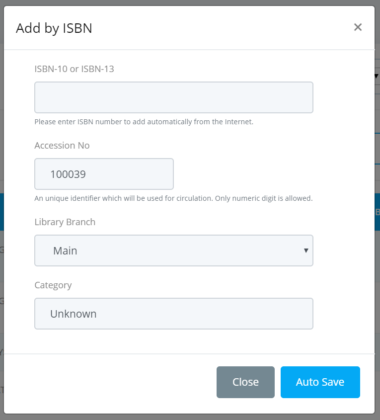

* Enter the ISBN number of the book you want to add to your catalog.
* Select the branch under which the book to be added. 
* Specify a category under which the book to be added.
* Click the `Auto save` button.
* System will automatically find the matching book from the Internet and add to your catalog.
* If successful, system will show a confirmation message with the title name and view page link.

Related information:

* If the book is already exist in your catalog, system will prompt the `Add Copy` form to add a new copy instead of adding a new `Media` record.
* An associated `Media copy` record will also be created automatically. You are free to make any changes to the newly created copy record as you feel necessary.
* Though `Smart Add` gets book information from various sources, there is no guarantee that it will get every book information from the Internet even if they are available.

### Manual Add

You can add media using our `Manual Add` method. This method is suitable when you don't find book using the "Smart Add" method.

To use this method, please follow the below steps:

* Please go to the `Dashboard -> Catalogs -> Catalog Items` section.
* Click on the `Manual Add` button.
* System will display the Add Media form.
	
	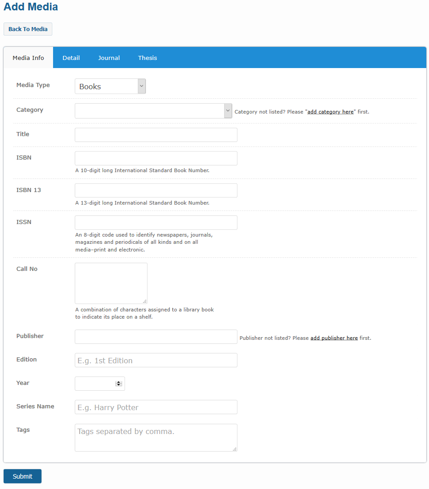

* Enter book information with the details. Only the Title field is mandatory.
* Click on the `Submit` button when you are done.
* The data will be saved and you will be redirect to the view detail page.
* Add relevant author information from this view page. You can add multiple authors one by one.

An associated `Media copy` record will be created automatically. You are free to make any changes to the newly created copy record as you feel necessary.


### Bulk Import

Librarika support bulk import of catalog items in CSV formats.

#### a. Prepare your data

* Read our [Import Items](https://demo.librarika.com/spages/import-items) detail instructions article for more critical information.
* See our sample google spread sheet at [Sample Import Format](https://docs.google.com/spreadsheets/d/1MOphgqXTbOs2YvzvFDjIVAzS8Z7aji58bpuVmDbTnb8/edit?usp=sharing).
* Use google sheets to avoid UTF-8 encoding issue with Microsoft Excel. [Optional] 
* Download the final CSV file directly from google docs using `File -> Download as -> Comma Separated Values (.csv)` to avoid issues. [Optional] 

#### b. Check List

Please make sure followings before you go ahead with importing your data:

* Column names must be match exactly to our sample format. 
* Column names are case-sensitive.
* The source file is in correct CSV format. Use google sheets if possible.
* The CSV file is UTF-8 encoded. MS Excel produce non UTF-8 csv file.
* Numeric columns contain numeric values. No string characters in numeric fields.
* Accession number values are unique and not empty.
* Books with multiple copies have sequential copy number starting from 1.

#### c. Import Items

1. Go to `Dashboard -> Catalogs -> Catalog Items` section.
2. Click on `Import Items` button.
3. Select data format, specify the CSV file and select branch name.
4. Click on `Submit` button to submit the form.
5. If everything is all right, you will see your data to review. Please review them carefully.
6. Confirm the data and click on `Save` button.
7. You will see a confirmation message with number of items added into the system.
8. If same book is provided multiple times, only one media entity will be created. And for each book, a media copy record associated to that parent media record will be created.

Note: When you enter multiple copies of the same book, they will be added a copy under the same title, as a result you will see actual title counts in your catalog smaller than the number of records you have uploaded from the csv file.

### Edit Media

You can edit media information from the `Catalog Items` page.

* Please go to the `Dashboard -> Catalogs -> Catalog Items` section.

* Locate the item you want to edit from your catalog and click on the `View` link on the right to that item.

	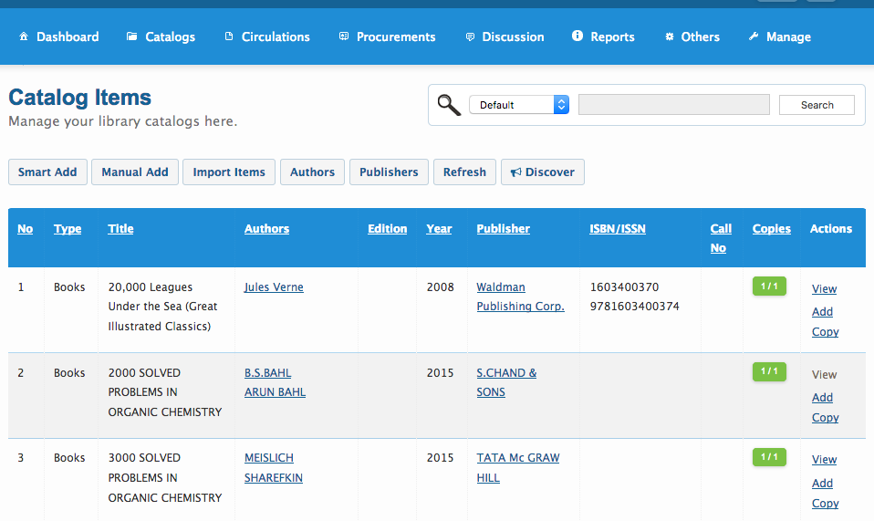

* Then in the media view page click on the `Edit Item` button, the below form will appear with existing information.
	
	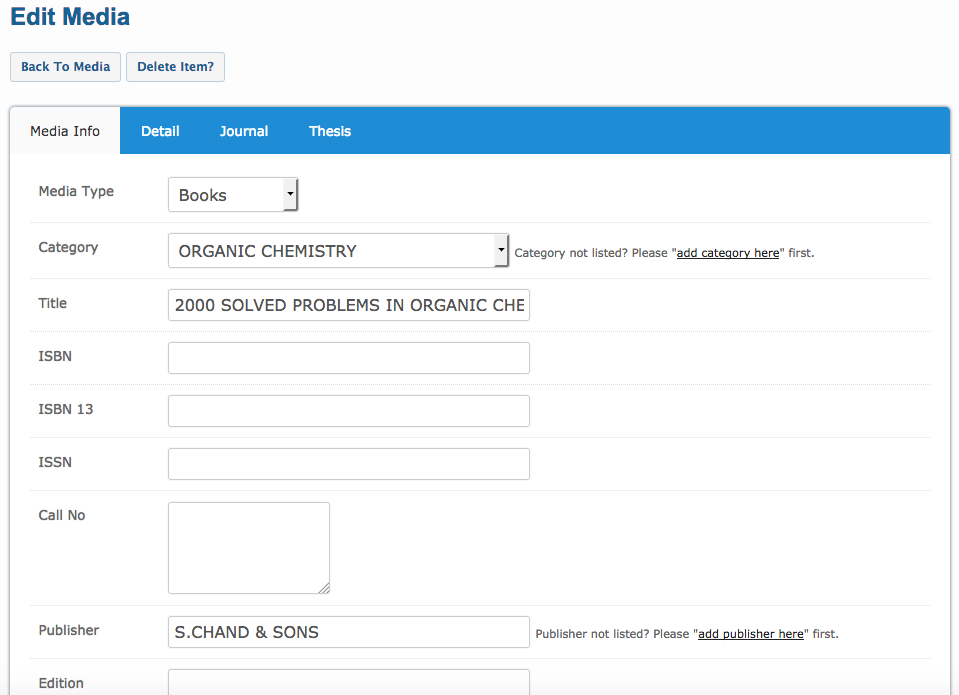

* Do make necessary changes to the media entity.
* Click on the `Submit` button when you are done and your changes will be saved.

### Delete Media

You can delete a title from your catalog. Deleting a title will also delete all related copies, circulations and other dependent records. So, please be careful when you delete a title entry from your library.

* Please go to the `Dashboard -> Catalogs -> Catalog Items` section.
* Locate the item you want to delete from your catalog and click on the `View` link on the right to that item.

	

* Click on the `Delete this item?` button and confirm your delete action.
	
	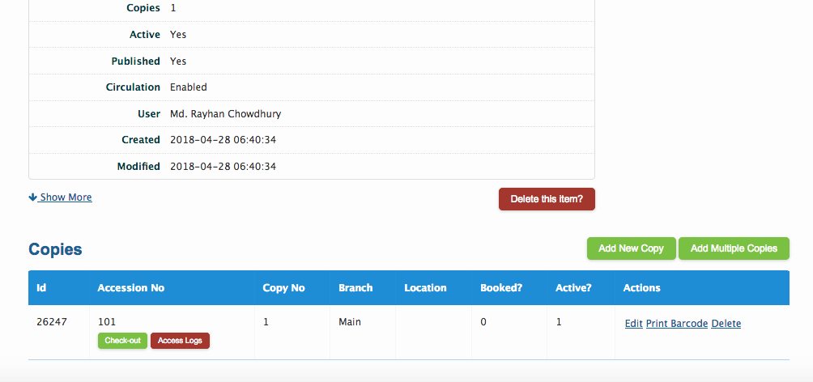

* The record will then be deleted from the library.

---

## Media Copies

Media copy record contains information about each individual item in a library catalog. The information includes accession number, branch, copy number, location, included materials, binding etc as they may vary among copies of the same title.

### Add Copy

To add a new copy to an existing media item, please follow the below steps: 

* Please go to the `Dashboard -> Catalogs -> Catalog Items` section.

* Locate the item you want to add copy to from your catalog and click on the `Add Copy` link on the right to that item.

	

* A `Add New Copy` form will be displayed.

	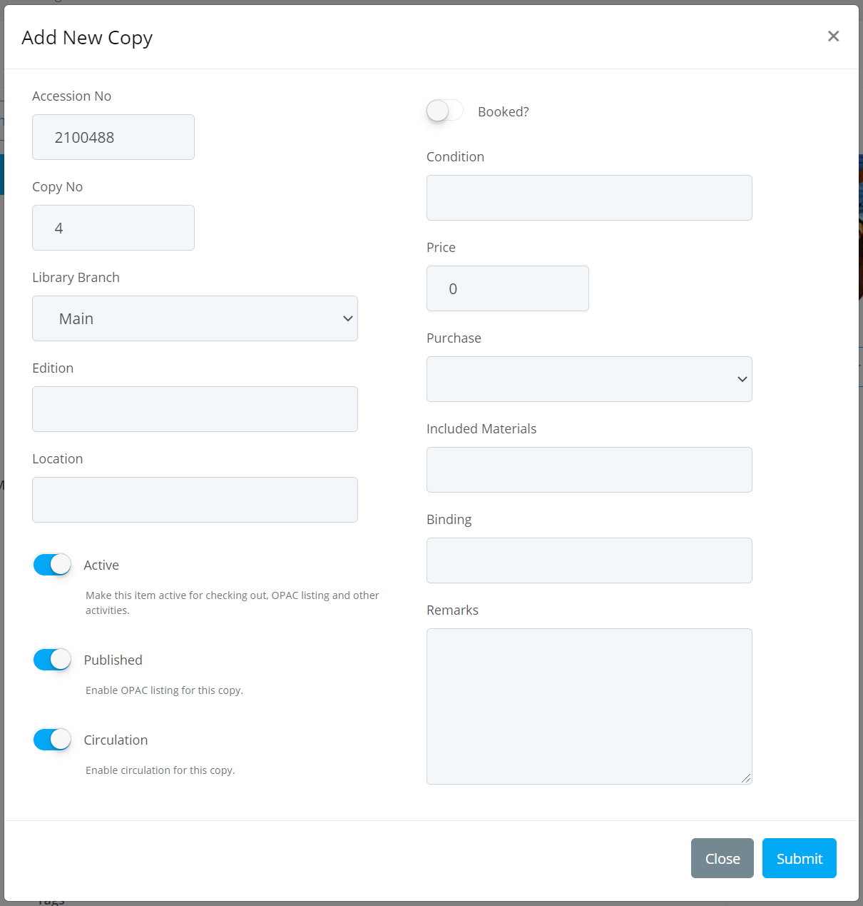

* Enter necessary information regarding your copy.
* Click on the `Submit` button when you are done
* A new copy record will be created.

### Add Multiple Copies

To add multiple copies at once to an existing media item, please follow the below steps: 

* Please go to the `Dashboard -> Catalogs -> Catalog Items` section.

* Locate the item you want to add multiple copies to from your catalog and click on the `View` link on the right to that item.

	

* Navigate to the copies section at the bottom of the page and you can see a `Add Multiple Copies` button.

	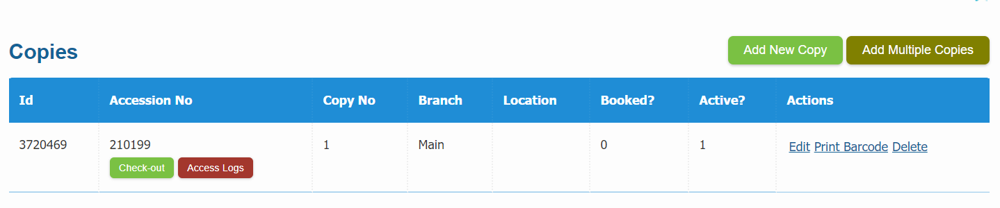

* Click on it and a `Add Multiple Copies` form will be appeared like below.

	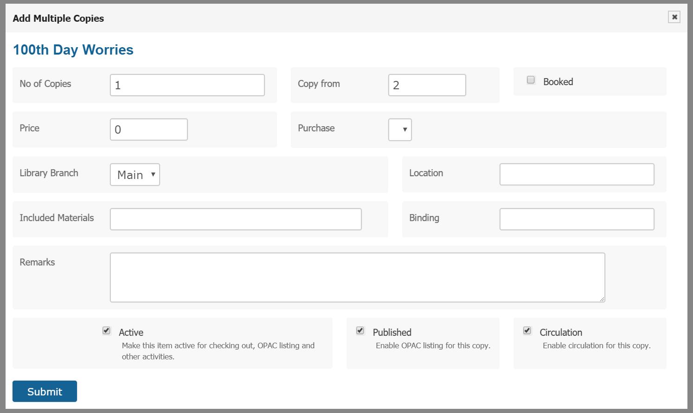

* Enter necessary information regarding your copies.
* Click on the `Submit` button when you are done
* All your new copies record will be created.

### Edit Copy

You can edit media copy information, change accession number, change branch, enable / disable circulation, published and active status flags, etc for a specific copy from the `Catalog Items` page. 

* Please go to the `Dashboard -> Catalogs -> Catalog Items` section.

* Locate the item you want to edit from your catalog and click on the `View` link on the right to that item.

	

* Navigate to the copies section at the bottom of the page.

	

* Click on the `Edit` link on right to that specific copy.

	

* Do make necessary changes.
* Click on the `Submit` button when you are done and your changes will be saved.

### Change Accession Number

To change accession number, please follow the edit copy instructions above. Please remember that, accession number must be unique among all copies of your library. If you plan to use barcode labels, it is better to have a larger 6 to 8 digits long accession number for better scanning performance.

### Delete copy

You can delete an individual copy from your catalog. This will also delete all related circulations and other dependent records specific to that copy. So, please be careful when you delete a copy from your library.

* Please go to the `Dashboard -> Catalogs -> Catalog Items` section.
* Locate the item you want to delete from your catalog and click on the `View` link on the right to that item.

	

* Navigate to the copies section at the bottom of the page.
* Click on the `Delete` link on right to the copy you want to delete and confirm your delete action.
	
	

* The copy entity will then be deleted from the library.

Note: Instead of deleting a copy from your library, it is better to make it inactive. This will ensure that all reference to related circulation records  will be preserved.

---

## E-Books

You can upload one or more pdf or e-pub files for each of your e-book item in your catalog. In order to upload e-books, you must have e-book subscription enabled.

### Add E-Book

To add a new e-book, please follow the below steps: 

* Please go to the `Dashboard -> Catalogs -> Catalog Items` section.
* Click on the `Manual Add` button and system will display the Add Media form. Now select media type equals to **E-Books** from the dropdown menu.  

	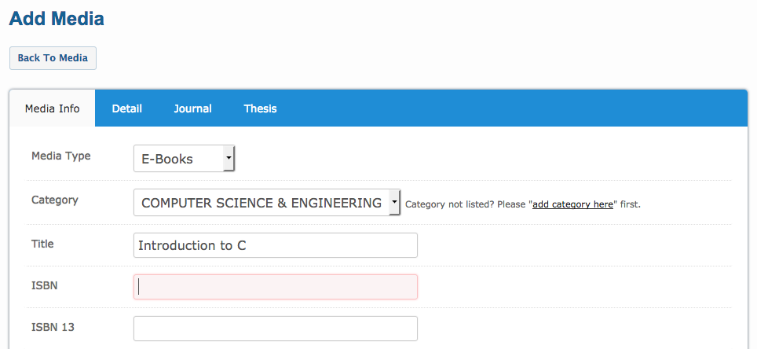

* Enter title and other information about the e-book item and click the `Submit` button once you are done. 
* A new E-book item will be added to the catalog and you will be redirected to the item detail page.
* Now scroll down the the E-Books section of the detail page.
	
	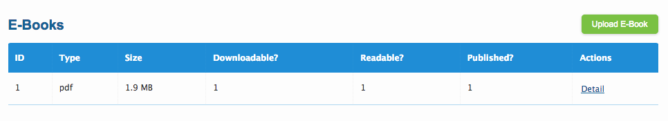  

* Click on `Upload E-book` button to upload new pdf or e-pub file.

	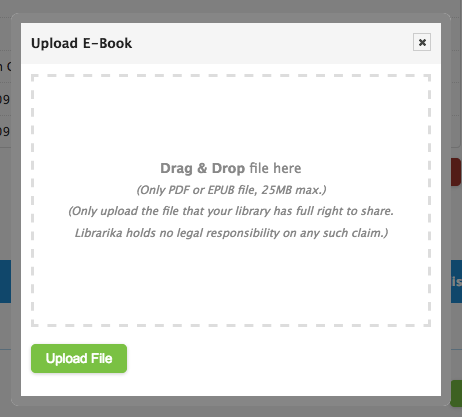  

* Once uploaded, your item will be available in the OPAC.

Note: Please make sure that you have enough copyright to share these e-book files with others.

