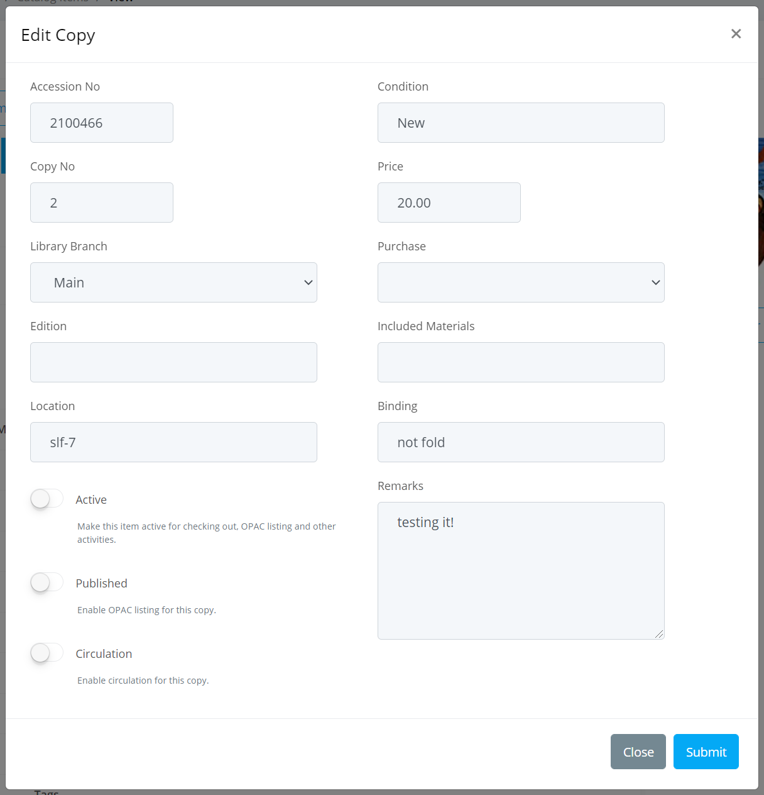

# Cataloging

Cataloging new books / items in **Librarika** platform is super easy. We have tried our level best to keep the interface simplified, so that our librarians can spent more time with their daily duties instead of working with complex cataloging tools.

Our simplified cataloging interface enables novice user or people with very limited experience to manage their library perfectly. This makes **Librarika** a suitable platform for schools, small colleges, corporate offices, NGOs, personal libraries where dedicated skilled librarians are not always available.

## Basics

**Librarika** organizes books under two logical entities: Media and Media Copy. When a new book is added to a library, master book information is added once as `Media` entity, we also call this as title or title record. Other related info is added to the `Media Copy` entity with reference to the parent `Media` entity. Then when another copy of the same book is added, only a new `Media Copy` entity is created with reference to the previous parent `Media` entity.

##### Media entity

Contains non-repeating fields such as title, ISBN, ISBN13, description, abstract, publisher, authors, cover photos etc.

##### Media Copy entity

Contains uniquely identifiable data such as accession number, copy number, location, branch as well as some other information related to the copy.

##### Relationship
```
 		Media (Single)
			  |
 	 	 	   --- Media Copies (Multiple)
```

##### Accession number:

When a new item is added to the catalog, the system assigns an auto-generated unique incremental accession number (numeric only) to each copy for your library. This accession number is then used to uniquely identify that specific copy during check-out / check-in / other system level activities. 

System usually assigns this number starting form 1. The auto generation logic for new accession number is as below:

	accession_number = max(accession_number) + 1

The same accession number field is used to generate barcode labels. If you plan to use barcode labels, you may need to start with a larger number (such as 100001) as some barcode scanner can not read small barcode properly.

The auto generation of accession number doesn't happen when you do bulk import of books or items. In this case, system saves the value of accession number field right from the provided source file without checking the uniqueness. This is to provide the flexibility to the librarians so that they can migrate their existing barcodes easily.

Tips: If you edit the accession number of a book copy to 100001 which is the max accession value in your library, then next accession will be 100002. You can use this tips to start your library's accession number from any arbritary position. 

---

## Media

You can access all your catalog items along with their associated copy's information from the `Dashboard -> Catalogs -> Catalog Items` section. Clicking on the `View` link next to a Catalog Item will display the item detail containing all the copies. You can edit / modify / delete those information for this same detail page.

### Smart Add

Smart add method lets you easily add book's information from the Internet. All you need is the ISBN number to catalog a new book. 

Note: Please treat this smart add method as an added feature, not a complete replacement of the `Manual Add` method.

To use this method, please follow the below steps:

* Please go to the `Dashboard -> Catalogs -> Catalog Items` section.
* Click on the `Smart Add` button.
	
	

* Enter the ISBN number of the book you want to add to your catalog.
* Select the branch under which the book to be added. 
* Specify a category under which the book to be added.
* Click the `Auto save` button.
* System will automatically find the matching book from the Internet and add to your catalog.
* If successful, system will show a confirmation message with the title name and view page link.

Related information:

* If the book is already exist in your catalog, system will prompt the `Add Copy` form to add a new copy instead of adding a new `Media` record.
* An associated `Media copy` record will also be created automatically. You are free to make any changes to the newly created copy record as you feel necessary.
* Though `Smart Add` gets book information from various sources, there is no guarantee that it will get every book information from the Internet even if they are available.

### Manual Add

You can add media using our `Manual Add` method. This method is suitable when you don't find book using the "Smart Add" method.

To use this method, please follow the below steps:

* Please go to the `Dashboard -> Catalogs -> Catalog Items` section.
* Click on the `Manual Add` button.
* System will display the Add Media form.
	
	

* Enter book information with the details.
* Click on the `Submit` button when you are done.
* The data will be saved and you will be redirect to the view detail page.
* Add relevant author information from this view page. You can add multiple authors one by one.

An associated `Media copy` record will be created automatically. You are free to make any changes to the newly created copy record as you feel necessary.


### Bulk Import

Librarika support bulk import of catalog items in CSV formats.

#### a. Prepare your data

* Read our [Import Items](https://demo.librarika.com/spages/import-items) detail instructions article for more critical information.
* See our sample google spread sheet at [Sample Import Format](https://docs.google.com/spreadsheets/d/1MOphgqXTbOs2YvzvFDjIVAzS8Z7aji58bpuVmDbTnb8/edit?usp=sharing).
* Use google sheets to avoid UTF-8 encoding issue with Microsoft Excel. [Optional] 
* Download the final CSV file directly from google docs using `File -> Download as -> Comma Separated Values (.csv)` to avoid issues. [Optional] 

#### b. Check List

Please make sure followings before you go ahead with importing your data:

* Columns names must be exactly same and case sensitive.
* File in correct CSV format. Use google sheets if possible.
* The CSV file is UTF-8 encoded. MS Excel produce non UTF-8 csv file.
* Numeric columns contain numeric values.
* Accession numbers are unique and not empty.

#### c. Import Items

1. Go to `Dashboard -> Catalogs -> Catalog Items` section.
2. Click on `Import Items` button.
3. Select data format, specify the CSV file and select branch name.
4. Click on `Submit` button to submit the form.
5. If everything is all right, you will see your data to review. Please review them carefully.
6. Confirm the data and click on `Save` button.
7. You will see the confirmation with number of items added into the system.
8. If same book is provided multiple times, only one record in media section will be created, each one will be added as a separate copy linked to that media record.

Note: When you enter multiple copies of the same book, they will be added a copy under the same title, as a result you will see actual title counts in your catalog smaller than the number of records you have uploaded from the csv file.

### Edit Media

You can edit media information from the `Catalog Items` page.

* Please go to the `Dashboard -> Catalogs -> Catalog Items` section.

* Locate the item you want to edit from your catalog and click on the `View` link on the right to the item.

	

* Click on the `Edit Item` button, the below form will appear with existing information.
	
	

* Do make necessary changes.
* Click on the `Submit` when you are done and your changes will be saved.

### Delete Media

You can delete a title from your catalog. But this will also delete all related copies, circulations and other related records. So, please be careful when you delete a title entry from your library.

* Please go to the `Dashboard -> Catalogs -> Catalog Items` section.
* Locate the item you want to delete from your catalog and click on the `View` link on the right to the item.

	

* Click on the `Delete this item?` button and confirm your delete action.
	
	

* The record will then be deleted from the library.

---

## Media Copies

Media copy record contain information about each individual item in a library catalog. Information such as Accession number, Branch, Copy number, Location, Included materials, Binding etc as they can vary among copies of the same book.

### Add Copy

To add a new copy to an existing media item, please follow the below steps: 

* Please go to the `Dashboard -> Catalogs -> Catalog Items` section.

* Locate the item you want to add copy to from your catalog and click on the `Add Copy` link on the right to the item.

	

* A new `Add New Copy` form will be displayed.

	

* Enter necessary information regarding your copy.
* Click on the `Submit` when you are done and your changes will be saved.

### Edit Copy

You can edit media copy information, change accession number, change branch, activate / deactivate circulations, published and active flags, etc for the copy from the `Catalog Items` page. 

* Please go to the `Dashboard -> Catalogs -> Catalog Items` section.

* Locate the item you want to edit from your catalog and click on the `View` link on the right to the item.

	

* Navigate to the copies section at the bottom of the page.

	

* Click on the `Edit` link on right to that specific copy.

	

* Do make necessary changes.
* Click on the `Submit` when you are done and your changes will be saved.

### Change Accession Number

To change accession number, please follow the edit copy instructions above. Please remember that, accession number must be unique for each item copy of your library. If you plan to use barcode labels, it is better to have a larger 6 to 8 digits long accession number for better scanning performance.

### Delete copy

You can delete an individual copy from your catalog. This will also delete all related circulations and other related records specific to that copy. So, please be careful when you delete a copy from your library.

* Please go to the `Dashboard -> Catalogs -> Catalog Items` section.
* Locate the item you want to delete from your catalog and click on the `View` link on the right to the item.

	

* Navigate to the copies section at the bottom of the page.
* Click on the `Delete` link on right to the copy and confirm your delete action.
	
	

* The copy entity will then be deleted from the library.

---

## E-Books

[...]