# Circulations

The circulations section contains all the information regarding your check-outs, check-ins, reservation requests, overdue items etc.

As a generic term, we also call this as "Media bookings" section.

## List check-outs

You can access the list of all circulations related entries in this section under different status filters such as Pending, Reserved, Issued, Overdue, Cancelled, Returned etc. 

* Please go to the `Dashboard -> Circulations -> Circulations` page.
* Circulation records will be displayed as shown below:

	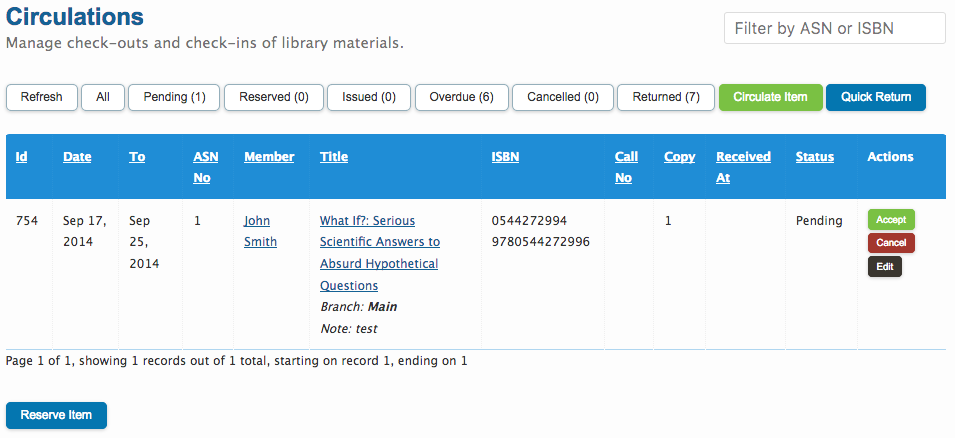

* Now you can see all the different status filters in the `All` dropdown menu.

	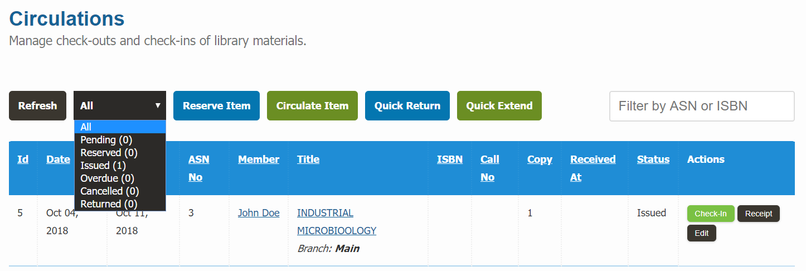

## Check-out Item

To check-out or loan an item to a member of your library, please follow the below steps:

* Please go to the `Dashboard -> Circulations -> Circulations` section.
* Click on the `Circulate Item` button.

	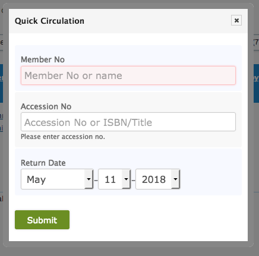

* First enter member number or member name. An auto-select list will appear, please select the member from the list.

	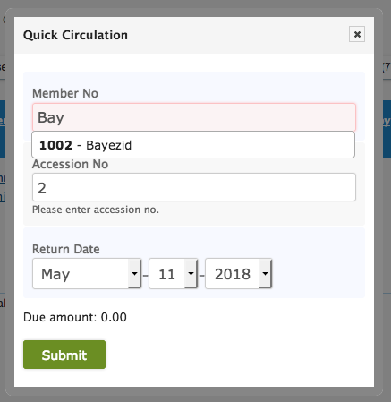
 
* Then enter accession number or book title. An auto-select list will appear with green / red indicator, please select the item with green indicator. Red indicator means, the item is not available for check-out.

	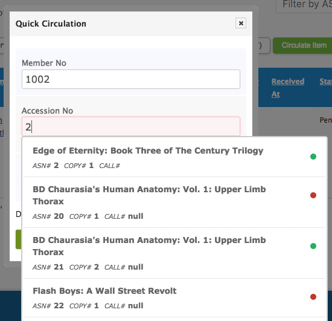

* Change the return date if you wish to.

	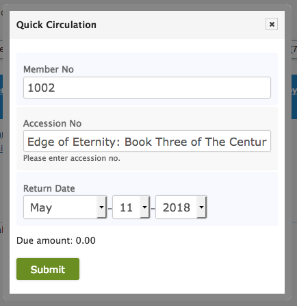

* Click on the `Submit` button when you are done.

## Check-in Item

To check-in or receive an item from a member, please follow the below steps:

* Please go to the `Dashboard -> Circulations -> Circulations` section.
* Click on the `Quick Return` button.
* Enter the accession number of the item you want to check-in. An auto-select list will appear with green / red indicators. Your item should have red indicator.

	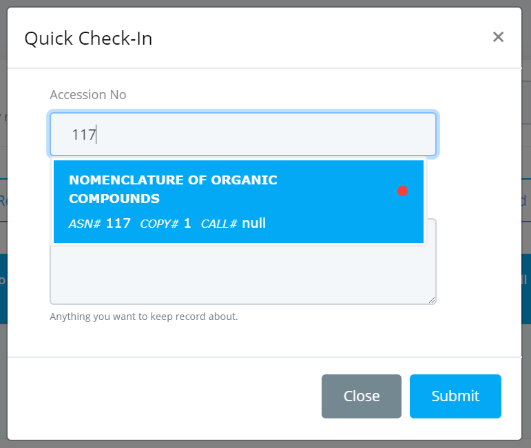

* Select the item from the list.

	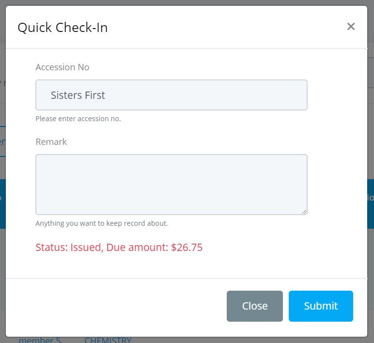

* Enter any remark note in the remark input box, if you want to.
* Click on the `Submit` button when you are done.

## Reserve Item

To reserve an item on behalf of a member, please follow the below steps:

* Please go to the `Dashboard -> Circulations -> Circulations` section.
* Click on the `Reserve Item` button.
* The Reserve Item form will be displayed as shown below.

	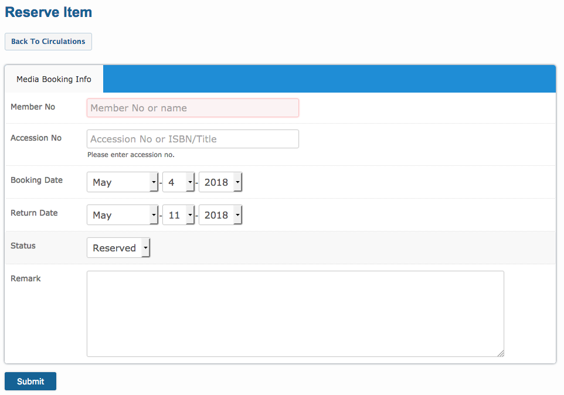

* Enter member number, accession number, booking date, return date etc.
* Select status as "Reserved".
* Click on the `Submit` button when you are done.

## Change Return Date

You can update / extend return date of any circulation record specially that has already been issued but not yet returned. 

To update or extend an item from a member, please follow the below steps:

* Please go to the `Dashboard -> Circulations -> Circulations` section.
* Click on the `Quick Extend` button.
* Enter the accession number of the item you want to extend. An auto-select list will appear with red indicators.

	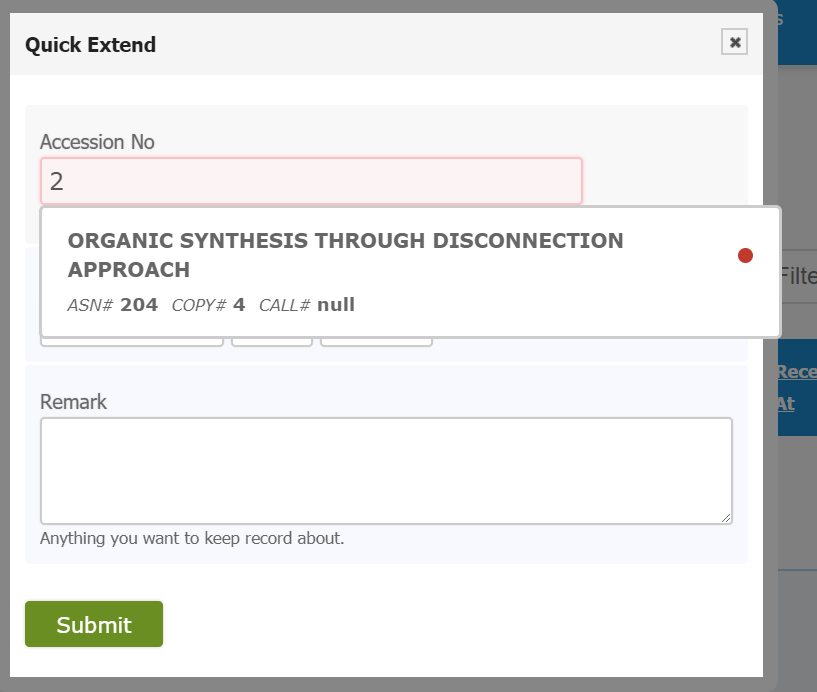

* Select the item from the list.

	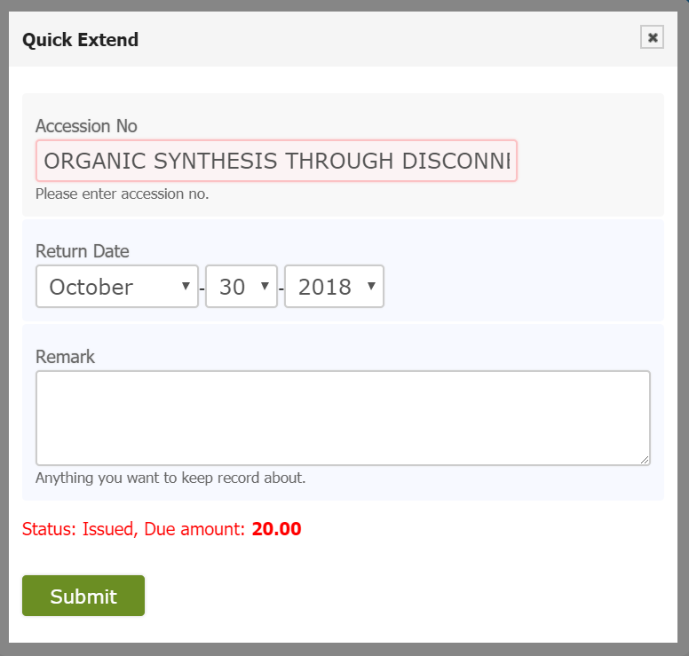

* Enter any remark note in the remark input box, if you want to.
* Click on the `Submit` button when you are done.

## Edit Check-out

You can edit any existing circulation entry, change return date, status etc from the circulations page.

To edit a circulation, please follow the below steps:

* Please go to the `Dashboard -> Circulations -> Circulations` section.
* Locate the item you want to edit from your circulation records and click on the `Edit` link on the right to that item.

	

* An edit circulation form will appear as shown below.

	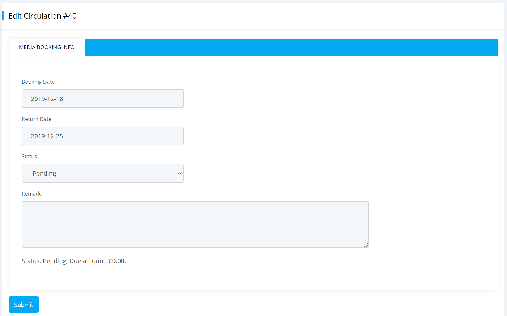

* Edit or update necessary information regarding the circulation.
* Click on the `Submit` button when you are done.

## Extra Fuctionality

If you have larger amount of circulation entries then you can use our filtering option so that you can easily find any entry and also you can do all other circulation related activities.

To use this functionality, please follow the below steps:

* Please go to the `Dashboard -> Circulations -> Circulations` section.
* In the top corner of circulations page you can see a `Filter by ASN or ISBN or Member No` input box. Enter accession number or isbn or member no of the item in that box.
	
	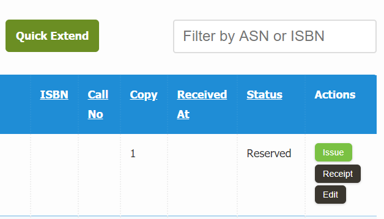

* An auto-select list will appear, select the item from the list. All related circulations of the selected item will appear as shown below.
	
	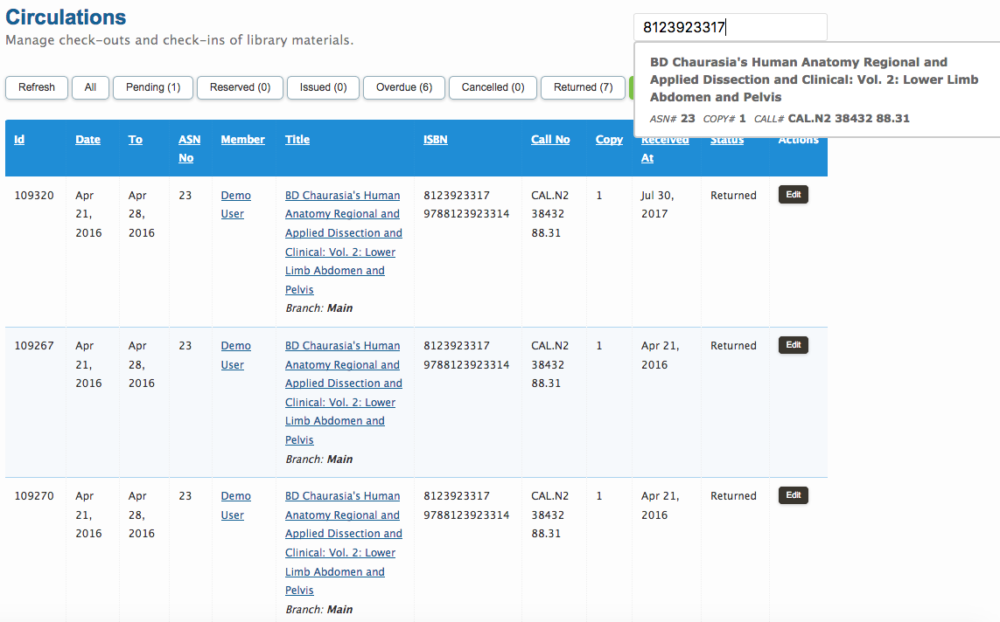

* Now you can perform any action regarding your needs for circulations.

## Circulation Issue

Keep in mind that whenever checking out books you can not able to scroll past the 10th book even though you have several more copies of the same book in your library. Because **there is a cap limit of 10 items in auto complete dialogue box**.

