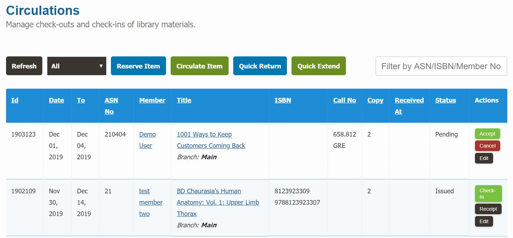

# Circulations

The circulations section contain all the information regarding your check-outs, check-ins, reservation requests, overdue items etc.

As a generic term, we call this as a media bookings section also.

## List check-outs

You can access the list of all circulations related information entries in this section. 

* Please go to `Dashboard -> Circulations -> Circulations` page.
	

## Check-out Item

To check-out or loan an item to a member of your library, please follow the below steps:

* Please go the `Dashboard -> Circulations -> Circulations` section.
* Click on the `Circulate Item` button.

	

* First enter member number or member name. An auto-select list will appear, please select the member.

	

* Then enter accession number or book title. An auto-select list will appear with green / red indicator, please select the item with green indicator. Red indicator means, the item is not available in the library.

	

* Change return date if you wish to.

	

* Click on the `Submit` button when you are done.

## Check-in Item

To check-in or receive an item from a member, please follow the below steps:

* Please go the `Dashboard -> Circulations -> Circulations` section.
* Click on the `Quick Return` button.

	

* Enter the accession number of the item you want to check-in. An auto-select list will appear with green / red indicators. Your item should have red indicator.

	

* Enter any remark note in the remark box, if you want to.
* Click on the `Submit` button when you are done.

## Reserve Item

To reserve an item on behalf of a member, please follow the below steps:

* Please go the `Dashboard -> Circulations -> Circulations` section.
* At the bottom click on the `Reserve Item` button.

	

* Enter member number, accession number, booking date, return date etc.
* Select status as "Reserved".
* Click on the `Submit` button when you are done.

## Change Return Date

You can update / extend return date of any circulation record that has already been issued but not yet returned.

## Edit Check-out

