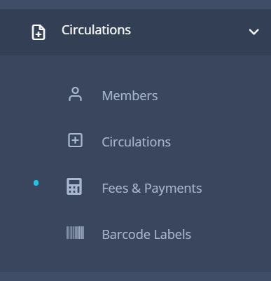
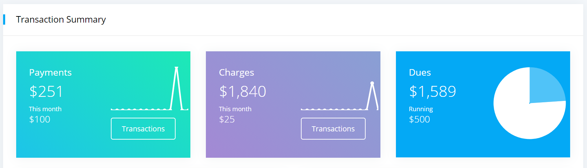
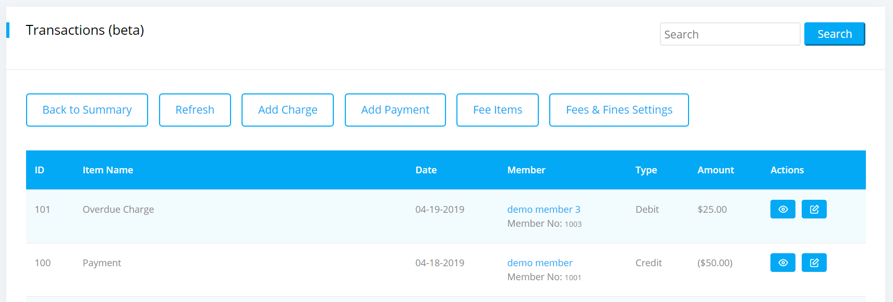
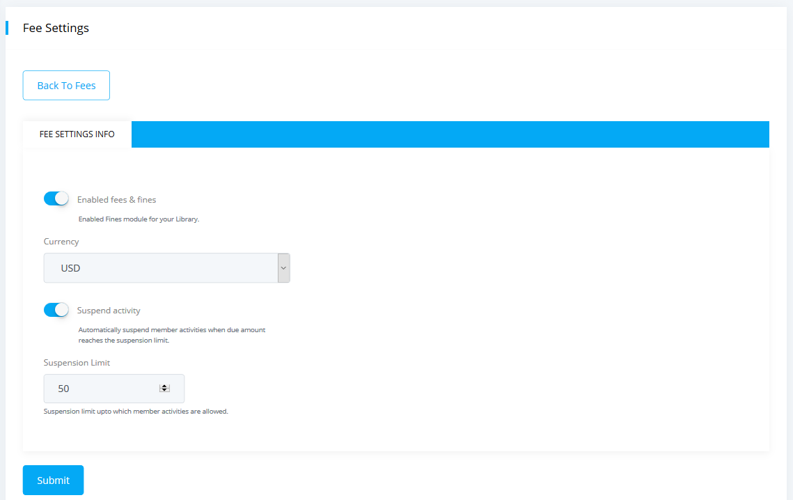
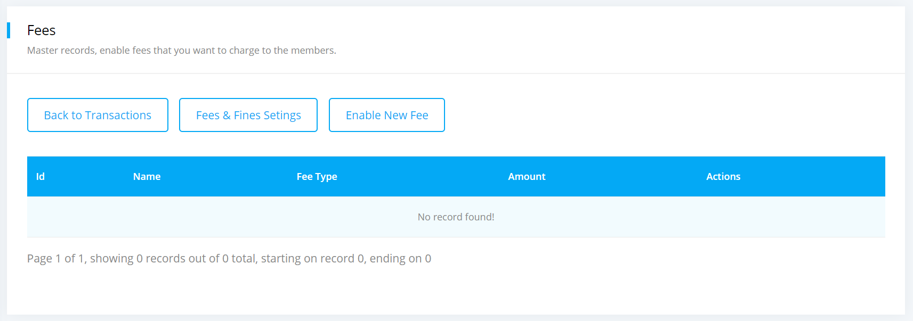
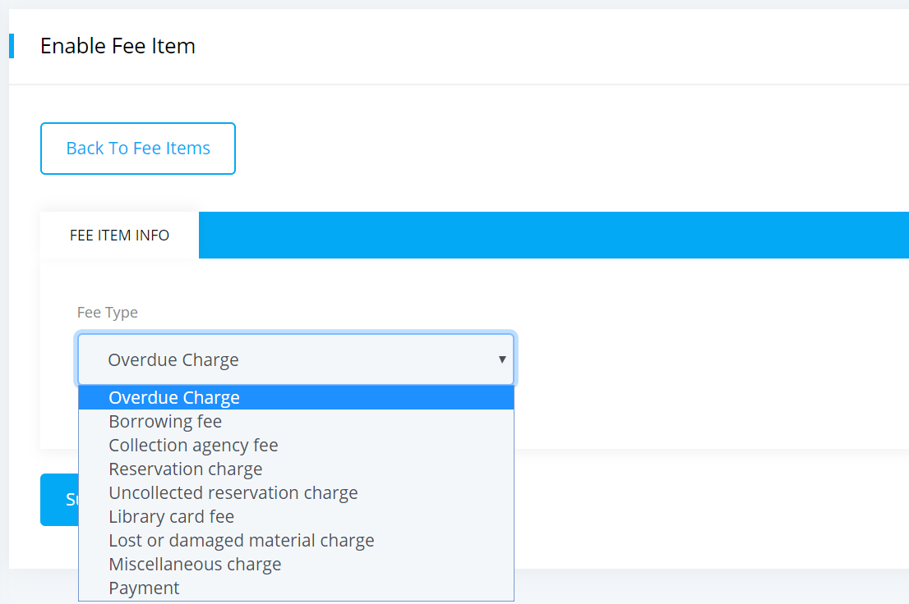
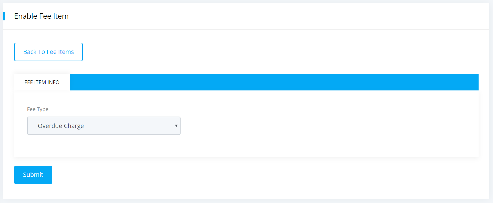
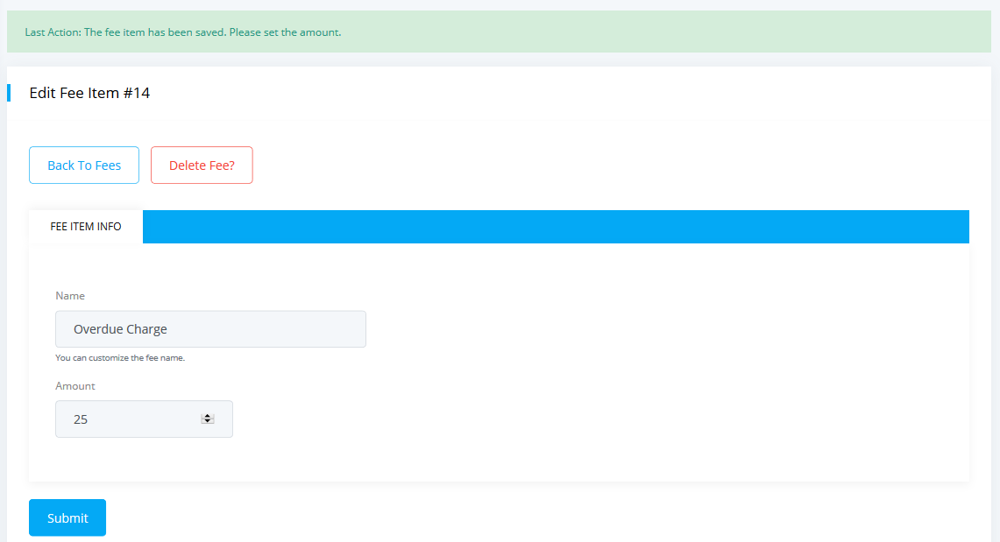
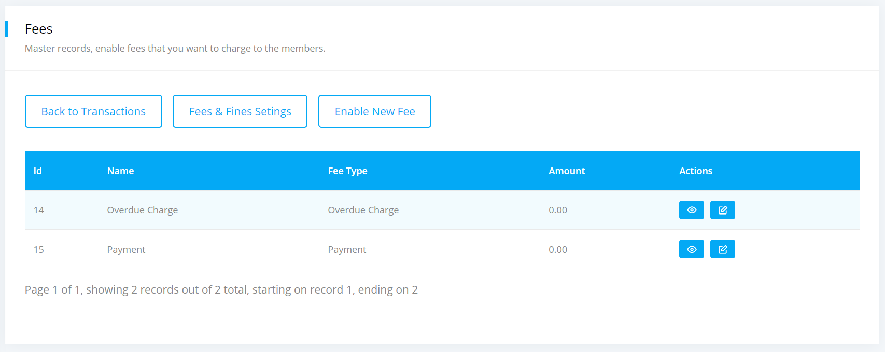

# Fees & Payments

Our fees and payments module allows libraries to collect fees and fines on various library activities. We tried to make this module very simple in terms of design and functionalities.

The module is based on charges that you can apply and payments that you can collect from your library members.

**Note: Only premium libraries have access to this module.**

## Features

* Apply overdue fee.
* Apply payment.
* Apply various other charges.
* View Member's full account statement.
* Access payment matrics such as daily payments, charges.
* Suspend member borrowing activity based on automatic threshold value.
* And more.

## How to activate the module

Please complete the following easy steps to setup your library. It should not take more than 5 minutes.

* Please go to the `Dashboard -> Circulations -> Fees & Payments` from the dropdown menu.

	

* Click on `Fees & Payments` option and a page will be appeared like below.

	

* Then click on the `Transactions` button and a page will be appeared like below.

	

* Here you can view all the transection details of your library members.
* Now from the top of this section please click on the `Fees & Fines Settings` button.
* The fee settings form will be appeared like below.

	

* To add "Overdue Charge" fee item please click on the `Fee Items` button from the `Transections` module.
* A form named `Fees` will be appeared like below.

	
 
* Now click on the `Enable New Fee` button from the top of this section.
* You can see different types of fee item in the dropdown of the fee type field.

	 

* Now select **Overdue Charge** as fee type like below.

	

* Click on the `Submit` button and your fee item will be saved.
* Set the overdue amount per day, you can also change the fee title for overdue charge and finally save the information.

	
	
* To add "Payment" fee item please click on the `Fee Items` button from the `Transections` module.
* Again click on the `Enable New Fee` button and select `Payment` as fee type.
* Click on the `Submit` button and your fee item will be saved.
* You have now added two fee items as listed below.

	

* And you are now ready to collect payments.
* Also you can activate the other types of fee item same as mentioned above.

#### Overdue Charges

System will apply / update overdue charges for currently overdue items on daily basis. Once the item is returned you can edit / adjust the applied overdue amount.

#### Limitations

Since, we have launched this module as early beta, please be aware of any bugs and issues that may arises and let us know if you feel anything. As a pre-caution, please take backup of your transaction information on regular basis.