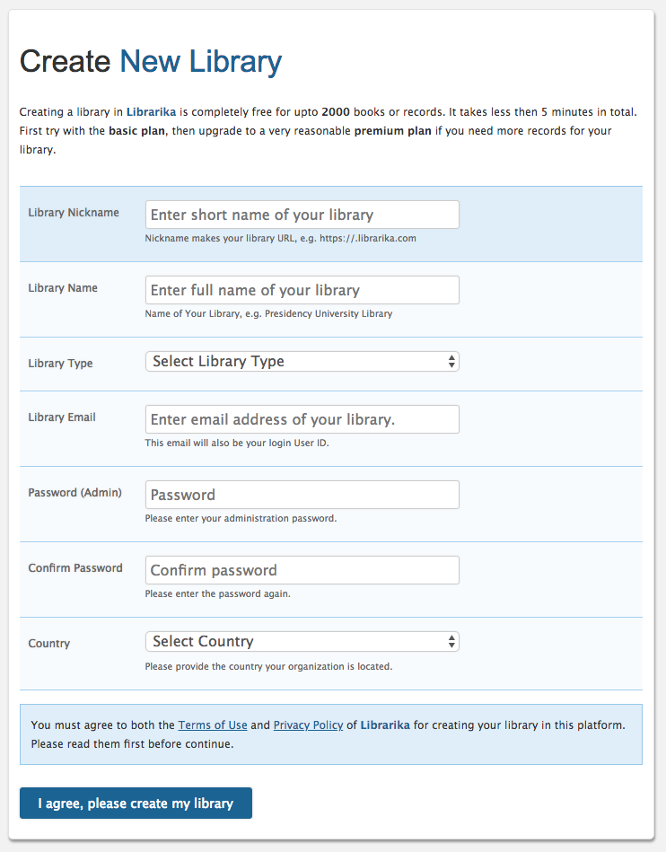
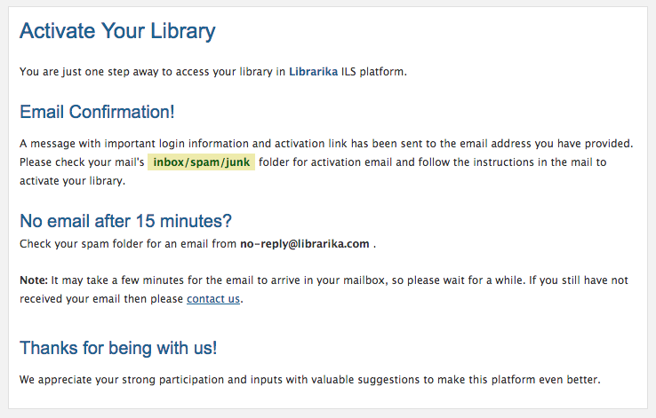
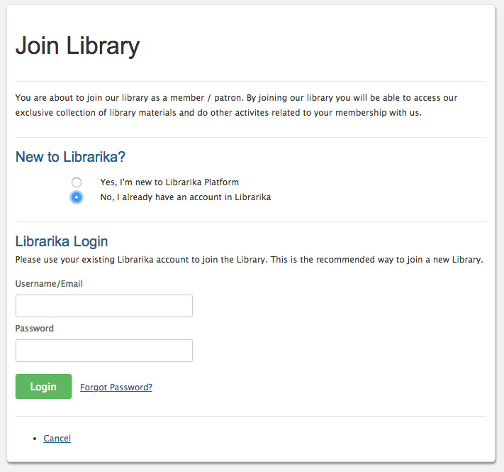
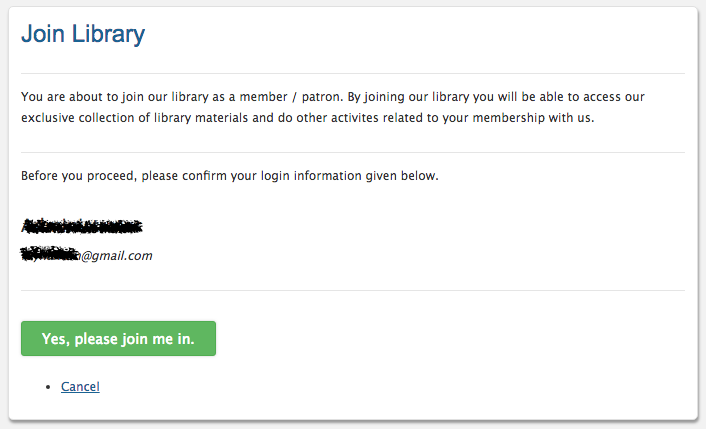
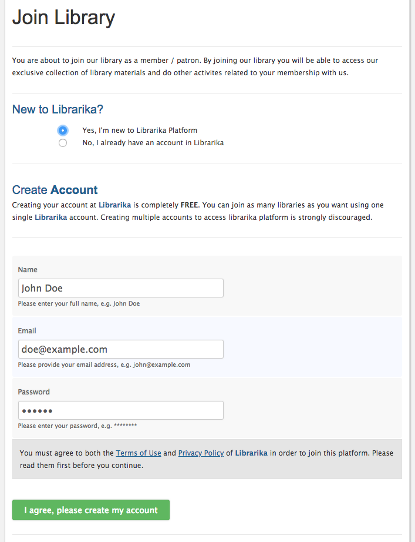
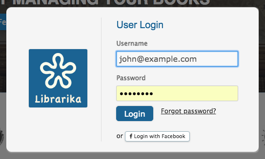
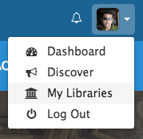
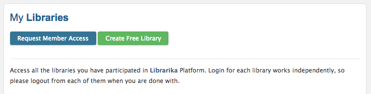

# Getting Started

Getting sarted with Librarika is super easy. It only takes few minutes to start 
a new library in **Librarika**.

---

## Create New Library

Both new to Librarika and existing users can open a new library in Librarika platform. If you are new to the platform, please proceed to the [new user](#new-user) section for a fresh start. 

For existing users, please follow [existing user](#existing-user) section first before you start a new library. 

### Existing User

* Follow the same instruction as the [new user](#new-user) section below, just enter your account email address.
* You will not be asked to enter password information as you are an existing user.
* And, if your account is already verified, your new library will be activated automatically. 

### New User

Create a new library for the first time.

* Go to [https://librarika.com][Librarika]
* Click on `Create Free Library` button 

	

* Enter information about your library in **Create New Library** form.
	*	**Library Nickname:**
	This is the single most important input for your library. Please keep it as short as possible, because this will be your library access URL. We prefer this to be less than 20 characters.

	*	**Library Name:**
	Enter full name of your library. Example: _The Liberty School Library_.
	
	*	**Library Email:**
	Enter your email address carefully. This email address will be used to log you into the library. 

		A verification email will be sent to this email address.

	*	**Password (Admin):**
	Enter a new password for your admin login and confirm the password. Please remember this password, as you will need it to log into your library.

* Select a library type and country from the dropdown list.
* Once, you are done, please click on the `I agree, please create my library` button.
* You will see a confirmation page, with instructions regarding the verification process.

	

#### Activate Your Library

Now you need to verify your library before you can start entering books. Please open the activation email you have received from Librarika in your mailbox. Click on the activation link to activate your library.

Once activated, you will receive a welcome email. You can now log into your libary and start using.

#### Have not received activation email yet?

Sometime, your mail server may reject the emails we sent from librarika. It mostly happens with corporate mail servers with custom domains. If that happens, please discuss with your system administrator to whitelist librarika.com domain for your organization.

Email communication is very important for a library admin, so please make sure you receive the emails sent from Librarika. 

Otherwise, you will miss important emails regarding your library.

#### Multiple Libraries

It is ok to create multiple libraries under the same Librarika account.

---

## Join a Library

You can join a library in two different ways.

* A library staff may invite you to join their library as a member (patron).
* Or, you can sign up for a Librarika account on your own. Then submit a member access request to a specific library of your choice.

Both methods are covered in this section.

### a. Join from invitation email

This is the simplest way to join a library. Open the invitation email in your mail box. 

* It is very important that you first log out of all Librarika libraries (if already logged in) before you proceed.
* Open the invitaion email and click on the **activation link** from the email.
* The Join Library form will be opened in your browser.
* For existing Librarika user:
	* Choose the `No, I already have an account in Librarika` option.

		

	* Enter login email address and password and click on Login.
	* Then, click on the `Yes, please join me in.` button. You will then be joined to the library.

		

* For new Librarika user:
	* Choose the `Yes, I'm new to Librarika Platform` option.
		
		

	* Enter _name_, _email address_ and _password_ for a new account.
	* Click on the `I agree, please create my account` button. A new account will be created and you will be logged into it automatically.
	* Now click on `Yes, please join me in.` button. You will then be joined to the library.

		

* Once you join a library as a member, you can access the member only area of that library, browse library catalog (even if it is a private library), submit reservation request, see current check-out items, write reviews etc.	

### b. Submit member access request

You can proactively join a library by submitting the member access request from our **[Librarika.com][Librarika]** global site. 

* Please go to [Librarika.com][Librarika]
* Log into your Librarika account with your login id and password.

	

* Once logged in, click on `My Libraries` menu from the top right corner of your browser screen as shown below.

	

* Click on `Request Member Access` button as shown below.

	

* In the request for member access form, please enter the exact URL of the target library you want to join.

	

* Click on the `Submit` button and your request will be submitted.
* You will then receive a confirmation message on the screen regarding your submission.
* Once submitted, depending on the library prolicy, a library offical will review your request and assign you a library "**Member No**" for future access.
* If accepted, you can then log into that specific library and access the member only area.

[Librarika]: https://librarika.com/  "Librarika ILS - The Free Library Management System"
