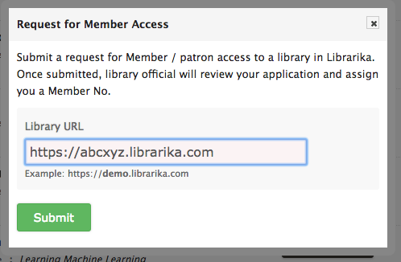

# Getting Started

Getting sarted with Librarika is super easy. It only takes few minutes to start 
a new library in **Librarika**.

---

## Create New Library

If you are new to Librarika, please proceed to **New User** section to start fresh. For exiting users, please follow **Existing User** section. 

### New User

Create a new library for the first time.

* Go to [https://librarika.com](https://librarika.com)
* Click on `Create Free Library` button 

	

* Enter information about your library in **Create New Library** form.
	*	**Library Nickname:**
	This is the single most import input for your library. Please keep it as short as possible, because this will be your library access URL.

	*	**Library Name:**
	Enter full name of your library. Example: _The Liberty School Library_.
	
	*	**Library Email:**
	Enter your email address carefully. This email address will be used to log you into the library. 

		A verification email will be sent to this email address.

	*	**Password (Admin):**
	Enter a new password for your admin login and confirm the password. Please remember this password, as you will need it to log into your library.

* Enter other information such as password, country, library type etc.
* Once, you are done, please click on `I agree, please create my library` button.
* You will see the confirmation page, with instruction regarding the verification process.

	

#### Activate Your Library

Now you need to verify your library before you can start entering books. Please open the activation email you have received from librarika in your mailbox. Click on the activation link to activate your library.

Once activated, you will receive a welcome email. You can now log into your libary and start using.

#### Have not received activation email yet

Sometime, your mail server may reject the emails we sent from librarika. It mostly happens with corporate mail servers with custom domains. If that happens, please discuss with your system administrator to whitelist librarika.com domain for your organization.

Email communication is very import for a library admin, so please make sure you receive the emails sent from Librarika. 

Otherwise, you will miss important emails regarding your library.

### Existing User

* Same as **New User** section above, just enter your account email address.
* You will not be asked to enter password information.
* And, if your account is already verified, your new library will be activated automatically.

#### Multiple Libraries

It is ok to create multiple libraries under same the librarika account.

---

## Join a Library

You can join a library in different ways.

* A library staff may invite you to join their library as a member (patron).
* Or, you can sign up for a Librarika account on your own. Then send a member request to a specific library to join.

### a. Join From Invitation

This is the simplest way to join a library. Open the invitation email in your mail box. 

* Log out of libraria before you proceed.
* Open the invitaion email and click on the activation link from the email.
* You will see the Join Library form.
	
* For existing Librarika user:
	* Select `No, I already have an account in Librarika` radio box.

		

	* Enter login email address and password and click on Login.
	* Clik on `Yes, please join me in.` button. You will then be joined to the library.

		

* For new Librarika user:
	* Select option `Yes, I'm new to Librarika Platform`.
		
		

	* Enter _name_, _email address_ and _password_ for your new account.
	* Click on `I agree, please create my account`.
	* Clik on `Yes, please join me in.` button. You will then be joined to the library.

		
	

* Once you join a library as a member, you can access the member only section of the library, browse library catalog (for both public and private libraries), submit reservation request, see current check-out items, write reviews etc.	

### b. Send Member Request

You can proactively join a library by sending the member request from our **[Librarika.com](https://librarika.com)** global site. 

* Please go to [Librarika.com](https://librarika.com)
* Log inot your librarika account

	

* Click on `My Libraries` menu as shown below.

	
* Click on `Request Member Access` button as shown below.

	

* In the request for member access from, please enter the exact URL of the library you want to join.

	

* Clink on the `Submit` button, your request will be submitted and you will receive a confirmation message on the screen regarding your submission.
* Once submitted, depending on the library prolicy, a library offical will review your request and assign you a library Member No for future access.
* If accepted, you can then log into that specific library and access member only area.

