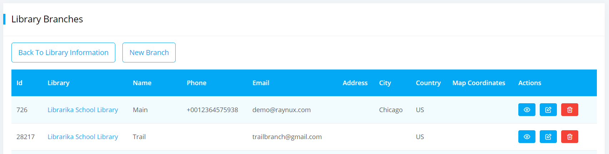
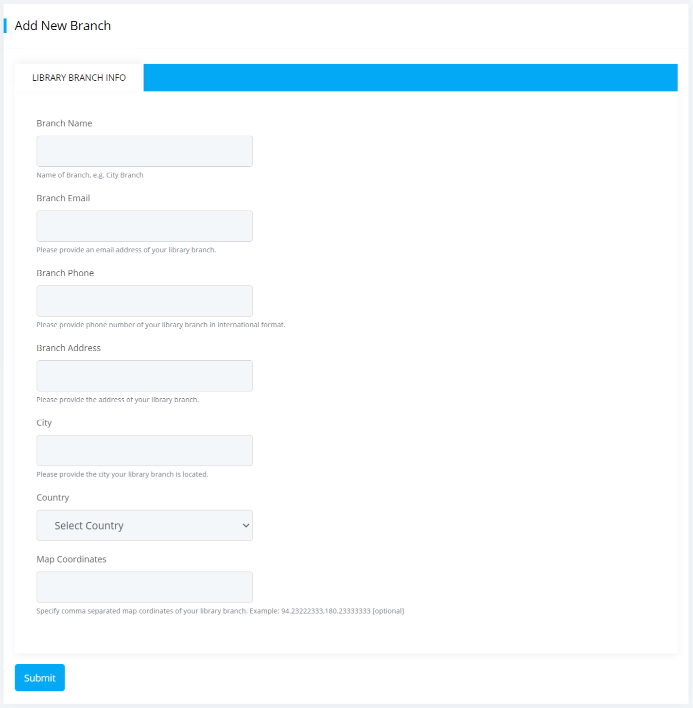
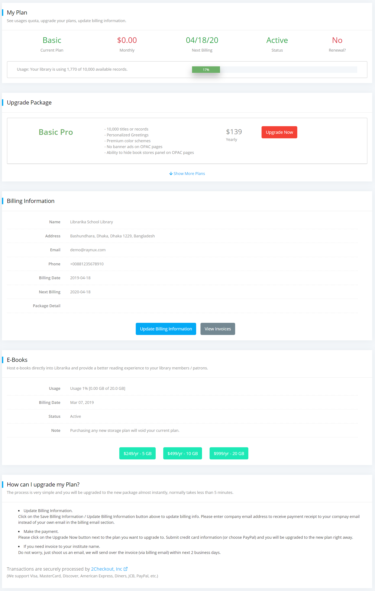

# Library

This section explains how to manage your library master data and other related information.

## Create Library

Please see the [create new library](getting-started.md#create-new-library) section in order to start a new free library. 

If you want to subscribe to a Premium Plan, please create a free library first and then upgrade to the desired premium plan following the [upgrade to premium plan](#upgrade-to-premium-plan) instructions.

---

## Change Library Information

### Change / Update library Info

Please update your library information carefully and make sure that they are up to date.

**Steps to update library information**:

* Go to the **Library Information** section from the dashboard.

	

* Click on the `Library Info` tab if not selected automatically.
	
	

* Enter / update the information you want to change.
	* The description field should contain a short description about your library, library business hours, rules, policies, etc. This field is very important for your library site visitors as it will be displayed on the "Ask a Librarian" public page.
	* The email address and phone number provided here will be displayed on the "Ask a Librarian" public page. However, you can individually turn off the display of email address, phone number from the [preferences](#change-preferences) section. 
	* Uncheck the **Private** checkbox to make your catalog publicly visible online. 
* Now you want to make your library private so that, only the members will be allowed to access the OPAC catalog.
	* Please checked the **Private** checkbox to make your catalog members only.

		If checked, your catalog will not be visible online, only member's with login access can access the information. This feature is suitable for corporate libraries.

* Click on the `Submit` button to save your changes.

### Change / Update organization information

Please update your organization information carefully and make sure that they are up to date. The email address and phone number that you enter in this page will not be available in public.

**Steps to update organization information**:

* Go to the **Library Information** section from the dashboard.

	

* Click on the `Organization Info` tab.
	
	

* Enter / update the information that you feel necessary.
* Click on `Submit` button to save your changes.

---

## Upload Library Logo

Logo is the single most important thing that gives your library an official identity. Please update your library logo as soon as possible to make it looks professional. For personal library, it is ok to keep the default Librarika logo.

We support 200x200 pixel size file in PNG/JPG format.

**Steps to upload logo**:

* Go to the **Library Information** section from the dashboard.

	

* Click on the `Organization Info` tab.
	
	

* In Logo field click on the `browse` button and select a 200x200 pixel size png/jpg file.
* Click on the `Submit` button to save your changes.

---

## Change Preferences

The preferences section is the single most important settings page for your library. Here you can change the followings:

* Basic options
* Self-service settings
* Request items settings
* Notifications and Reminders settings
* Appearances / themes / languages settings

**Steps to update preferences**:

* Go to the **Prefereces** section from the dashboard.

	

* Click on the `Options` tab if not selected automatically.

	

* Enter / update the information you want to change.
	* The `Keep email private` checkbox has 3 options that you can set based on your own preference and it will be displayed on the "Ask a Librarian" page.

		

	* Then if you checked the `Keep phone number private` checkbox then you can find 3 options to set and based on this setting it will be displayed on the "Ask a Librarian" page.

		

	* Next is the `Greetings` field where you can modify your verbage or welcome message for your library.
	* The `Ebook URL Visibility` option set privacy for your e-book which is links with 5 options, that is Hide To All / Public / Member / Borrower Always / Active Borrower. You can set them independently for each of the items in your catalog.
	* The `Booking Time` option is the time interval in days in which **Booking Quota** limit will be executed.
	* In the `Booking Quota` field you can assign a booking quota limit for a member up to which he / she can request / checkout / loan items at the **Booking Time** limit.
	* Then the `Enable member access request` checkbox which you need to enable so that the new members can get accesss to your library.

* If you click on the `Self Service` tab then it will be dispalyed like below.

	

	* If you enable the `Enable member checkouts` and `Enable member check-ins` then your library members can self-checkout or check-in a book.
	* Also you can set other options for your library members.

* If you click on the `Request Items` tab then it will be dispalyed like below.

	

	* If you enable the `Enable item request` then member can request your library item from their member area section.
	* In the `Member` field you can set 3 member type options whom can request library item online, that is All members / Regular members only / Privileged members only.
	* By default the action is pending for requesting an item. But you can choose the other option **Reserved** if you want to reserve that item for your member immediately.

* If you click on the `Notifications/Reminders` tab then you can set reminders for your library members.

	

	* Our system will send notification reminders to the members of your library based on this settings.
	* If you enable the `Notify on Overdue` checkbox then a reminder email will be send after X-hours of the overdue item. 
	* If you enable the `Remind before due date` checkbox then a reminder email will be send before X-hours of the due date.
	* If you enable the `Remind on reservation` checkbox then member will receive a reminder email before X-hours of the reservation date.
	* **Here the most important field is the `Notified Librarians` where you can set maximum of five librarians who will receive notification reminders if any member joined or requested a book.**

* If you click on the `Appearance` tab then it will be dispalyed as below.

	

	* From this page you can set premium color schemes for your library dashboard and OPAC. Also you can select your preferred language from the Language dropdown menu.

* Finaly if you click on the `Upgrade` tab, then you can upgrade your library to your desired plan.
* From the above tabs you can set / enter / update the value that you want.
* Click on the `Save Preferences` button to save your changes.
* Your latest changes will be applied instantly.

---

## Create Library Branch

To create a new library branch or update the information of your previous library branches please follow the below steps.

* Please go to `Dashboard -> Manage -> Library Information` section then click on the **Manage Branches** button.
* A page will be appeared like below.

	

* Then in the library branches page you will find the **Create New Branch** button.
* Click on it and an add branch page will be displayed.

	

* Then enter all the information related to your branch and click on the submit button and a new branch will be created.
* To view all the details of your library branch please click on the `View` link on the next to that branch.
* If you want to change any branch information then click on the `Edit` link on the next to that branch.

---

## Upgrade to Premium Plan

You can upgrade your library to a premium plan anytime you want from the Dashboard. It takes only just few minutes. The upgradation process is same for both new and existing libraries.

To upgrade, please follow the below steps:

* Login in to your library dashboard.

	

* Click on the "My Plan" option from the "Manage" dropdown menu.
	
	

* The My Plan page will be displayed as shown below.

	

* Click on "Show More Plans" link if you want to see more premium plans. 
* Choose your desired plan and click on the `Upgrade Now` button next to the your choosen plan.
* You will be prompted with a check-out form containing plan name, yearly subscription info and billing amount.
* Complete the check-out procedure by entering billing information and payment method.
* Your library will be upgraded to the Premium Plan instantly.

---

### Change or Update Payment / Billing Information

For premium libraries, the payment method is charged automatically when the annual subscription expires. You may want to change / update payment information so that next renwal takes place without any service disruption.

You can change the payment information anytime. Please follow the below steps:

* Please go to [https://2co.com](https://2co.com).
* Then Click on the `Login` icon on the right to the 2checkout page.
* A **2CO- Customer Area** page will be appeared like below.

	

* Now create a account with your order number or email address that was used during the purchase.
* Then you can update your credit card information.
* When your current subscription expires, the system will automatically charge the credit card listed in your order profile and then generate an invoice.

##### Cancel Subscription

* Also, you can cancel the subscription using the same process mentioned above.
* Please note that, once cancelled, no future payment will be made to this order.

---

## Delete Library

You can remove your library anytime from the dashboard. All you need is the _Library Admin_ permission in order to delete your library. When you delete a library, the library information and your own user account, catalogs, checkouts, members information and other related information will be removed.

However, the individual login accounts created in Librarika platform either by library member or staff users will stay active even though they were part of your library users, this is becuase each user is treated independently in Librarika platform and one user can join multiple libraries using the same account.

Note: If you are on any paid plan (Premium Plan or E-Book Plan), please let us know so that we can discontinue your subscription before you delete your library.

**Steps to delete a library**:

* Go to the **Library Information** section from the dashboard.

	

* Click on the `Remove Library` Tab.
	
	

* Check `Remove my library` and `Remove my account` options as shown above.
* Also check the `Confirm removal` option to confirm your removal request.
* Once you click on the `Submit` button your library will be deleted.