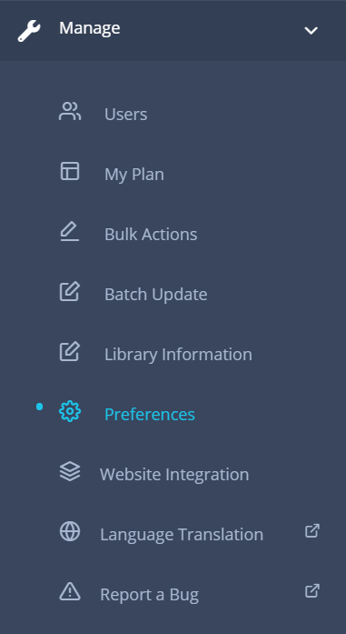

# Library

This section explains how to manage your library master data and other related information.

## Create Library

Please see the [create new library](getting-started.md#create-new-library) section in order to start a new library.

---

## Upgrade Library Plan

---

## Change Library Information

### Change / Update library Info

Please update your library information carefully and make sure that they are up to date.

**Steps to update library information**:

* Go to the **Library Information** section from the dashboard.

	

* Click on the `Library Info` tab if not selected automatically.
	
	

* Enter / update the information you want to change.
	* The description field shoud contain a short description about your library, library business hours, rules, policies, etc. This field is very importat for your library site visitor as this will be displayed on the "Ask a Librarian" page.
	* The email address and phone number provided here will be displayed on "Ask a Librarian" public page. However, you can individually turn off the display of email address, phone number from the preferences section. 
	* Uncheck the Private checkbox to make your catalog publicly visible online. 

		If checked, your catalog will not be visible online, member's with login access can access the information. This feature is suitable for corporate libraries.

* Clik on the `Submit` button to save your changes.

### Change / Update organization information

Please update your organization information carefully and make sure that they are up to date. The email address and phone number that you enter in this page will not be available in public.

**Steps to update organization information**:

* Go to the **Library Information** section from the dashboard.

	

* Click on the `Organization Info` tab.
	
	

* Enter / update the information that you feel necessary.
* Clik on `Submit` button to save your changes.

---

## Upload library logo

Logo is the single most import thing that gives your library an official identity. Please update your library logo as soon as possible to make it looks professional. For personal library, it is ok to keep the default librarika logo.

We support 200x200 pixel size file in PNG format.

**Steps to upload logo**:

* Go to the **Library Information** section from the dashboard.

	

* Click on the `Organization Info` tab.
	
	

* In Logo field click on the `browse` button and select a 200x200 pixel size png file.
* Clik on the `Submit` button to save your changes.

---

## Change prefereces

The preferences section is the single most important settings page for your library. Here you can change followings:

* Basic options
* Self-service settings
* Request items settings
* Notifications and Reminders settings
* Apperances / themes / languages settings

**Steps to update preferences**:

* Go to the **Prefereces** section from the dashboard.

	

* Click on tabs that you are interested to.
	
	

* Set / Enter / update the value that you want.
* Clik on the `Submit` button to save your changes.
* You latest changes will be applied instantly.

---

## Delete library

You can remove your library anytime from the dashboard. All you need is the _Library Admin_ permission in order to delete your library. When you delete a library, the library information and your own user account, catalogs, checkouts, members information and other related information will be removed.

But the individual login accounts created in librarika platform will stay active even though they were part of your library users, this is becuase each user is treated independentaly in librarika platform and one user can join multiple libraries using the same account.

Note: If you are on any paid plan (Premium Plan or E-Book Plan), please let us know so that we can discontinue your subscription before the removal.

**Steps to delete a library**:

* Go to the **Library Information** section from the dashboard.

	

* Click on the `Remove Library` Tab .
	
	

* Check `Remove my Library` and `Confirm removal` options as shown above.
* Clik on the `Submit` button.
