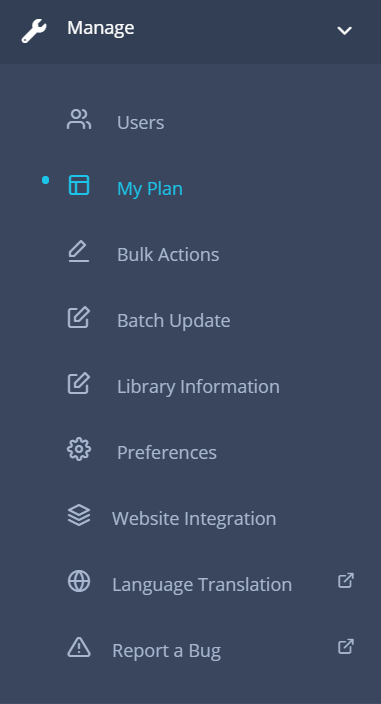
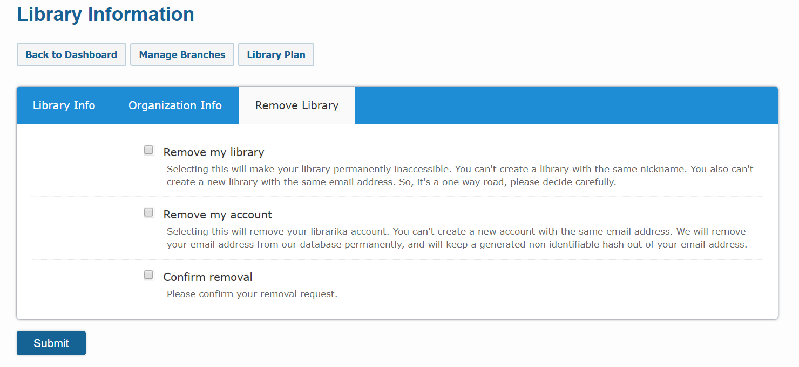

# Library

This section explains how to manage your library master data and other related information.

## Create Library

Please see the [create new library](getting-started.md#create-new-library) section in order to start a new free library. 

If you want to subcribe to a Premium Plan, please create a free library first and then upgrade to the desired premium plan following the [upgrade to premium plan](#upgrade-to-premium-plan) instructions.

---

## Change Library Information

### Change / Update library Info

Please update your library information carefully and make sure that they are up to date.

**Steps to update library information**:

* Go to the **Library Information** section from the dashboard.

	

* Click on the `Library Info` tab if not selected automatically.
	
	

* Enter / update the information you want to change.
	* The description field shoud contain a short description about your library, library business hours, rules, policies, etc. This field is very importat for your library site visitors as it will be displayed on the "Ask a Librarian" public page.
	* The email address and phone number provided here will be displayed on the "Ask a Librarian" public page. However, you can individually turn off the display of email address, phone number from the preferences section. 
	* Uncheck the **Private** checkbox to make your catalog publicly visible online. 

		If checked, your catalog will not be visible online, only member's with login access can access the information. This feature is suitable for corporate libraries.

* Clik on the `Submit` button to save your changes.

### Change / Update organization information

Please update your organization information carefully and make sure that they are up to date. The email address and phone number that you enter in this page will not be available in public.

**Steps to update organization information**:

* Go to the **Library Information** section from the dashboard.

	

* Click on the `Organization Info` tab.
	
	

* Enter / update the information that you feel necessary.
* Clik on `Submit` button to save your changes.

---

## Upload Library Logo

Logo is the single most import thing that gives your library an official identity. Please update your library logo as soon as possible to make it looks professional. For personal library, it is ok to keep the default Librarika logo.

We support 200x200 pixel size file in PNG/JPG format.

**Steps to upload logo**:

* Go to the **Library Information** section from the dashboard.

	

* Click on the `Organization Info` tab.
	
	

* In Logo field click on the `browse` button and select a 200x200 pixel size png/jpg file.
* Clik on the `Submit` button to save your changes.

---

## Change Prefereces

The preferences section is the single most important settings page for your library. Here you can change followings:

* Basic options
* Self-service settings
* Request items settings
* Notifications and Reminders settings
* Apperances / themes / languages settings

**Steps to update preferences**:

* Go to the **Prefereces** section from the dashboard.

	

* Click on tabs that you are interested to.
	
	

* Set / Enter / update the value that you want.
* Clik on the `Submit` button to save your changes.
* You latest changes will be applied instantly.

---

## Upgrade to Premium Plan

You can upgrade your library to a premium plan anytime you want from the Dashboard. It takes only just few minutes. The upgradation process is same for both new and existing libraries.

To upgrade, please follow the below steps:

* Login in to your library dashboard.

	

* Click on the "My Plan" option from the "Manage" dropdown menu.
	
	

* The My Plan page will be displayed as shown below.

	

* Click on "Show More Plans" link if you want to see more premium plans. 
* Choose your desired plan and click on the `Upgrade Now` button next to the your choosen plan.
* You will be prompted with a check-out form containing plan name, yearly subscription info and billing amount.
* Complete the check-out procedure by entering billing information and payment method.
* Your library will be upgraded to the Premium Plan instantly.

---

### Change or Update Payment / Billing Information

For premium libraries, the payment method is charged automatically when the annual subscription expires. You may want to chnage / update payment information so that next renwal takes place without any service disruption.

You can change the payment method anytime. Please follow the below steps:

* Please go to [https://2co.com](https://2co.com). 

	  

* Make sure that you  see green lock icon with **2Checkout.com inc (US)** text on the browser's address bar as shown in the picture above.  
* Enter your Order Number or Paypal Invoice ID and the email address which given at the time of purcase.
* You will then see the payment and billing information detail with current subscription status. 
* You can make make necessary changes here and save your changes.

##### Cancel Subscription

* Also, you can cancel the subscription using the same process mentioned above.
* Please note that, once cancelled, no future payment will be made to this order.

---

## Delete Library

You can remove your library anytime from the dashboard. All you need is the _Library Admin_ permission in order to delete your library. When you delete a library, the library information and your own user account, catalogs, checkouts, members information and other related information will be removed.

However, the individual login accounts created in Librarika platform either by library member or staff users will stay active even though they were part of your library users, this is becuase each user is treated independentaly in Librarika platform and one user can join multiple libraries using the same account.

Note: If you are on any paid plan (Premium Plan or E-Book Plan), please let us know so that we can discontinue your subscription before you delete your library.

**Steps to delete a library**:

* Go to the **Library Information** section from the dashboard.

	

* Click on the `Remove Library` Tab .
	
	

* Check `Remove my Library` and `Confirm removal` options as shown above.
* Clik on the `Submit` button.
