# Member Area

Member area is a special section for library members only, where they can access their own activity with the library. This section is only available for library members and not available for library staff.

## My Bookings

My bookings section list all of your currently active bookings along with their due date and status.

To view your active bookings, please follow the below steps:

* Please login to your library.
* Click on `Member Area` section from the Main menu.

	

* List of all active bookings will appear as shown below.

	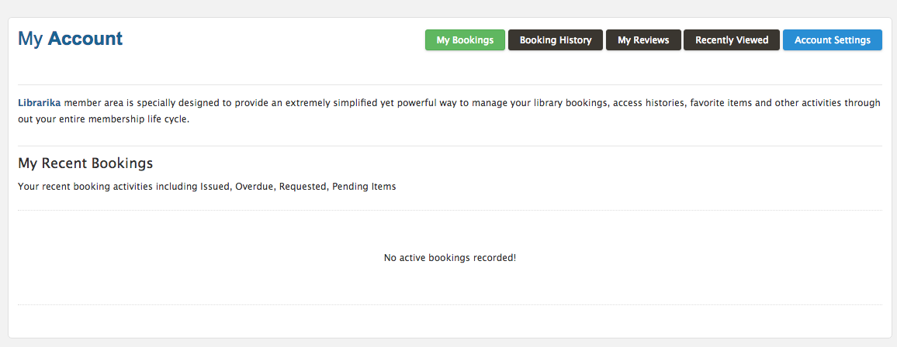

* You can now take relevant actions based on the status of each booking.

## Booking History

Booking History will provide you all the history of the bookings that you have viewed.

To view your history of bookings, please follow the below steps:

* You have to login first. 
* Click on `My Account` section from the Main Menu.

    

* After clicking my account the `Booking History` will appear as shown below.

    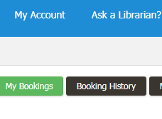

 * Then all the recent history will be appear like below.

    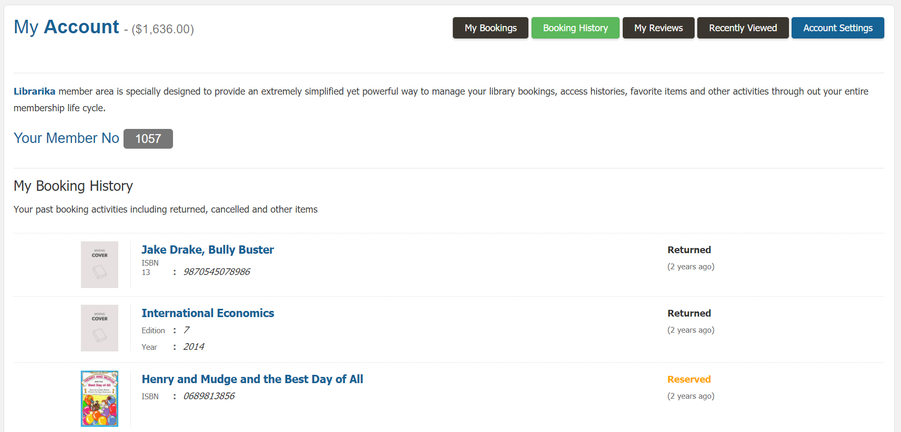

* Now you can view all the history of your actions time to time.
  
## My Reviews

My Reviews is the page that facilitate all the reviews of your library books.

If you want to see all the reviews then you have to follow the steps:

* At first login and go to my account like before.
* In `My Account` section you can see the button `My Reviews` like below.

    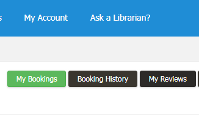

* If you click it then you can see all the reviews of you books like below.

    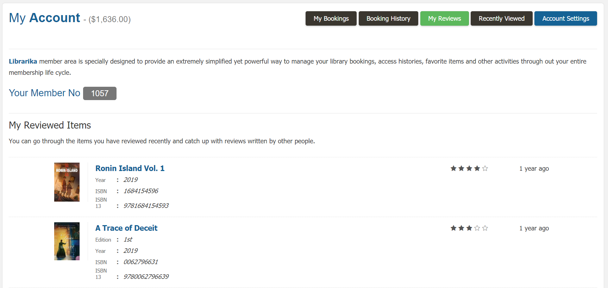

* Now you can view all the books that you have reviewed.
* You can also see the details of the books by clicking on its title and also view the reviews written by other people.

## Recently Viewed

Recently Viewed section will show you all the books that you have recently viewed.

* Like before from `My Account` go to the `Recently Viewed` option.
* Click on it and you can see the books you have viewed recently like below.

    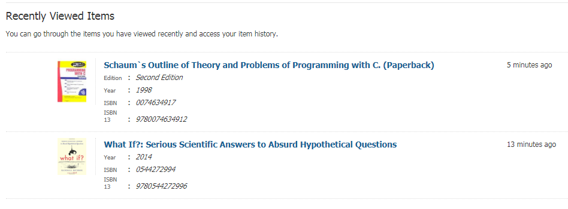

* When you view this page you can also see the details of each book by clicking on its title.
* Here you can also give your book review which is not previously reviewed.

## Account Settings

Account Settings is the section where you can update all of your account information.

* From `My Account` go to the account settings option. 
* Click on `Account Settings`  and you can see all the information of your account
  that you want to update like below.

    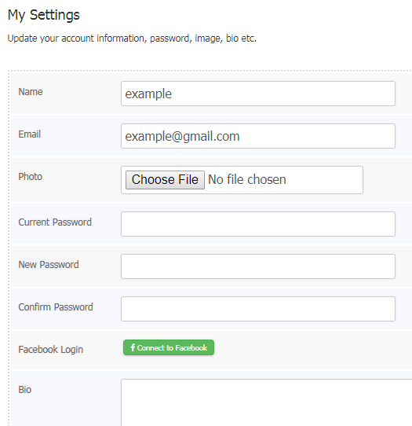

* If you want to change your password then enter your current password, new password and confirm new password.
* If you do not want to change your password then leave all passwords field empty.
* After updating all information you have to click `Save Settings` as shown below.
    
    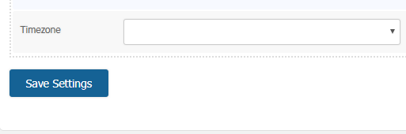

* Once you click the save settings button your given information will be saved.
* Now whenever you visit this page you can view your information or update your info.

## Submit Reservation Request

Submit Reservation Request is the section where you can send a request for any books that you want to reserve.

To complete your reservation, please follow the below steps:

* At first login to your library.
* Click on `Catalog Search` from the main menu.
    
    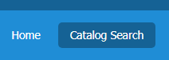

* In the `Catalog Search` page you can search any books that you want to reserve.
* Now search your needed book and it will be appear as shown below.

    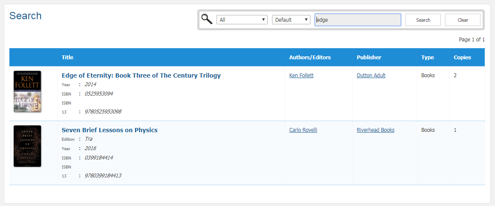

* If you click the `Title` of the book then all of its details will be shown up like below.

    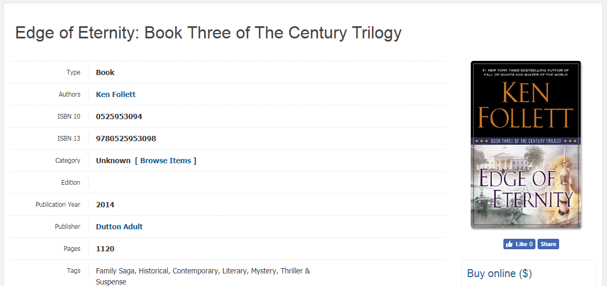

* In the book details page you can see the request button for each copy of the book.

    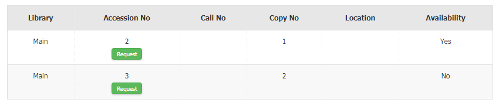

* If you click the `Request` button then your reservation request form will be appear.

    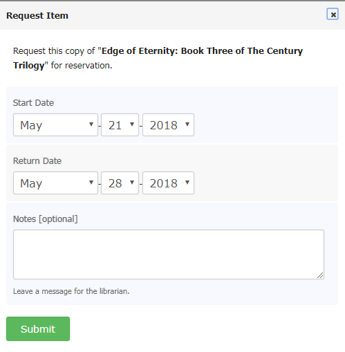 

* Now you can give your reservation date and also you can write a simple note about it, then click on `Submit`.
* Once you submit this form your request will be placed successfully like below.

    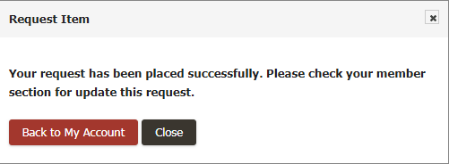 

* Now your request has been placed and if the library staff accept your request, then you will be notified and the item will be reserved for you.

## Cancel Reservation Request

Cancel Reservation Request is the section where you can cancel your reservation request that you have been placed earlier.

To cancel your reservation, please follow the below steps:

* At first go to the Main Menu.
* Click on `My Account` section of your Main Menu.
* You can see the `Cancel` button in your Recent Bookings.
    
     

* Click on `Cancel` and you can see the cancel reservation form of your book like below.

    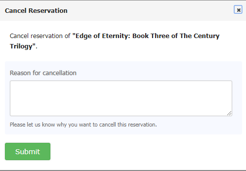

* Now you must have to show a reason why you want to cancel your reservation, otherwise you can not Submit the form and an
error message will appear.

    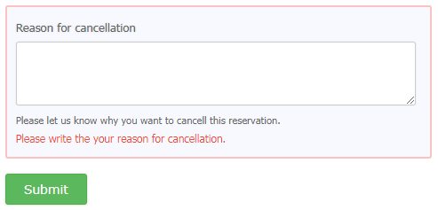

* After giving your reason you can Submit your form.
* Once you click on `Submit` your cancellation will be confirmed like below.

    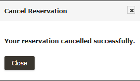

