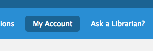
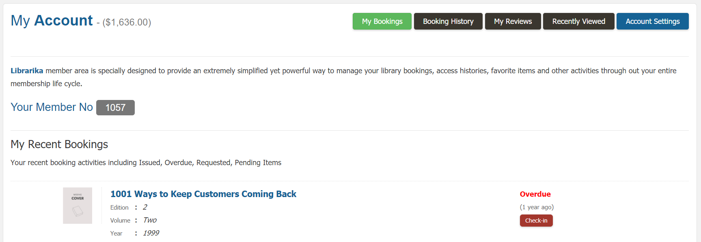
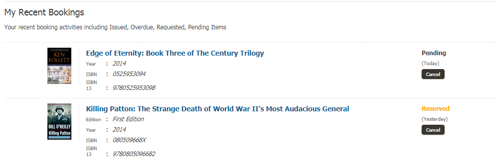

# Member Area

Member area is a special section for library members only, where they can access their own activity with the library. This section is not available to any library staff.

## My Bookings

My Bookings section will list all of your currently active bookings along with their due date and status.

To view your active bookings, please follow the below steps:

* Please login to your library.
* Click on `My Account` menu from the top.

	

* List of all active bookings will appear as shown below.

	

* You can now take relevant actions based on the status of each booking.

## Booking History

Booking History will provide you all the history of the bookings that you have viewed.

To view your history of bookings, please follow the below steps:

* You have to login first. 
* Click on `My Account` menu from the top.

    

* My account page will appear with the button named `Booking History` as shown below.

    

 * Click on it and all your recent booking history will be appeared.

    

* Now you can view all the history of your actions time to time.
  
## My Reviews

My Reviews is the section that facilitate all the reviews on each of your library books.

If you want to see all the reviews then you have to follow the below steps:

* At first login to your library and go to my account menu like before.
* In `My Account` section you can see the button `My Reviews` like below.

    

* If you click on it then you can see the review on your books like below.

    

* Now you can view all those books that have been reviewed so far.
* You can also see the details of the books by clicking on its title and also view the reviews written by other people.

## Recently Viewed

Recently Viewed section will show you all those books that you have been viewed recently.

* Like before from `My Account` go to the `Recently Viewed` option.
* Click on it and you can see the books you have viewed recently like below.

    

* When you view this page you can see the details of each book by clicking on its title. From there you can also give your review on that book.

## Account Settings

Account Settings is the section where you can update all the information of your library account.

* From `My Account` go to the account settings option. 
* Click on `Account Settings` button and you can see all the information of your account like below.

    

* Now you can update any information of your account.
* If you want to change your password then please enter current password, new password and confirm new password fields.
* If you do not want to change your password then leave all passwords field empty.
* After updating all information you have to click on `Save Settings` button as shown below.
    
    

* Once you click the save settings button your given information will be saved.
* Now whenever you visit this page you can view your information or update your info.

## Submit Reservation Request

Submit Reservation Request is the section where you can send a request for any books that you want to reserve.

To complete your reservation, please follow the below steps:

* At first login to your library.
* Click on `Catalog Search` from the main menu.
    
    

* In the `Catalog Search` page you can search any books that you want to reserve.
* Now search your needed book and it will appear as shown below.

    

* If you click on the `Title` of the book then all of its detail will be shown up like below.

    

* In the book details page you can see the request button for each copy of the book.

    

* If you click on the `Request` button then your reservation request form will appear.

     

* Now you can give your reservation date and also you can write a simple note about it, then click on `Submit` button.
* Once you submit this form your request will be placed successfully like below.

     

* Now your request has been placed and if the library staff accept your request, then you will be notified and the item will be reserved for you.

## Cancel Reservation Request

Cancel Reservation Request is the section where you can cancel your reservation request that you have been placed earlier.

To cancel your reservation, please follow the below steps:

* At first go to the Main Menu.
* Click on `My Account` menu from the top.
* You can see the `Cancel` button in your recent bookings section.
    
     

* Click on `Cancel` button and you can see the cancel reservation form of your book like below.

    

* Now you must have to show a reason why you want to cancel your reservation, otherwise you can not submit the form and an error message will be shown.

    

* After giving your reason you can submit your form.
* Once you click on `Submit` button your cancellation will be confirmed like below.

    

