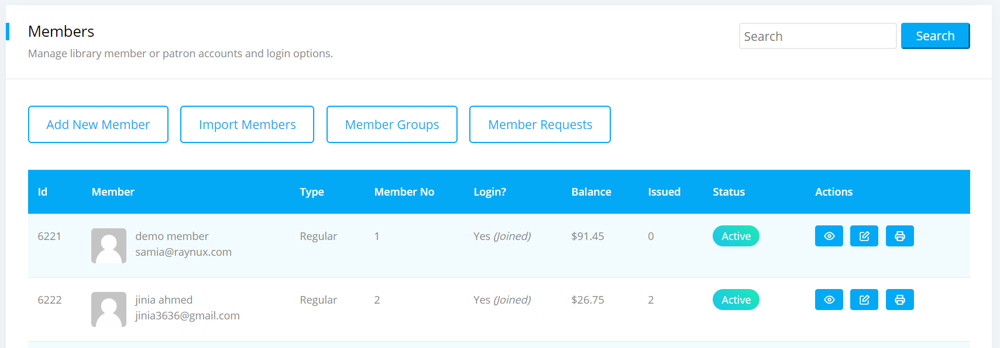
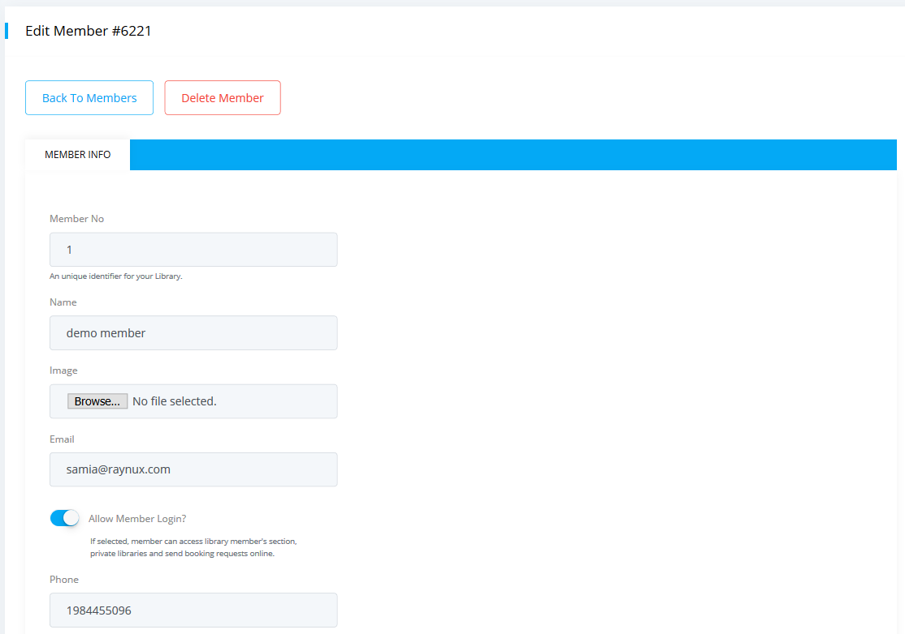
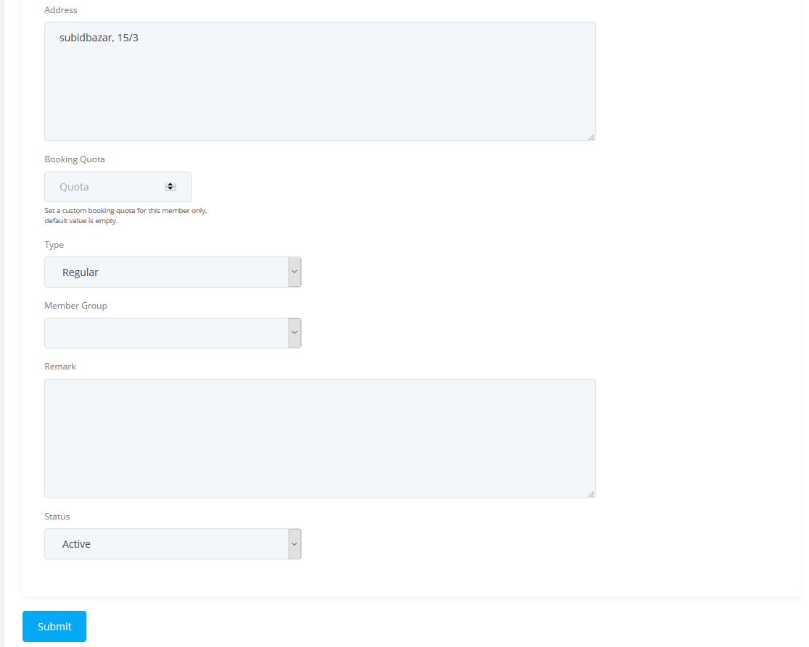

# Members (or Patrons)

The members section is where you enlist all your members (or patrons) of your library. Only an unique _member no_ is necessary for a member to check out/in books from your library.

You can provide login access to a member if you wish but it is not a mandatory requirement from system's perspective. However, if you enable login access, system will ask for an unique email address for the member.

### Booking Quota

A booking quota is the total limit up to which a member can reqeust / check-out / reserve books (or items) at a given point of time. By default, a global variable for the booking quota is available under `Manage -> Preferences` section, but the global quota will be overridden with the individual booking quota if set specifically for a member.

You can set individual booking quota for each member using the Add / Edit member method mentioned below. Again, if a individual quota not set, then global quota will be enforced.

### Add new member

To add a member to your library, please follow the below steps:

* Please go to the `Dashboard -> Circulations -> Members` section.

* Click on `Add New Member` button.
* Add new member form will be displayed as shown below.

	

* Enter necessary information regarding the member. Only member no, name, type and status fields are mandatory.
* Click on the `Submit` button when you are done
* A new member record will be created.

### Edit existing member

To edit an existing member in your library, please follow the below steps:

* Please go to the `Dashboard -> Circulations -> Members` section.
* Locate the member record you want to edit.

	

* Click on the `Edit` icon on the right to that member.
* Member edit form will be displayed as shown below.

	
	

* Update necessary information regarding the member.
* Click on the `Submit` button when you are done. 
* Your changes will be saved.

### Import members

You can peform bulk import of members to your library using our bulk import method. Please read our [Import Members][member_bulk_import] instruction page for more details on how to proceed.

### Member Related Bookings

From members section you can find all the related circulations of your library members. For example all the books a member has borrowed, whether they still have it or have returned it etc. By default you can see only the active bookings of a member but you can see other bookings also. However, you can also export them into a csv file.

* To view your member related bookings please go to member view page and navigate to the bottom then you can see all the bookings like below. 

	

### Member area access

Librarika has a member only access area for the members (or patrons) of a library. If access is granted, member can login to the library using their credential and access the member area.

In member area they can access following informtions:

* View current checked-out items including due date and status.
* View requested items with pending / approval status.
* View past check-out history with status. 
* View recently viewed / favorited items.
* Write review to the past check-out items.

Also, they can perform some activities that is otherwise not possible, such as: request item, write review, access catalogs in a private library.

#### Enable member access

Enabling membr access is very easy. You can do it in following way:

* Go to the members edit page as per above [edit member](#edit-existing-member) instruction.
* Enter email address of the member if empty.
* Check the `Allow Member Login` option.
* Click on the `Submit` button when you are done.
* A "Join Library" invitation email will be sent to that email address.
* Member needs to accept the invitation in order to connect with your library.

Alternatively, a member can create an account in *Librarika* platform indenendently and submit `Member Access Request` to join your library. In this case, go to the [Member Requests](#member-requests) section as mentioned below and accept or reject the reqeust upon review.

#### Disable member access

Same way you can disable member login access from the edit member page. 

* Go to the members edit page as per above [edit member](#edit-existing-member) instruction.
* Uncheck the `Allow Member Login` checkbox. 
	* Unchecking only this option, will soft-disable the login access. You can enable the access later without requiring any new invitation email.
* To permanently disable the login access, uncheck the `Remove Login` checkbox too.
	* If unchecked, you can enable login access again with a new invitation email. 
* Click on the `Submit` button when you are done.

### Delete member

To delete a member from your library, please follow the below steps:

* Please go to the `Dashboard -> Circulations -> Members` section.

* Locate the member record you want to delete and click on the `Edit` icon on the right to that member.

	

* Member edit form will be displayed with a button named `Delete Member` on the top of the section.
* Click on the `Delete Member` button
* The member record will be deleted.

Related:

* Deleting a member will set member reference to null for all circulation records, but it will not actually delete the circulation records from the system for future reference.

---

## Member Groups

Member groups section lets you add / edit / delete member group information such as Grade / Class to your library. Once a new member group is created, you can then assign member's to that group from the member edit page.

Member group provides the flexibility to bulk edit / delete the belonging members (or patrons) using the bulk actions method.

To access Member Groups:

* Please go to the `Dashboard -> Circulations -> Members` section.
* Click on the `Member Groups` button on top of the section.

---

## Member Requests

Member requests section is where you will see all pending member requests for your library. When someone submit a member access request, it will appear here based on your library policy.

You can then either accept the request or decline the request. If you want to accept, system will ask you to provide a Member No for the new member.

To access Member Requests:

* Please go to the `Dashboard -> Circulations -> Members` section.
* Click on the `Member Requests` button on top of the section.

[member_bulk_import]: https://librarika.com/spages/import-members "Bulk Import of Members"