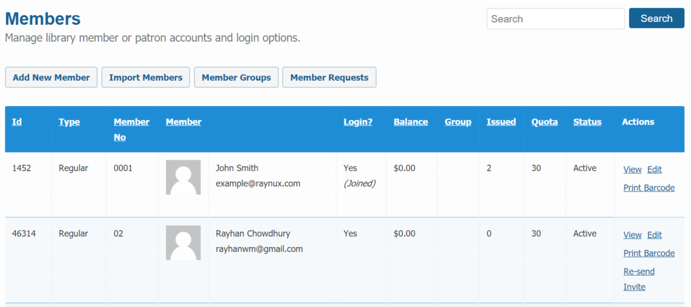

# Members (or Patrons)

The members section is where you enlist all your members (or patrons) of your library. Only an unique _member no_ is necessary for a member to check in and out book from your library.

You can provde login access to a member if you wish but it is not necessary. If you enable login access, system will ask for an unique email address for the member.

### Booking Quota

A booking quota is the limit up to which a member can reqeust / check-out / reserve books (or items) at a given point of time. By default, a global variable for the booking quota is available under `Manage -> Preferences` section, but the global quota will be overridden with the individual booking quota if set specifically for a member.

You can set individual booking quote for each member using the Add / Edit member method mentioned below. Again, if a individual quota not set, then global quota will be enforced.

### Add new Member

To add a member to your library, please follow the below steps:

* Please go the `Dashboard -> Circulations -> Members` section.

* Click on `Add New Member` button.
* Add new member form will be dsiplayed as shown below.

	

* Enter necessary information regarding the member. Only member number, name, status and member type fields are mandatory.
* Click on the `Submit` button when you are done and your changes will be saved.

### Edit existing member

To edit a member in your library, please follow the below steps:

* Please go the `Dashboard -> Circulations -> Members` section.

* Locate the member record you want to edit and click on the `Edit` link on the right to the member.
	
* Member edit form will be dsiplayed as shown below.

	

* Update necessary information regarding the member.
* Click on the `Submit` button when you are done and your changes will be saved.

### Import Members

You can peform bulk import of members to your library using our bulk import method. Please read our [Import Members][member_bulk_import] instruction page for more details on how to proceed.

### Member Area Access

Librarika has a member only access are for the members (or patrons) of the library. If granted, member can login to the library and access the member area.

In member area they can access following informtions:

* View current checked-out items including due date and status.
* View requested items with pending / approval status.
* View past check-out history with status. 
* View recently viewed / favorited items.
* Write review to the past check-out items.

Also, they can perform some activities that is not possible without the member access such as Request Item, write review, access private library.

#### Enable Member Access

Enabling membr access is very easy. You can do it in following way:

* Go to the members edit page as per above **Edit Member** instruction.
* Enter email address of the member if empty.
* Check the `Allow Member Login` option.
* Click on the `Submit` buton when you are done.
* A "Join Library" invitation email will be sent to the email address.
* Member needs to accept the invitation in order to connect with your library.

Also, a member can create an account in *Librarika* platform indenendently and submit `Member Access Request` to join your library. In this case, go to the `Member Requests` section as mentioned below and accept or reject the reqeust after the review.

#### Disable Member Access

Same way you can disable member login from the edit member page. 

* Go to the members edit page as per above **Edit Member** instruction.
	
* Uncheck the `Allow Member Login` option. 
	* Unchecking only this option, will soft-disable the login access. You can enable the access later without requiring any new invitation email.
* To permanently disable login, uncheck the `Remove Login` too.
	* If unchecked, you can enable login access again with a new invitation email. 
* Click on the `Submit` buton when you are done.

### Delete Member

To delete a member from your library, please follow the below steps:

* Please go the `Dashboard -> Circulations -> Members` section.

* Locate the member record you want to edit and click on the `Edit` link on the right to the member.

	

* Member edit form will be dsiplayed with a button named `Delete Member` on the top of the section.
* Click on the `Delete Member` button and the member record will be deleted.

Related:

* Deleting a member will set member reference to null for all circulation records, but it will not actually delete the circulation records from the system for future reference.

---

## Member Groups

Member groups section lets you add / edit / delete member group information such as Grade / Class to your library. Once a new member group is created, you can then assign member's to that group from the member edit page.

Member group provides the flexibility to bulk edit / delete the belonging members (or patrons) using the bulk actions method.

To access Member Groups:

* Please go the `Dashboard -> Circulations -> Members` section.
* Click on the `Member Groups` button on top of the section.

---

## Member Requests

Member requests section is where you will see all pending member requests for you library. When someone submit a member access request, it will appear here based on your library policy.

You can then either accept the reqeust or decline the reqeust. If accepted, system will ask you to provide Member Number for the new member.

To access Member Requests:

* Please go the `Dashboard -> Circulations -> Members` section.
* Click on the `Member Requests` button on top of the section.

[member_bulk_import]: https://librarika.com/spages/import-members "Bulk Import of Members"