# OPAC

OPAC is a library acronym for "Online Public Access Catalog" When library staff use the term, we mean the Libraries Catalog.

# Purpose Of OPAC

An online public access catalog is an online database of materials held by a library or group of libraries. Users search a library catalog principally to locate books and other material available at a library. OPAC is the gateway to library's collection.

# Home Page

A home page is refers to the first page that appears upon opening a website on web browser, sometimes called the start page. In this page you can view all the information and also the workflow of Librarika.

* In home page at first you can see all the menus and your profile icon bar. 
	
	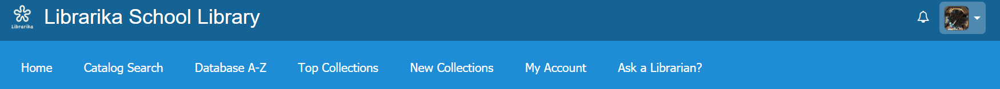
   
* Then you can see two buttons. If you click on one of them like the `View All Features` button then you can see all the features of Librarika.

	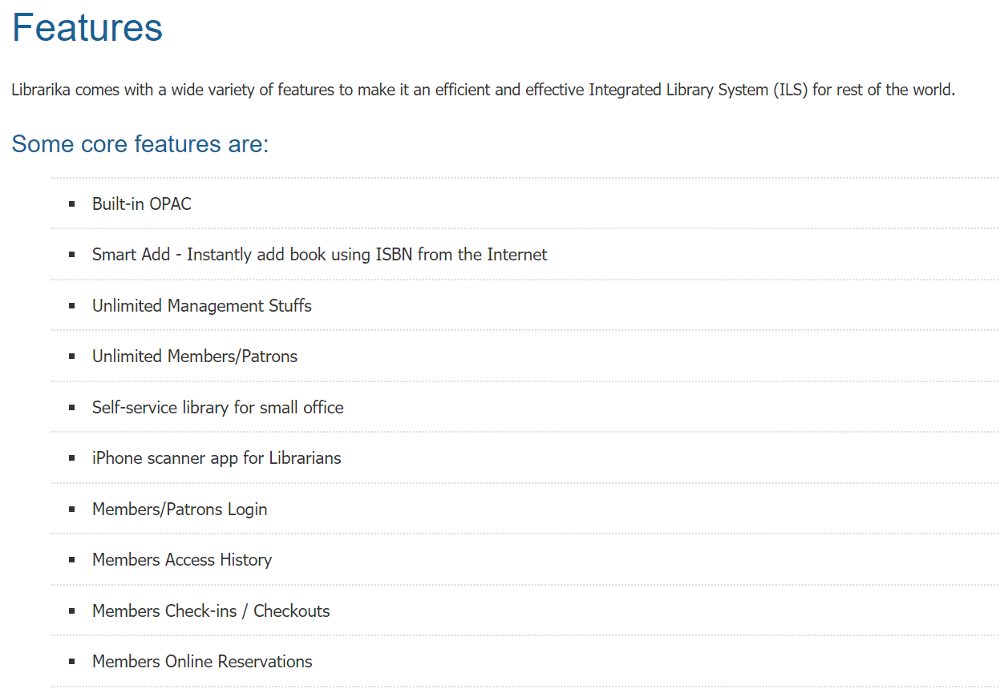

* You can create a free account on librarika by clicking on `Create Free Library` button.
* If you are already logged in then from the `Member Area` you can update your account settings.
* You can search the catalog by keyword and media types option from `Search Catalog`
* You can also acccess other library resources from home page.
* At last you can view all the newly arrived books and if you click one of them then you can also view all the information of that book.

# Catalog Search

Catalog Search is the section where you can search the entire library catalog items using a specific keyword or selecting a media type option. You can also browse the catalog by categories, authors, publishers or tags.

* At first if you want to search the catalog by a specific media type option then choose any media from the dropdown menu like below.

	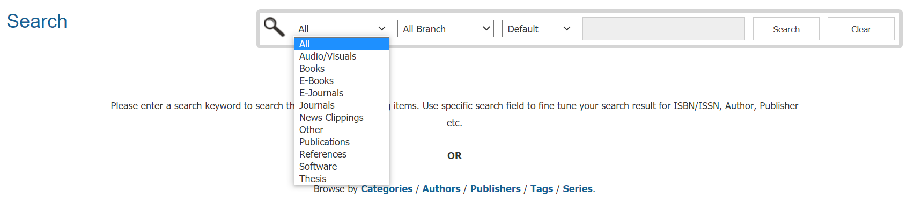

* If you want to search the catalog by any keyword then choose the `Default` mode. You can also use specific search field such as ISBN/ISSN, Title, Publisher and more options for a better result.

	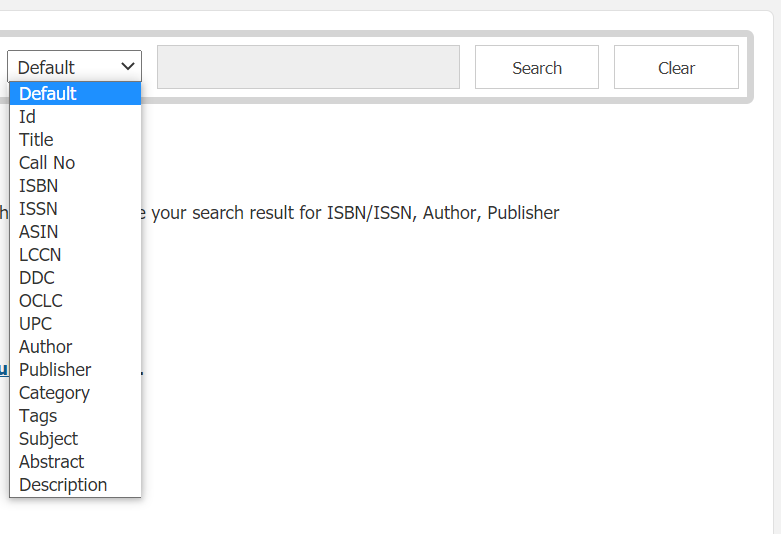

* You can browse the catalog by categories if you click on `Categories`

	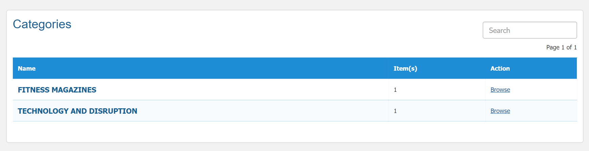

* You can browse the catalog by authors if you click on `Authors`

	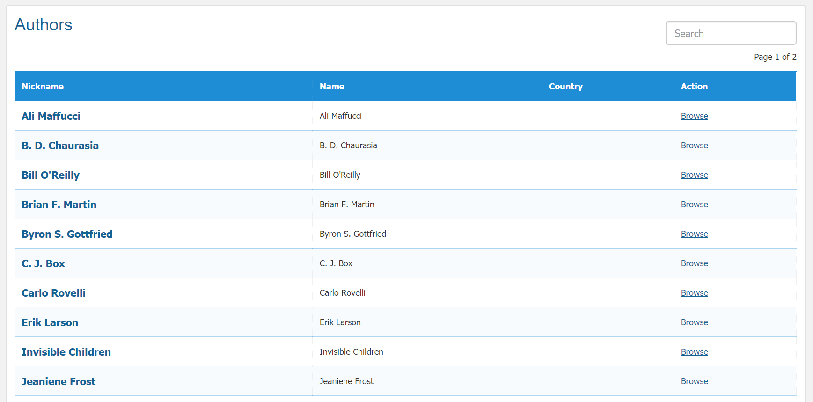

* You can browse the catalog by publishers if you click on `Publishers`

	

* You can browse the catalog by tags if you click on `Tags`

	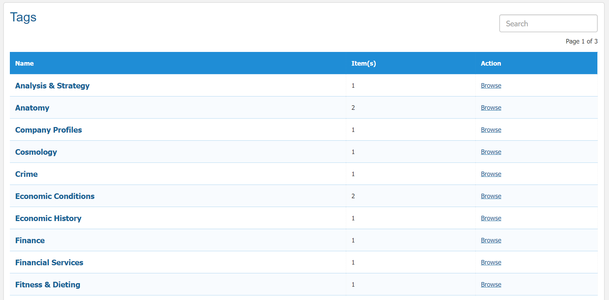

* You can also clear your searching history if you click on the `Clear` button.

# Database A-Z

Database A-Z is the section where you can browse your books by alphabetical order or numerical order.

* If you click on any character then you can see the list of books by that specific character.
* Say for example, you have clicked on `B` then you can see all the list of books which are starting with B.

	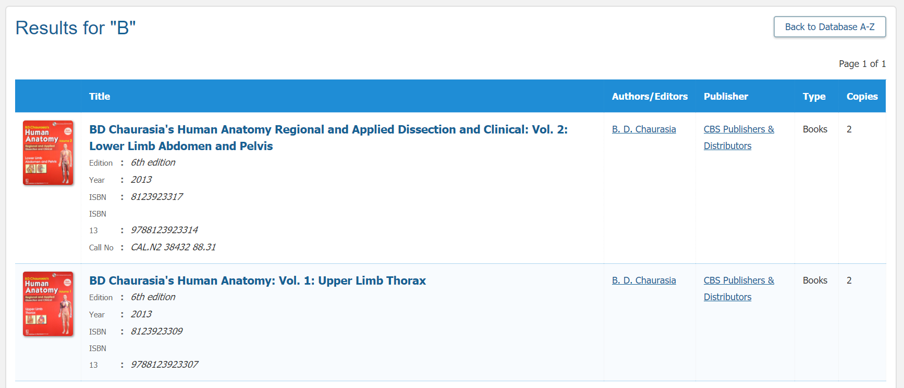

* Like characters you can also browse your books by numbers (0-9).

# Top Collections

Top Collections is the section where you can find those books which have higher checkouts, reviews and ratings.

* If you click on `Top Collections` then all of the top books in your library will be appeared like below.

 	

* In the top collections page if you click on any **Column Headings** then you can find the  list of books by that column heading.

# New Collections

New Collections is the section where you can find those books which are added recently to a Library.

* If you click on `New Collections` then all of the newly arrived books in your library will be appeared like below.

 	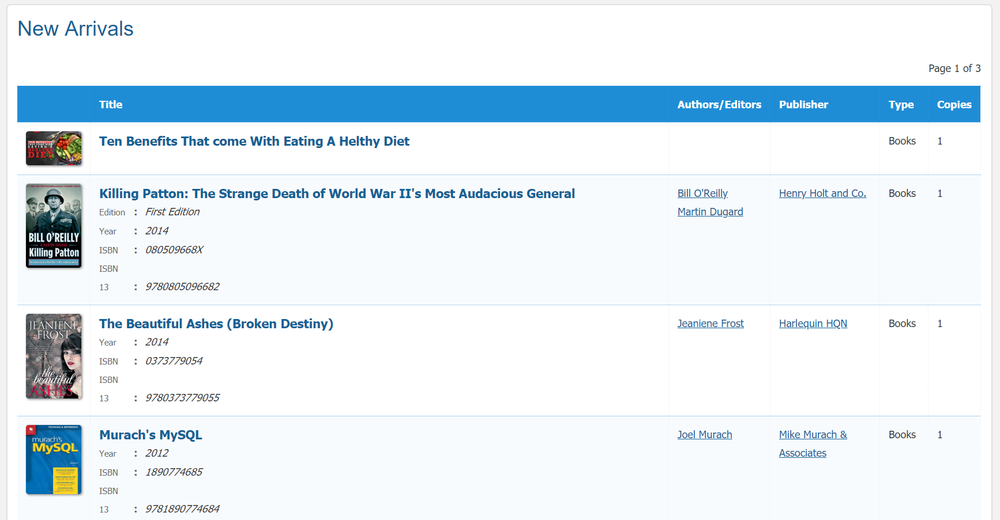

* In the new collections page if you click on any **Column Headings** then you can find the list of books by that column heading.

# My Account

My Account section is a powerful way to manage your library bookings, access histories, favorite items and other activities through out your entire membership life cycle.

* If you click on `My Account` then a page will appear like below

	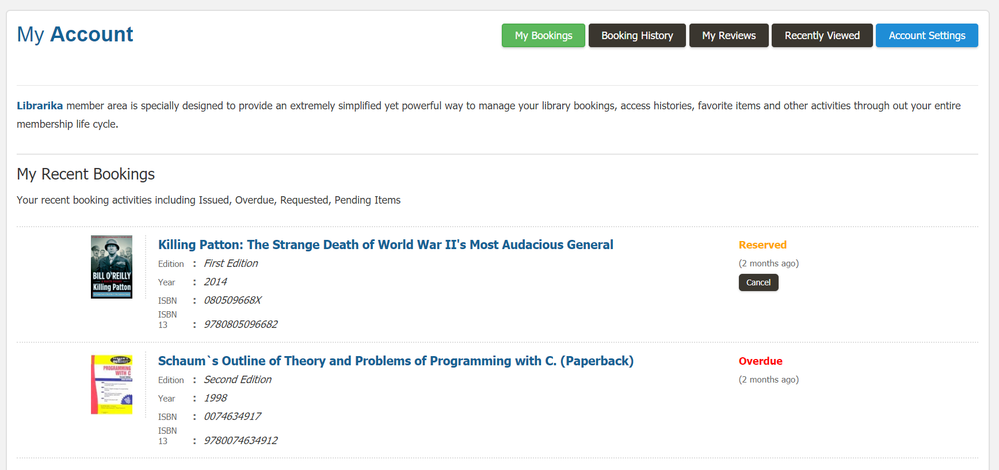

# Ask A Librarian

In this section You can ask any questions related to Librarika via E-mail.

* If you click on `Ask a Librarian` then a page will appear like below

	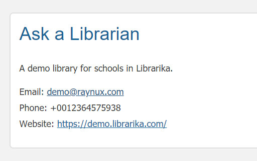

* Feel free to ask anything related to our system because Librarika is always ready to give response to your queries.  