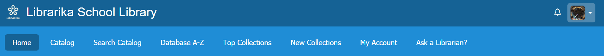
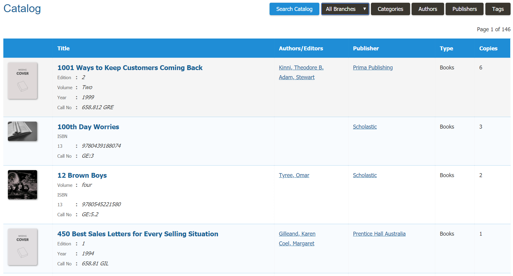
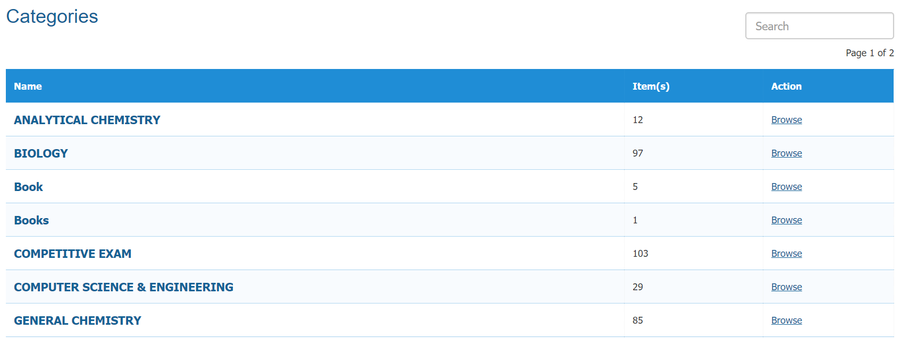
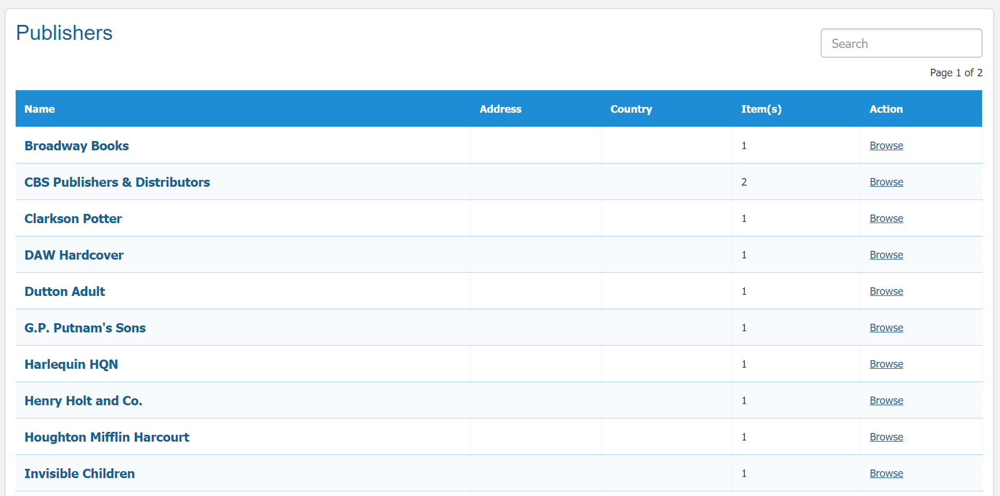

# OPAC

OPAC is a library acronym for "Online Public Access Catalog" When library staff use the term, we mean the Libraries Catalog.

### Purpose of OPAC

An online public access catalog is an online database of materials held by a library or group of libraries. Users search a library catalog principally to locate items and other material available at a library. OPAC is the gateway to library's collection.

# Home Page

A home page is refers to the first page that appears upon opening a website on web browser, sometimes called the start page. In this page you can view all the information and also the workflow of Librarika.

* In home page at first you can see all the menus and your profile icon bar. 
	
	
   
* Then you can see two buttons. If you click on one of them like the `View All Features` button then you can see all the features of Librarika.

	

* You can create a free account on librarika by clicking on `Create Free Library` button.
* If you are already logged in then from the `Member Area` you can update your account settings.
* You can view all of your library catalog from `Catalog` menu.
* You can search the catalog by keyword and media types option from `Search Catalog`
* You can also acccess other library resources from home page.
* At last you can view all the newly arrived items and if you click one of them then you can also view all the information of that book.

# Catalog

A catalog is a collection of items found in a library to provide all the information necessary to describe all item accurately both physically and intellectually in order to distinguish it from every other items.

* If you click on the catalog menu then a catalog of your library items will be appeared like below.

	

* Now you can view any item of your library catalog with necessary information.
* If you click on the `Search Catalog` button on the top corner of your catalog page then you will go to the search page of your library.
* If you click on the `All Branches` option then you can view the catalog based on a specific library branch. 
* If you click on the `Categories` button then you can view all the list of your library categories. You can also see the amount of item under each category. By clicking on any specific category you can view all the items which are related to this category.

	

* You can view all the authors of your library catalog if you click on the `Authors` button. If you click any specific author then you can view the item related to this author.
* If you click on the `Publishers` button then you can view all the publishers of your library catalog. Also you can see the amount of item under each publisher.
* Finally by clicking on the `Tags` button you can view the tags of your library catalog.

# Search Catalog

Search Catalog is the section where you can search the entire library catalog items using a specific keyword or selecting a media type option. You can also browse the catalog by categories, authors, publishers or tags.

* At first if you want to search the catalog by a specific media type option then choose any media from the dropdown menu like below.

	

* If you want to search the catalog by any keyword then choose the `Default` mode. You can also use specific search field such as ISBN/ISSN, Title, Publisher and more options for a better result.

	

* You can browse the catalog by categories if you click on `Categories`

	

* You can browse the catalog by authors if you click on `Authors`

	

* You can browse the catalog by publishers if you click on `Publishers`

	

* You can browse the catalog by tags if you click on `Tags`

	

* You can also clear your searching history if you click on the `Clear` button.

# Database A-Z

Database A-Z is the section where you can browse your items by alphabetical order or numerical order.

* If you click on any character then you can see the list of items by that specific character.
* Say for example, you have clicked on `B` then you can see all the list of items which are starting with B.

	

* Like characters you can also browse your items by numbers (0-9).

# Top Collections

Top Collections is the section where you can find those items which have higher checkouts, reviews and ratings. Only 100 top collected items will be displayed.

* If you click on `Top Collections` then all of the top items in your library will be appeared like below.

 	

* In the top collections page if you click on any **Column Headings** then you can find the  list of items by that column heading.

# New Collections

New Collections is the section where you can find those items which are added recently to a Library. Only 100 new items will be displayed.

* If you click on `New Collections` then all of the newly arrived items in your library will be appeared like below.

 	

* In the new collections page if you click on any **Column Headings** then you can find the list of items by that column heading.

# My Account

My Account section is a powerful way to manage your library bookings, access histories, favorite items and other activities through out your entire membership life cycle.

* If you click on `My Account` then a page will appear like below

	

* For other tabs please go to [Member Area](member-area) section.

# Ask A Librarian

In this section you can contact with your library administrator and ask any questions related to your library via e-mail.

* Please click on `Ask a Librarian?` menu and a page will be appeared like below

	

* Here you can find all the contact information of your library.  