# Reports

This is the section where you can view all the reports of your library depending on varoius topics such as catalog, circulation, member, overdue and others within a date range. You can find different filtering options on each report. Also you can print them out or export them per your need. 

To access this section, please follow the below steps:

* Please go to `Dashboard -> Reports` section.
* Click on the `Reports` menu.
* Reports page will be appeared like below.

	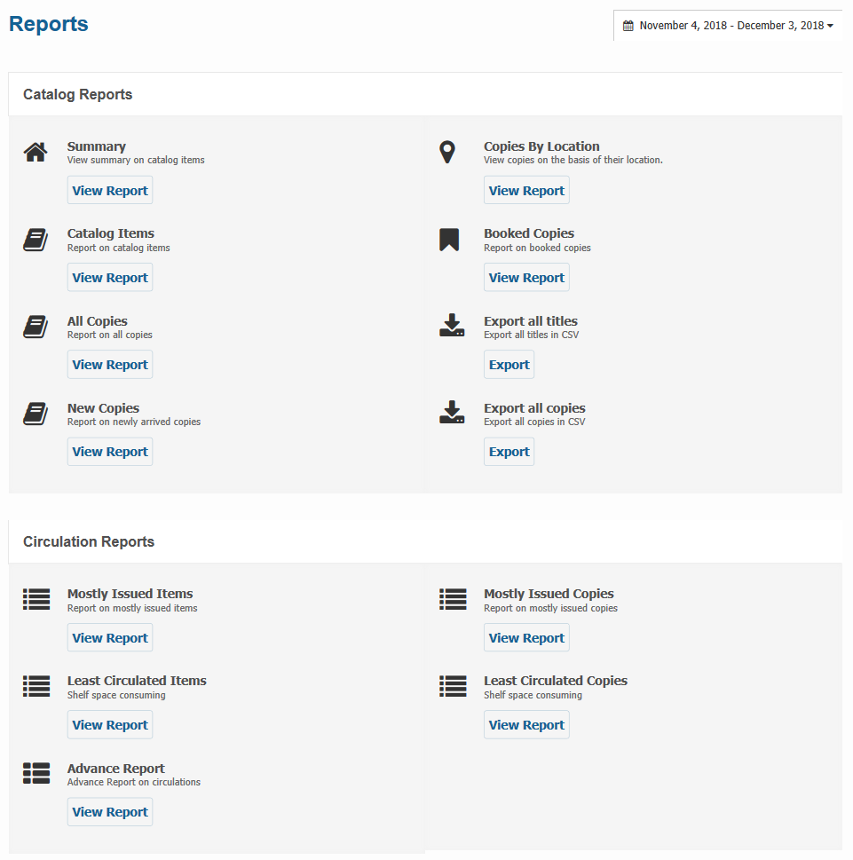
	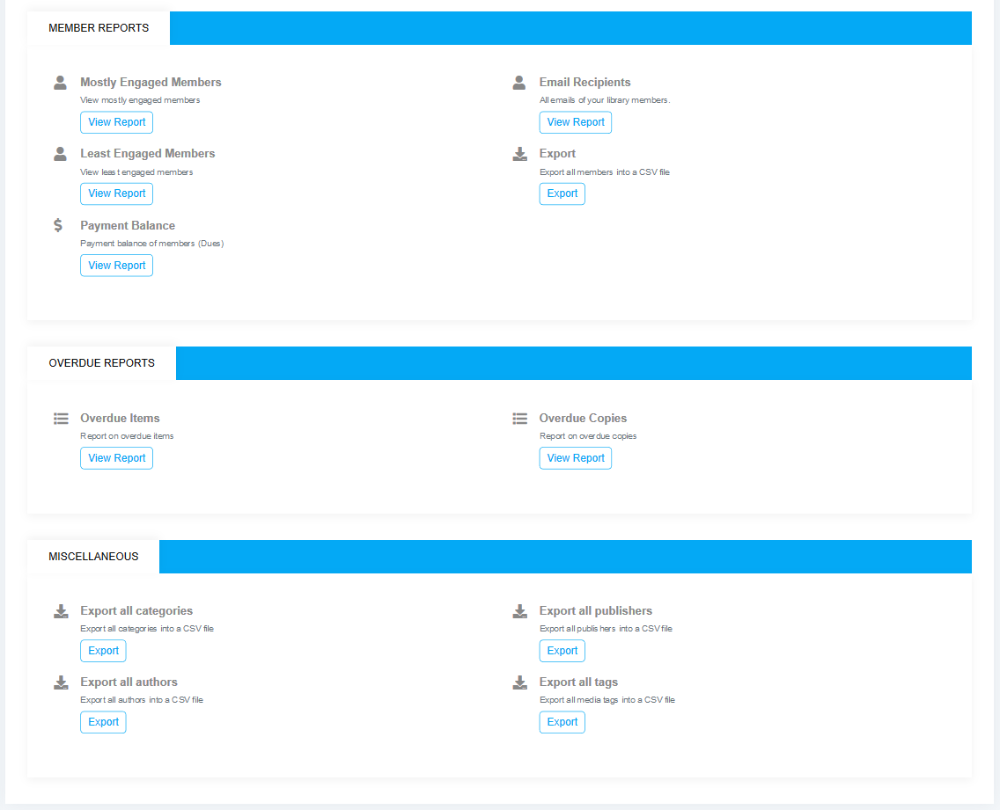

## Catalog Reports

Catalog Reports are based on your library catalog items and their related copies.

* At the beginning of reports section you can see the catalog reports like below.

	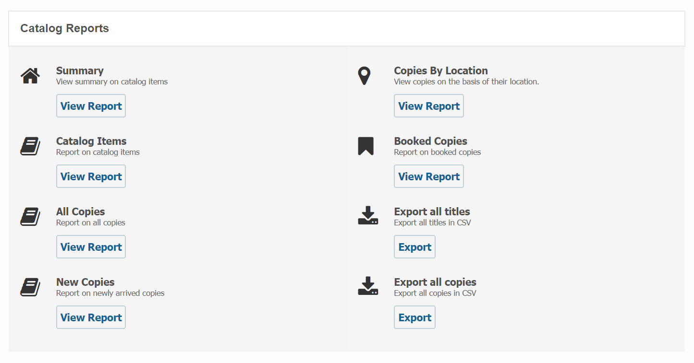

* At first you can view the report of `Summary` on your catalog items. 
* if you click on the view report button below the summary heading then an item summary page will appear like below.

	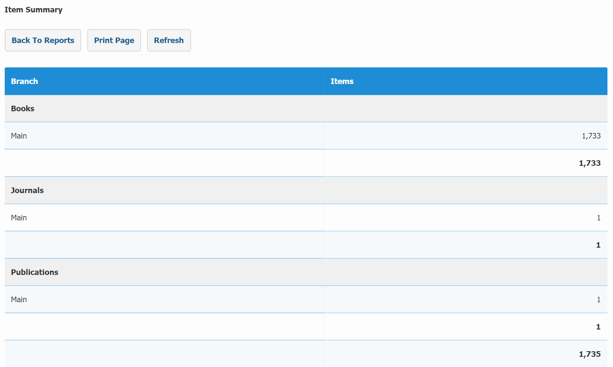

* Now you can view how many items are resides under each branch. Also you can print them out if you need.
* Next if you click on the view report button below the `Catalog Items` heading then the catalog items page will appear.

	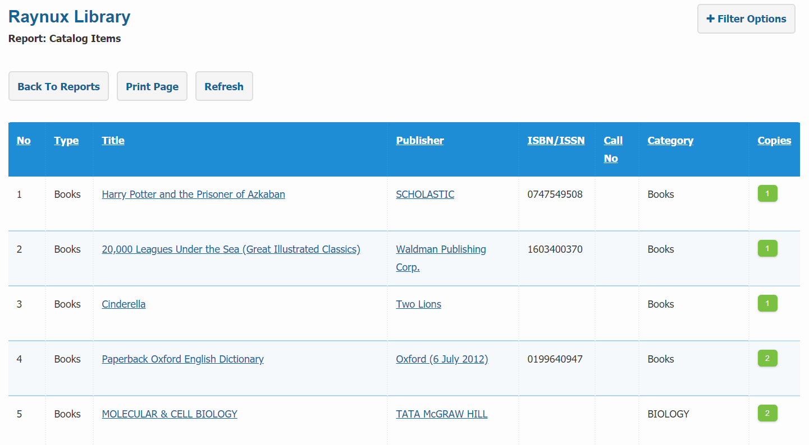

* If you click on the `Filter Options` on the top right corner of this page then you can find several filtering options for your catalog items.

	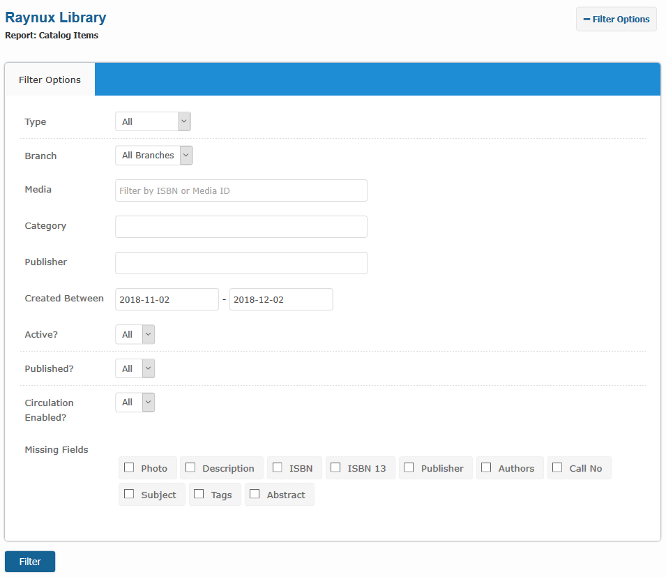

* Now you can enter any fields from which you want to filter and click on the `Filter` button once you are done.
* Next if you click on the `All Copies` view report button then you can view all the copies of your library catalog items.

	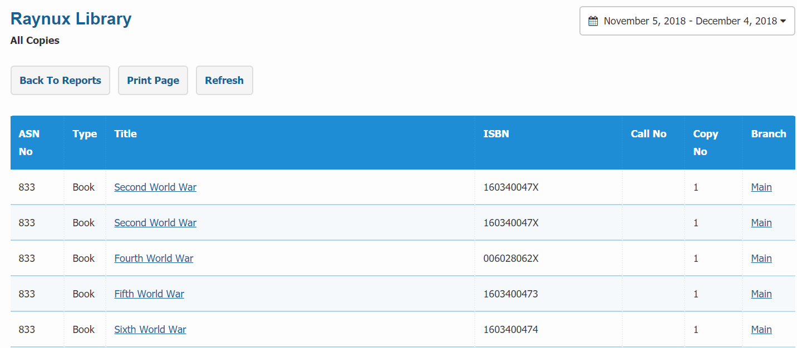

* Also you can view all the copies in a particular date range like below.

	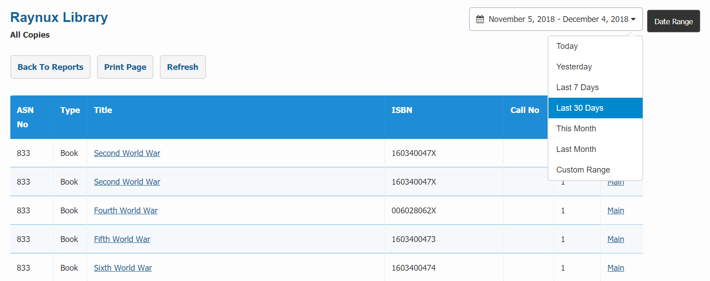

* Next you can view reports only for the newly arrived copies under each item from `New Copies` view report. Also you can view this within a date range.
* Then you can view all the copies by their location from `Copies By Location` view report.
* Next report is only for those copies which have been booked. If you click on the `Booked Copies` view report then you can view all the booked copies of your library catalog items.
* Next you can export all the titles in CSV format if you click on the Export button below the `Export all titles` heading.
* And finally you can export all the copies in CSV format if you click on the Export button below the `Export all copies` heading. 

## Circulation Reports

Circulation Reports are mainly based on those items and copies which have been checked out from your library catalog.

* If you scroll down the reports section then the next reports you can view is on circulation.

	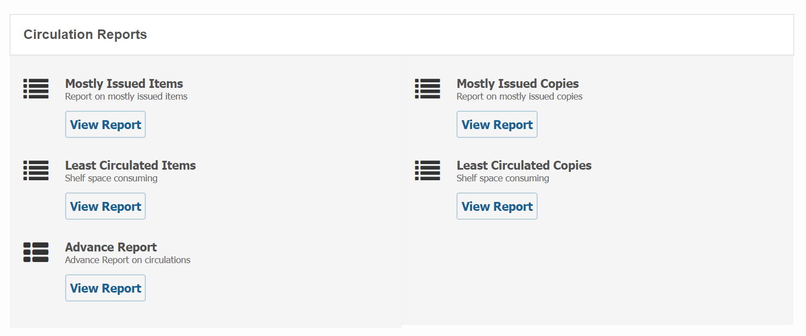

* At first you can see the circulation report on those items which have highest number of checkouts. To view this please click on the view report button below the `Mostly Issued Items` heading.

	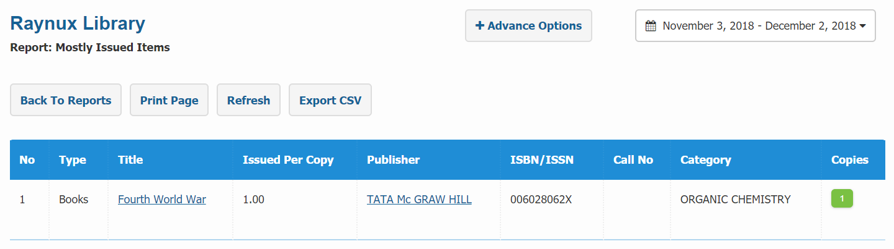

* Also you can filter all the mostly issued items by clicking on `Advance Options` button.
	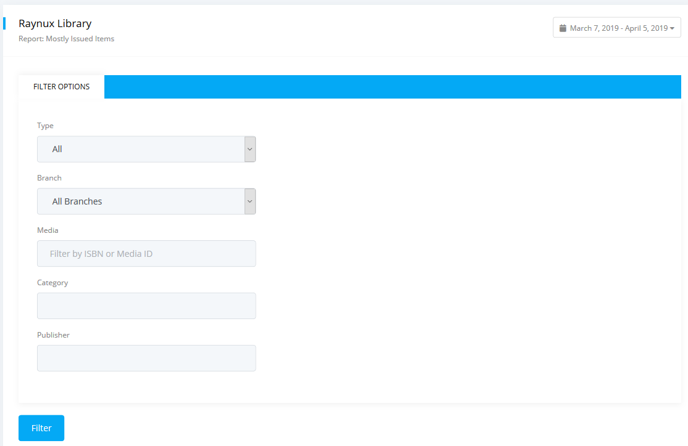

* Next you can see the circulation report on those items which have lowest number of checkouts. To view this please click on the view report button below the `Least Circulated Items` heading.

	

* Next one is the `Advance Report` where you can find more advance functionality for filtering your circulations.
* If you click on the `Filter Options` on the top right corner of the circulations report page then several filtering options will appear like below.

	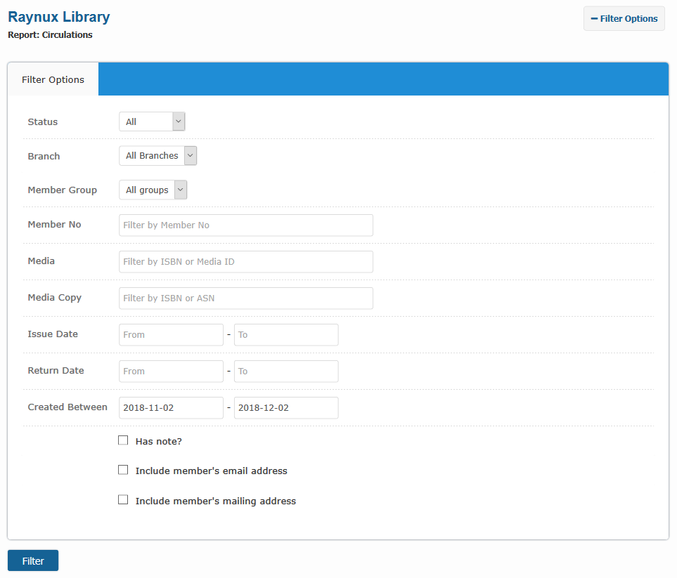
	
* Next the report is on those copies which have highest number of checkouts. You can view this by clicking on the view report button below the `Mostly Issued Copies` heading.
* Finally the `Least Circulated Copies` from which you can view report on those copies which have lowest number of checkouts.

## Member Reports

Member Reports are solely designated for all the members of your library. 

* After the circulation reports you can view the reports on member.

	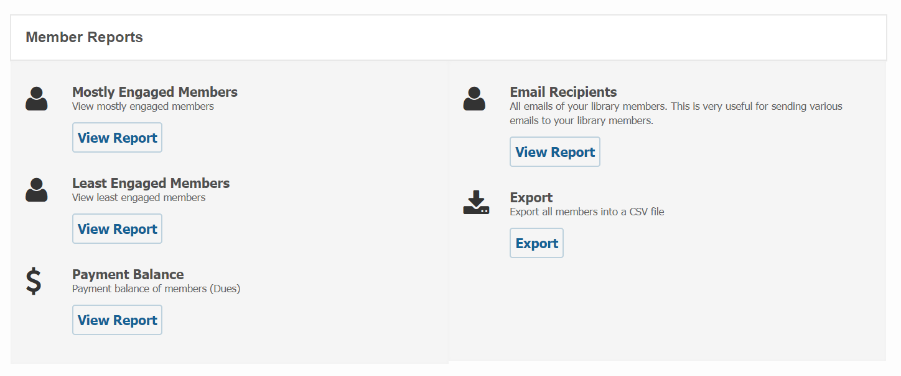

* At first you can view the reports on those members who are engaged mostly in your library activities. To view this please click on the view button below `Mostly Engaged Members` heading. Also you can filter this report if you click on the `Filter Options` on the top right corner of this page.

	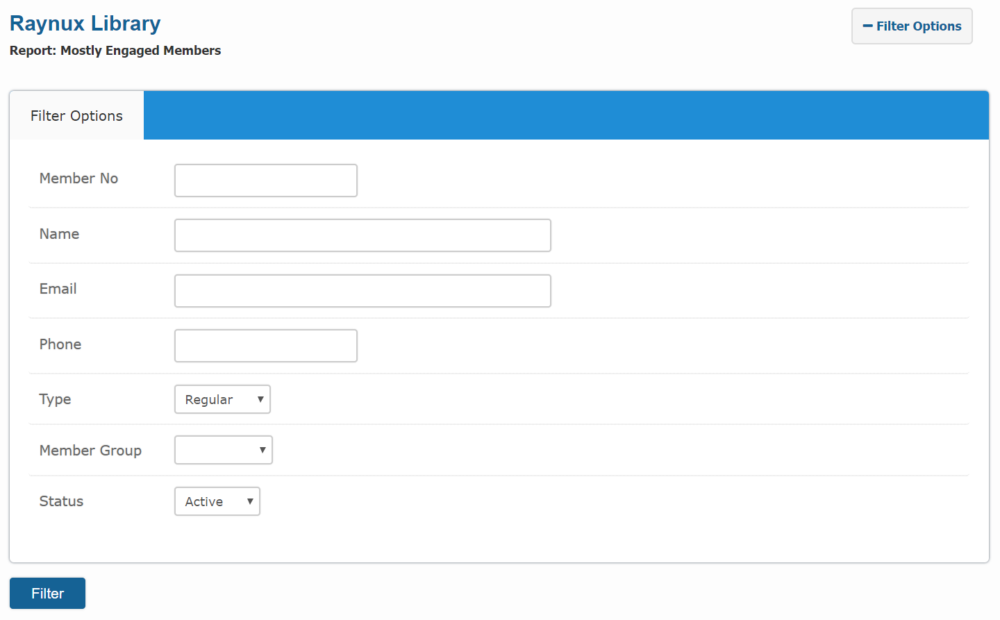
 
* Next you can view report on those members who are not much engaged in your library activities. Also you can use different filtering options like before.
* Then the next one is the `Payment Balance` report which is based on only for those members whose payment balance are dues.
* Next one is the `Email Recipients` report where you can find all the emails of your library members.
* At last you can export all the members of your library into a CSV file if you click on the `Export` button.

## Overdue Reports

Overdue Reports are based on the overdue items and copies of your library catalog.

* When you scrolling down the reports section you can view this reports after the member reports.

	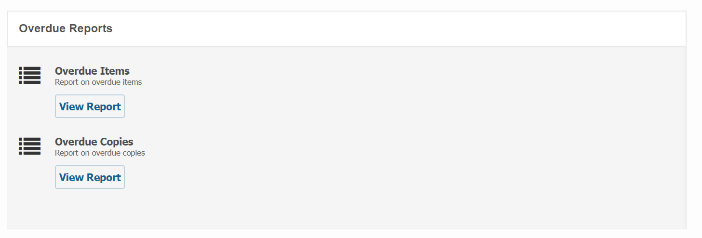

* At first you can view the report on overdue items if you click on the view report button below `Overdue Items` heading. You can also filter all your overdue items from the `Advance Options` button on the top right corner of this page.

	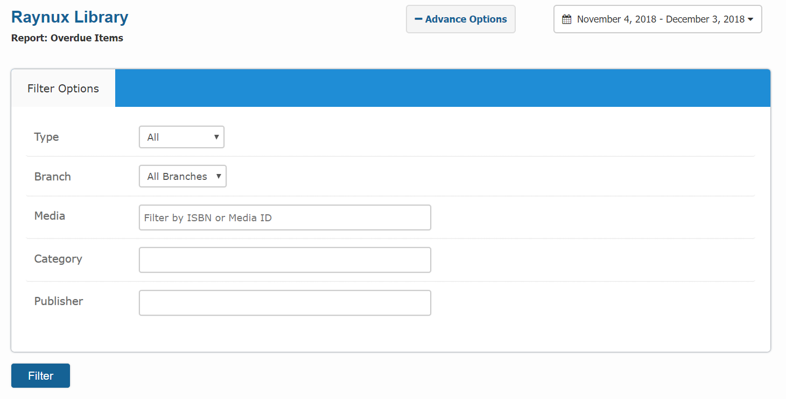

* Then the next report is on the `Overdue Copies` of your library catalog items.

## Miscellaneous

Miscellaneous reports are consisting of various types of listing such as categories, authors, publishers and tags of your library. You can Export all this reports into a CSV file from here.

* At the end of reports section you can export all the miscellaneous reports to keep backup of your records.

	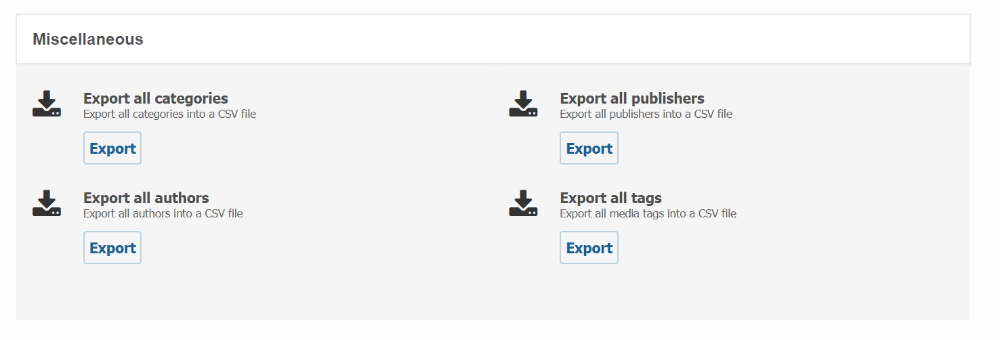