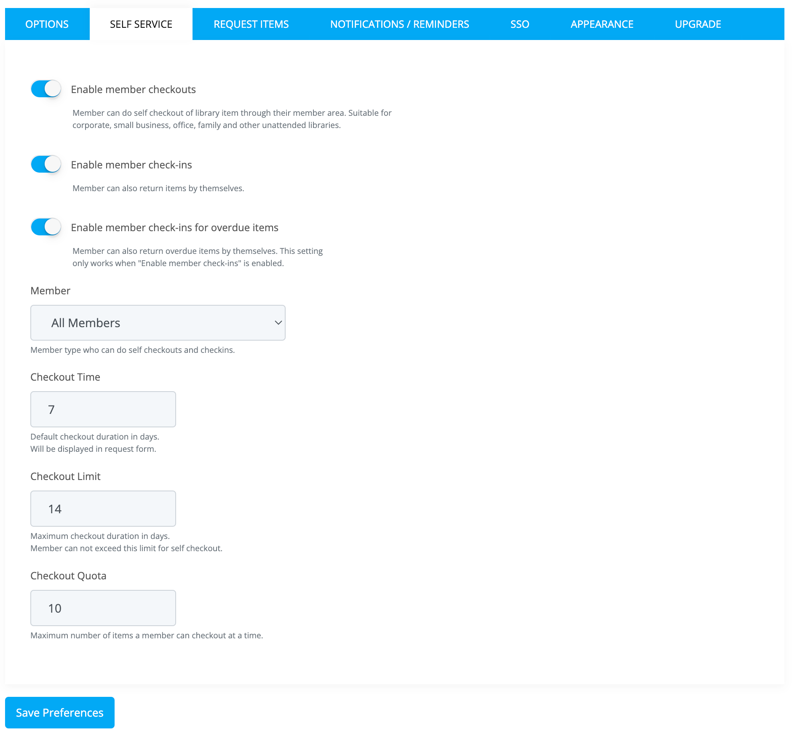

# Self-Service

Librarika offers two approaches for self-checkout: **Online Self-Service** and **Kiosk-Based Self-Service (SIP2)**. Online self-service allows members to check out and return items directly from their browser or phone, while kiosk-based self-service uses the industry-standard SIP2 protocol to connect physical self-checkout terminals with barcode scanners.

## Overview

| Feature | Online Self-Service | [Kiosk-Based (SIP2)](sip2.md) |
|---|---|---|
| Hardware required | None (browser only) | Kiosk terminal + barcode scanner |
| Barcode scanner needed | No | Yes |
| Plan requirement | All plans (including Free) | Paid plans + SIP2 license |
| Setup | Configure in Preferences | Contact Librarika support |
| Best for | Remote access, small libraries | High-traffic libraries, walk-in stations |

---

## Online Self-Service

Online self-service allows your library members to check out and return items directly from their browser without any staff involvement. Members simply log in, find the item they want, and click the checkout button.

### Prerequisites

Before members can use self-service, make sure the following are in place:

* **Member login access enabled** -- Each member must have login access turned on. See [Enable Member Access](members.md#enable-member-access) for instructions.
* **Self-service preferences configured** -- The self-service settings must be enabled in your library preferences (see below).

### Enable Self-Service for Your Library

To enable self-service checkout and check-in for your library members, follow these steps:

* Go to **Dashboard > Manage > Preferences**.
* Click on the `Self Service` tab.

	

* Configure the following settings:

	* **Enable member checkouts** -- Allow members to check out items by themselves from the catalog.
	* **Enable member check-ins** -- Allow members to return (check-in) items by themselves from their My Account page.
	* **Enable check-ins for overdue** -- Allow members to return items even if they are overdue. If disabled, overdue items can only be returned by library staff.
	* **Member type** -- Select which member types are allowed to use self-service: All members, Regular members only, or Privileged members only.
	* **Checkout Time** -- The default checkout duration (in days) for self-service checkouts.
	* **Checkout Limit** -- The maximum checkout duration (in days) that a member can select.
	* **Checkout Quota** -- The maximum number of items a member can have checked out at the same time through self-service.

* Click the `Save Preferences` button to save your changes.

### How Members Check Out Items

Once self-service checkout is enabled, members can check out items by following these steps:

1. Log in to the library using their member credentials.
2. Search for the item they want to borrow using the catalog search.
3. Go to the item details page.
4. Click the `Checkout` button on the available copy.
5. Select a return date (within the allowed checkout limit) and confirm the checkout.
6. The item will be checked out to the member immediately.

### How Members Return Items

Members can return items by following these steps:

1. Log in to the library.
2. Click on `My Account` from the top menu.
3. Find the item in the active bookings list.
4. Click the `Return` button next to the item.
5. The item will be returned immediately.

---

## Kiosk-Based Self-Service (SIP2)

For libraries that need physical self-checkout stations with barcode scanners, Librarika supports the industry-standard **SIP2 protocol**. SIP2 requires a paid plan and a separate SIP2 license purchased on a per-terminal basis.

For full details on SIP2 requirements, licensing, connection setup, and the upcoming Librarika Kiosk App, see the [SIP2 Integration](sip2.md) page.

---

## FAQ

**Do I need a barcode scanner for self-checkout?**

Only if you are using [kiosk-based (SIP2)](sip2.md) self-checkout. For online self-service, members check out items through their browser -- no barcode scanner is needed.

**Do I need third-party software for online self-service?**

No. Online self-service is a built-in feature of Librarika. Simply enable it in your library preferences and your members can start using it right away.

**Is SIP2 available on the free plan?**

No. SIP2 requires a paid plan and a separate per-terminal license. See [SIP2 Integration](sip2.md) for details.

**Can members check out items from their phone?**

Yes. With online self-service enabled, members can log in and check out items from any device with a web browser, including smartphones and tablets.
