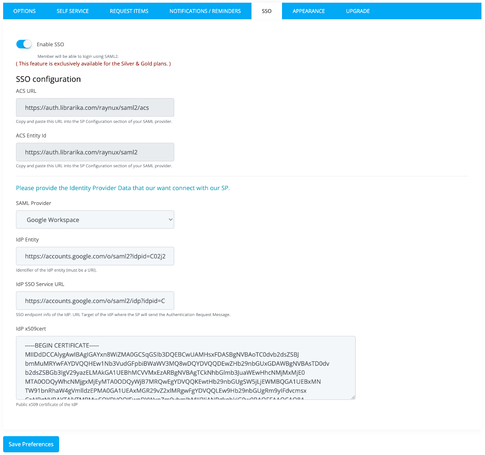

# SSO / SAML Integration

Single Sign-On (SSO) allows your library members to log in using their existing organizational credentials (e.g., school or company login) instead of creating separate Librarika passwords. Librarika supports SSO through the **SAML 2.0** protocol.

## Benefits

* **Simplified login** -- Members use their existing organizational username and password. No separate Librarika password needed.
* **Centralized authentication** -- User access is managed through your organization's Identity Provider (IdP). When a user is removed from your organization, they automatically lose access to the library.
* **Enhanced security** -- Authentication is handled by your organization's secure login system, supporting multi-factor authentication and other security policies.

## Plan Availability

SSO/SAML integration is available on **Silver** and **Gold** plans only.

## Supported Identity Providers

Librarika supports any SAML 2.0 compliant Identity Provider, including:

* Microsoft Azure AD (Entra ID)
* Google Workspace
* Okta
* OneLogin
* Auth0
* Ping Identity
* ADFS (Active Directory Federation Services)
* Shibboleth

If your Identity Provider supports SAML 2.0, it should work with Librarika even if it is not listed above.

---

## How SSO Works

1. A member visits your library and clicks the **SSO Login** button.
2. The member is redirected to your organization's Identity Provider (IdP) login page.
3. The member enters their organizational credentials (e.g., school email and password).
4. The Identity Provider authenticates the member and sends a SAML response back to Librarika.
5. Librarika validates the response and logs the member in automatically.

---

## Setup Instructions

Setting up SSO requires configuration on both sides -- your Identity Provider and Librarika. Follow these steps:

### Step 1: Access SSO Settings in Librarika

* Go to **Dashboard > Manage > Preferences**.
* Click on the `SSO` tab.

	

* You will see the following fields provided by Librarika:
	* **ACS URL** (Assertion Consumer Service URL) -- The endpoint where your IdP sends the SAML response.
	* **ACS Entity ID** -- The identifier for Librarika as the Service Provider.

* Copy these values -- you will need them in the next step.

**Note:** The URLs shown will contain your library's subdomain (e.g., `yourlibrary.librarika.com`).

### Step 2: Configure Your Identity Provider

In your Identity Provider's admin console, create a new SAML application with the following settings:

* **ACS URL / Reply URL** -- Paste the ACS URL from Step 1.
* **Entity ID / Audience URI** -- Paste the ACS Entity ID from Step 1.
* **Name ID Format** -- Email address (recommended).

The exact steps vary by provider. Consult your Identity Provider's documentation for creating a SAML application.

### Step 3: Enter IdP Details in Librarika

After configuring your Identity Provider, you will receive the following details. Enter them in the SSO tab in Librarika:

* **SAML Provider** -- Select your SAML provider from the dropdown list.
* **IdP Entity ID** -- The identifier of your Identity Provider (a URI provided by your IdP).
* **IdP SSO Service URL** -- The login endpoint URL where Librarika sends authentication requests.
* **IdP x509 Certificate** -- The public certificate from your IdP, used to verify SAML responses.

You can find these values in the **metadata** of your SAML provider. Most providers offer a metadata XML file or a metadata URL that contains all three values.

### Step 4: Enable SSO and Request Activation

* Check the **Enable SSO** checkbox.
* Click the `Save Preferences` button.
* **Contact Librarika support** to request SSO activation. Librarika staff will review your configuration and activate SSO for your library.

**Important:** SSO is not active immediately after saving. It requires manual review and activation by Librarika staff.

---

## Member Login with SSO

Once SSO is activated, members can log in to your library as follows:

1. Go to your library's login page.
2. Click the **SSO Login** button.
3. Enter organizational credentials on the Identity Provider's login page.
4. After successful authentication, the member is redirected back to the library and logged in.

**Note:** Members must have an existing member record in your library with login access enabled. The email address in the member record must match the email address in the Identity Provider.

---

## FAQ

**Can I use SSO with the free plan?**

No. SSO/SAML integration is available on Silver and Gold plans only.

**Is SSO activated immediately after I configure it?**

No. After you save your SSO configuration, you need to contact Librarika support for manual review and activation.

**Can members still log in with their Librarika password after SSO is enabled?**

Yes. Enabling SSO adds an additional login method. Members can continue to use their Librarika credentials if they have them.

**What if my Identity Provider is not listed in the dropdown?**

If your IdP supports SAML 2.0 but is not in the dropdown list, select the closest option or contact Librarika support for assistance.

**Do members need to be pre-created in Librarika?**

Yes. Members must have an existing member record with login access enabled and a matching email address in Librarika before they can log in via SSO.
