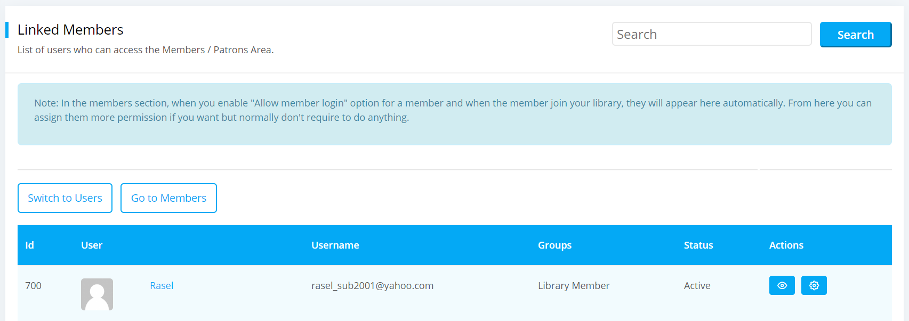

# Users

Users are those who can administer or manage all the activities of your library depending on their role. They can log into the library dashboard and do regular managerial activities. They can also add or remove a user from the library.

## List Users

Users is the section where you can see all the list of users based on their roles. They have access to the library and can do all the regular managerial workings of the library. 

To view list admin or stuff users, please follow the below steps:

* At first log in to your library.
* Please go to the `Dashboard ->  Manage -> Users` dropdown menu.

	

* Click on `Users` and a page will be appeared like below. Here you can see all the users of your library.

	

* If you click on the `View` icon next to any user then you can see all the information of that specific user like below.

	

* Here you can also see the group information of that user, if you click on the view icon from the **Group Memberships** table.

	

* Now you can also view all the related members of that group.

## Add User

User with library admin privileges can add a new user and give them access to the library for managerial activities.

To add a user, please follow the below steps:

* Please go to the `Users` section from the `Manage` dropdown menu.
* Click on `New User` button and a create user form will be appeared like below.

	

* Now enter the email address and select the roles either administrator, assistant or staff for creating a new user. After selecting email address a **Name** input field will appear like below.

	

* Here you can also choose multiple roles or groups for adding a new user.

* Click on `Submit` button and a user will be invited to join your library and the status for this new user will be **Invited**.

	

* Now the user needs to follow the invitation email and join the library. 

## Resend Invitation

When you will create a new user an invitation email will automatically send to the users email account for joining your library. That time if the user can not join the library for some reason then you can send the joining request again by clicking on re-send invite option.  

To do so, please follow the below steps:

* Please go to the `Users` section.
* Locate that user whom you want to send the invitation email again from users section and click on the `Re-send Invite` button on the right to that user.

	

* Click on it and the invitation email will be send to the users email account for joining your library.
* If an user click on the joining request, then that user will be able to join the library.
* Now the status of this new user will be turned into **Active** from **Invited**.

## Add / Update Permission

You can change the groups or roles of a user by setting permissions for the users.

To set permissions, please follow the below steps:

* Click on `Change Permissions` icon from the users section.
* A form will be appeared like below.

	

* Here you can change the groups or roles of a user from the previous one by changing permissions. You can also add permission for a new user.
* Also you can select multiple groups or roles for a user when you will either add or update permission.
* Click on `Save` button when you are done and your permissions will be saved.

## Remove Permission

You can also remove the permissions that you have given to the users for your library.

To remove the permissions, please follow the below steps:

* Click on `Change Permissions` icon like before from the users section.
* Now the `Change Permissions` form will be appeared same as the **Add / Update Permission** section mentioned above.
* In the `Change Permissions` form you have to uncheck the gruops or roles options and click on **Save** button.

	

* Now the permissions will be removed for the users.

## Linked Members

Linked members is the section where you can see the list of users who have access to the members area section of your library. Basically they are the members or patrons with log in access.

To view the list of linked members, please follow the below steps:

* Click on `Switch to Linked Members` button from the top of the users section.

	

* Now click on the switch to linked members button and the `Linked Members` page will be appeared like below.

	

* All the patrons accounts are listed here. These users can not access admin dashboard by default. 
* However, you can assign them admin permission, if you want them to be a part of your library management staff.