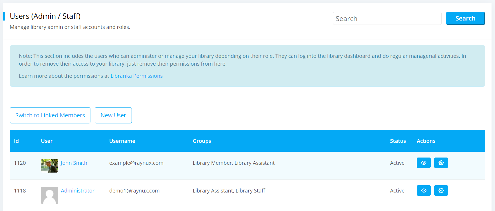

# Users

Users are those who can administer or manage all the activities of the library depending on their role. They can log into the library dashboard and do regular managerial activities. They can also add or remove a user from the library.

## List Users

List Users is the section where you can see all the list of users based on their roles. They have access to the library and can do all the regular managerial workings of the library. 

To view list admin or stuff users, please follow the below steps:

* At first log in to your library.
* Go to the `Manage` option from the Main Menu and click on `Users` from the `Manage` dropdown Menu.

	

* After click on `Users` a page will be appeared like below. You can see all the users of the library in this page.

	

* Click on `View` and you can see all the information of the user like below.

	

	- Here you can also see the group information of the user, if you click on the view of the **Group Memberships**.

		

	- Now you can view all the Group Members information from here.

## Add User

User with library admin privileges can add a new user and give them access to the library for managerial functions.

To add a user, please follow the below steps:

* Go to the List Users page.
* Click on `Add New User` and a page will be appeared like below.

	

* Now give the email address and select the roles either administrator, assistant or staff for creating a new user. After selecting email address a **Name** input field will appear like below.

	

* Here you can also choose multiple roles or groups for adding a new user.

* Click on `Save` button and a user will be invited to join your library and the status for this new user will be **Invited**.

	

* In the above you can see that, you can also add another user from here. 

	

* Now the user needs to follow the invitation email and join the library. 

## Resend Invitation

When you will create a new user an Invitation will automatically send to the users email account for joining your library. That time if the user can not join the library for some reason then you can send the joining request again by clicking on Resend Invitation.  

To do so, please follow the below steps:

* Go to the List Users page.
* Click on `Resend Invite` option and the invitation email will be send to the users email account for joining your library.

	

* If a user click on the joining request, then the user will be able to join the library.
* Now the status of this new user will be turned into **Active** to **Invited**.

## Add / Update Permission

You can change the groups or roles of a user by setting permissions for the users.

To set permissions for the users, please follow the below steps:

* Click on `Permissions` in the users page.
* A page will appear like below.

	

* Here you can change the groups or roles of a user from the previous one by changing permissions. You can also add permission for a new user.
* Now you can also select multiple groups or roles for a user when you will either add or update permission.
* Click on `Save` button and your permissions will be saved.

## Remove User

You can also remove the permissions that you have been given to the users.

To remove the permissions, please follow the below steps:

* Click on `Permissions` in the users page same as before.
* Now the `Change Permissions` page will be appeared same as the **Add Permission** mension above.
* In the `Change Permissions` page you have to unmark the gruops or roles options and click on **Save** button.

	

* Now your permissions will be removed from the users page.

## Linked Members

Linked Members is the section where you can see the list of users who can access the members area of your library. Basically these are the members or patrons with log in access.

To view the list of Linked Members, please follow the below steps:

* Click on `Switch to Linked Members` in the users page.

	

* Now the `Linked Members` page will be appeared like below.

	

* All the patrons accounts are listed here. These users can not access admin dashboard by default. 
* However, you can assign them admin permission if you want them to be part of your library management staff.